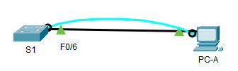
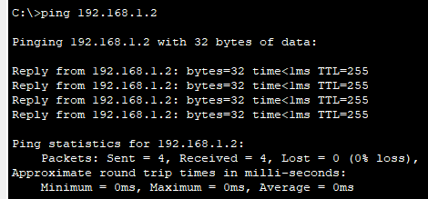
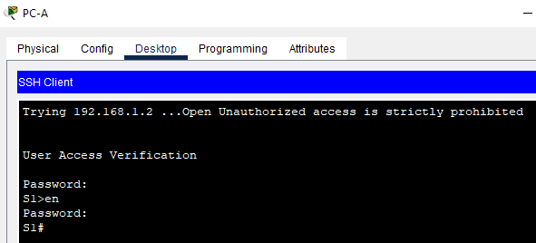

# ЛР1. Базовая настройка коммутатора 

## 1. Задачи
* **Часть 1. Проверка конфигурации коммутатора по умолчанию**
* **Часть 2. Создание сети и настройка основных параметров устройства**
  - Настройте базовые параметры коммутатора.
  - Настройте IP-адрес для ПК.
* **Часть 3. Проверка сетевых подключений**
  - Отобразите конфигурацию устройства.
  - Протестируйте сквозное соединение, отправив эхо-запрос.
  - Протестируйте возможности удаленного управления с помощью Telnet.

## 2. Топология сети


Топология сети для данной работы представлена на рисунке 1.

          
*Рисунок 1. Топология сети*

## 3. Таблица адресации
| Устройство  | Интерфейс | IP адрес |
| :-------------: | :-------------: | :--: |
| S1  | VLAN 1  | 192.168.1.2 /24 |
| PC-A  | NIC  | 192.168.1.10 /24 |


## 4. Выполнение работы
### Часть 1. Проверка конфигурации коммутатора по умолчанию

- Шаг 1. Создание сети по заданной на рисунке 1 топологии   
      
ПК PC-A подключен портом RS232 к консольному порту коммутатора S1, также через Straight-Through кабель подключен порт FastEthernet 0 ПК PC-A к порту FastEthernet 6 коммутатора S1.

**Вопрос**. Почему нужно использовать консольное подключение для первоначальной настройки коммутатора? Почему нельзя подключиться к коммутатору через Telnet или SSH?            
**Ответ**. Потому что в дефолтной настройке еще не настроено подключение по Telnet и SSH, а также нет IP адреса на устройстве

- Шаг 2. Проверьте настройки коммутатора по умолчанию

Файл конфигурации дефолтный, не имеет еще никаких параметров

**Вопрос**. Сколько интерфейсов FastEthernet имеется на коммутаторе 2960?    
**Ответ**. 24 интерфейса            
**Вопрос**. Сколько интерфейсов Gigabit Ethernet имеется на коммутаторе 2960?   
**Ответ**. 2 интерфейса          
**Вопрос**. Каков диапазон значений, отображаемых в vty-линиях?   
**Ответ**. Диапазоны 0-4 и 5-15     

Вопросы по SVI:   

**Вопрос**. Назначен ли IP-адрес сети VLAN 1?      
**Ответ**. Нет         
**Вопрос**. Какой MAC-адрес имеет SVI? Возможны различные варианты ответов.     
**Ответ**. 00e0.f9c2.77ad (show interfaces | include line | address)      
**Вопрос**. Данный интерфейс включен?     
**Ответ**. Нет

Вопросы по ОС:

**Вопрос**. Под управлением какой версии ОС Cisco IOS работает коммутатор?     
**Ответ**. 15.0(2)SE4
**Вопрос**. Как называется файл образа системы?      
**Ответ**. 2960-lanbasek9-mz.150-2.SE4.bin

Вопросы по порту коммутатора F0/6: 

**Вопрос**. Интерфейс включен или выключен?      
**Ответ**. Да
**Вопрос**. Что нужно сделать, чтобы включить интерфейс?      
**Ответ**.  Команда no shutdown             
**Вопрос**. Какой MAC-адрес у интерфейса?            
**Ответ**. 00d0.5822.9b06        
**Вопрос**. Какие настройки скорости и дуплекса заданы в интерфейсе?  
**Ответ**. Full-duplex, 100Mb/s          


### Часть 2. Создание сети и настройка основных параметров устройства

- Шаг 1. Настройте базовые параметры коммутатора

```
conf t
no ip domain-lookup
hostname S1
service password-encryption
enable secret class
banner motd # Unauthorized access is strictly prohibited. #

int vlan 1
ip add 192.168.1.2 255.255.255.0
no shutdown

exit
line con 0
password class
logging synchronous 

exit
line vty 0 4
pasword cisco
transpor input telnet

```

- Шаг 2. Настройте IP-адрес на компьютере PC-A.

В Packet Tracer настроены на интерфейса PC-A адрес 192.168.1.10 255.255.255.0
Для коммутатора на VLAN 1 повешен адрес 192.168.1.2 255.255.255.0 (команда приведена в шаге 1)


### Часть 3. Проверка сетевых подключений


- Шаг 1. Отобразите конфигурацию коммутатора

```
S1#show run
Building configuration...

Current configuration : 1334 bytes
!
version 15.0
no service timestamps log datetime msec
no service timestamps debug datetime msec
service password-encryption
!
hostname S1
!
enable secret 5 $1$mERr$9cTjUIEqNGurQiFU.ZeCi1
!
!
!
no ip domain-lookup
!
!
!
spanning-tree mode pvst
spanning-tree extend system-id
!
interface FastEthernet0/1
!
interface FastEthernet0/2
!
interface FastEthernet0/3
!
interface FastEthernet0/4
!
interface FastEthernet0/5
!
interface FastEthernet0/6
!
interface FastEthernet0/7
!
interface FastEthernet0/8
!
interface FastEthernet0/9
!
interface FastEthernet0/10
!
interface FastEthernet0/11
!
interface FastEthernet0/12
!
interface FastEthernet0/13
!
interface FastEthernet0/14
!
interface FastEthernet0/15
!
interface FastEthernet0/16
!
interface FastEthernet0/17
!
interface FastEthernet0/18
!
interface FastEthernet0/19
!
interface FastEthernet0/20
!
interface FastEthernet0/21
!
interface FastEthernet0/22
!
interface FastEthernet0/23
!
interface FastEthernet0/24
!
interface GigabitEthernet0/1
!
interface GigabitEthernet0/2
!
interface Vlan1
 ip address 192.168.1.2 255.255.255.0
!
banner motd ^C Unauthorized access is strictly prohibited ^C
!
!
!
line con 0
 password 7 0822455D0A16
 logging synchronous
!
line vty 0 4
 password 7 0822455D0A16
 login
 transport input telnet
line vty 5 15
 password 7 0822455D0A16
 login
!
!
!
!
end

```

**Вопрос**. Какова полоса пропускания Vlan 1?       
**Ответ**. BW 100000 Kbit

- Шаг 2. Протестируйте сквозное соединение, отправив эхо-запрос

С ПК PC-A пущен пинг до 192.168.1.2. Ответы получены.      
    


- Шаг 3. Проверьте удаленное управление коммутатором S1

С ПК PC-A удалось подключиться по telnet на адрес 192.168.1.2       
    


Конфигурация коммутатора сохранены
```
copy running-config startup-config
```


## 5.Вопросы для повторения

1.	Зачем необходимо настраивать пароль VTY для коммутатора?

Для удаленного доступа на устройства по IP адресу

2.	Что нужно сделать, чтобы пароли не отправлялись в незашифрованном виде?

Ввести команду 

```
service password-encryption
```
Либо использовать SSH