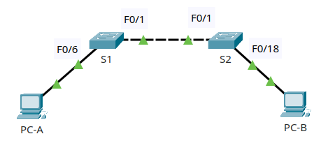
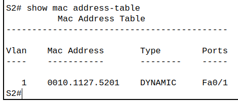
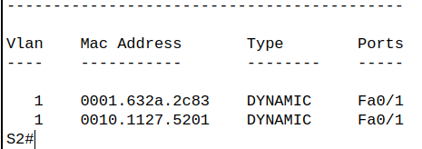
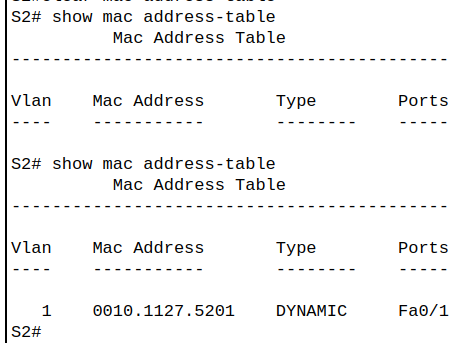
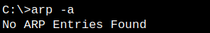
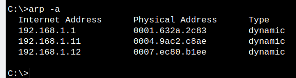
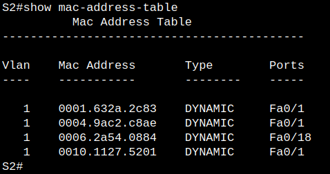

# ЛР 2. Просмотр таблицы MAC-адресов коммутатора 

## 1. Цели работы

Часть 1. Создание и настройка сети     
Часть 2. Изучение таблицы МАС-адресов коммутатора

## 2. Топология сети
Топология сети для данной работы представлена на рисунке 1.

 
Рисунок 1. Топология сети

## 3. Таблица адресации

| Устройство | Интерфейс | IP адрес | Маска подсети |
| :-------------: | :-------------: | :--: | :--: |
| S1 | VLAN 1 | 192.168.1.11 | 255.255.255.0 |
| S2 | VLAN 1 | 192.168.1.12 | 255.255.255.0 |
| PC-A | NIC | 192.168.1.1 | 255.255.255.0|
| PC-B | NIC | 192.168.1.2 | 255.255.255.0 |
## 4. Выполнение работы

### Часть 1. Создание и настройка сети

Команды для настройки коммутаторов:     
Коммутатор S1
```cisco
enable
conf t
enable secret class
no ip domain-lookup
hostname S1

line con 0
password cisco
logging synchronous
exit

line vty 0 4
password cisco
login
transport input telnet
exit

service password-encryption

banner motd # Private switch S1 # 

int vlan 1
ip address 192.168.1.11 255.255.255.0
no shutdown

```
Коммутатор S2

```cisco
enable
conf t
enable secret class
no ip domain-lookup
hostname S2

line con 0
password cisco
logging synchronous
exit

line vty 0 4
password cisco
login
transport input telnet
exit

service password-encryption

banner motd # Private switch S2 # 

int vlan 1
ip address 192.168.1.12 255.255.255.0
no shutdown

```
На РС-А назначен адрес 192.168.1.1, а на РС-В адрес 192.168.1.2

### Часть 2. Изучение таблицы МАС-адресов коммутатора

- Шаг 1. Запишите МАС-адреса сетевых устройств

| Устройство | MAC адрес |
| :-----: | :-----: |
| PC-A | 0001.632A.2C83 |
| PC-B | 0006.2A54.0884 |
| S1 (F0/1) | 0010.1127.5201 |
| S2 (F0/1) | 000a.41a8.d701 |

- Шаг 2. Просмотрите таблицу МАС-адресов коммутатора

При выполнении команды ```show mac address-table``` получен следующий результат:

 

S2 уже знает, что за интерфейсом F0/1 находится устройство с адресом *0010.1127.5201*. Глядя на таблицу в шаге 1, понятно, что это интерфейс F0/1 коммутатора S1.

**Вопрос**. Если вы не записали МАС-адреса сетевых устройств в шаге 1, как можно определить, каким устройствам принадлежат МАС-адреса, используя только выходные данные команды show mac address-table?

**Ответ**. Если в сети уже проходили пакеты, то будет указано несколько MAC аресов за тем или иным портом, например, так:

 

Тут можно лишь понять, в какую сторону двигаться, чтобы отыскать устройство с нужным МАС адресом. Но можно попробовать очистить таблицу адресов, тогда будет шанс увидеть непосредственно соседа за тем или иным портом, если быстро посмотреть вывод команды ```show mac address-table```.

- Шаг 3. Очистите таблицу МАС-адресов коммутатора S2 и снова отобразите таблицу МАС-адресов

Если очистить таблицу с МАС адресами (```clear mac address-table dynamic```), а затем быстро посмотреть в неё (```show mac address-table```), то сначала она пустая, а потом наполняется данными за счет пакетов STP протокола, что видно в режиме модуляции

 

- Шаг 4. С компьютера PC-B отправьте эхо-запросы устройствам в сети и просмотрите таблицу МАС-адресов коммутатора

Перед началом отправки echo запросов в сеть с PC-B таблица МАС адресов на нем пустая:

 

С PC-B отправлены 3 команды ping:
```cisco
ping 192.168.1.1
ping 192.168.1.11
ping 192.168.1.12
```
Теперь таблица МАС адресов наполнилась МАС адресами всех 3х устройств в сети:

 

После подключения к S2 через PC-B по telnet в таблице MAC адресов видны все устройства:

 

5. Вопрос для повторения

**Вопрос**. В сетях Ethernet данные передаются на устройства по соответствующим МАС-адресам. Для этого коммутаторы и компьютеры динамически создают ARP-кэш и таблицы МАС-адресов. Если компьютеров в сети немного, эта процедура выглядит достаточно простой. Какие сложности могут возникнуть в крупных сетях?

**Ответ**. Если устройств очень много, придется в КЭШ памяти хранить много соответствий МАС-IP. Из-за этого проверка по КЭШу будет идти дольше, а также размер самой памяти должен быть больше, что ведет к удорожанию оборудования.
