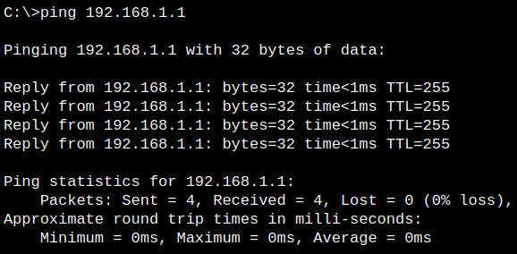
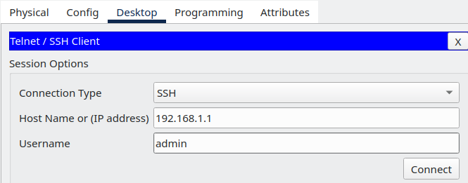
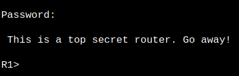
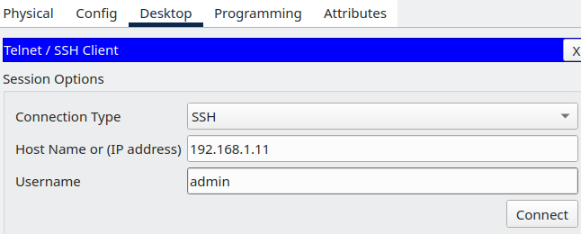
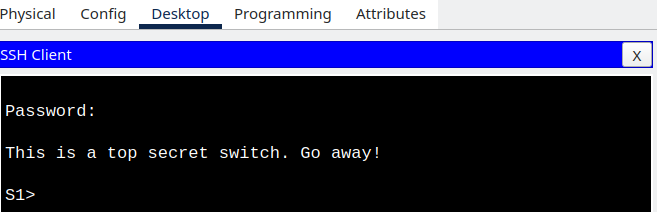
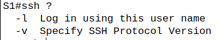
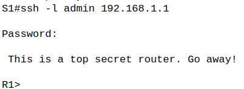
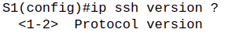

# ЛР 4. Настройка IPv6-адресов на сетевых устройствах

## 1. Цели работы

Часть 1. Настройка основных параметров устройства      
Часть 2. Настройка маршрутизатора для доступа по протоколу SSH     
Часть 3. Настройка коммутатора для доступа по протоколу SSH     
Часть 4. SSH через интерфейс командной строки (CLI) коммутатора     

## 2. Топология сети

           
Рисунок 1. Топология сети


## 3. Таблица адресации

| Устройство | Интерфейс | IP адрес | Маска подсети | Шлюз по умолчанию |
| :-------------: | :-------------: | :--: | :--: |  :--: |
| R1 | G0/0/1 | 192.168.1.1 |  255.255.255.0 |  |
| S1 | VLAN 1 | 192.168.1.11  |  255.255.255.0 | 192.168.1.1 |
| PC-A | NIC | 192.168.1.3 |  255.255.255.0 | 192.168.1.1 |


## 4. Выполнение работы

### Часть 1. Настройка основных параметров устройств

#### Шаг 1. Создайте сеть согласно топологии

На рисунке 1 представлена схема согласно топологии сети

#### Шаг 2. Выполните инициализацию и перезагрузку маршрутизатора и коммутатора

Выполнена перезагрузка S1 и R1 с помощью команд       
```
enable
reload
```

#### Шаг 3. Настройте маршрутизатор

Для настройки маршрутизатора выполнены следующие команды

```
enable 
configure terminal

enable secret class

hostname R1
no ip domain-lookup 
banner motd " This is a top secret router. Go away! "

line console 0
password cisco
login

line vty 0 4
password cisco
login

service password-encryption

interface g0/0/1
ip address 192.168.1.1 255.255.255.0
no shutdown 
```

Выполнение команды ```show ip interface brief``` на R1
   

#### Шаг 4. Настройте компьютер PC-A

В параметрах PC-A настроены следующие параметры в соответствии с заданием:    
**IP адрес** - 192.168.1.3       
**Маска** - 255.255.255.0     
**Default Gateway** - 192.168.1.1     

#### Шаг 5. Проверьте подключение к сети

С PC-A пущен ping на 192.168.1.1 (адрес интерфейса, g0/0/1 маршрутизатора R1). Команда выполнена успешно
    
Рисунок 2. Выполнение команды ping до 192.168.1.1

### Часть 2. Настройка маршрутизатора для доступа по протоколу SSH

#### Шаг 1. Настройте аутентификацию устройств

Имя устройства:     
```
hostname R0
```
Домен для устройства:
```
ip domain name lr5
```

#### Шаг 2. Создайте ключ шифрования с указанием его длины

Задание ключа шифрования в 1024 бита:

```
crypto key generate rsa general-keys modulus 1024
```

Включаем версию SSH 2:
```
ip ssh version 2
```

#### Шаг 3. Создайте имя пользователя в локальной базе учетных записей

Создан пользователь с данными:    
**Логин**: admin     
**Пароль**: Adm1nP @55    
```
username admin password Adm1nP@55
```

#### Шаг 4. Активируйте протокол SSH на линиях VTY

Следующими командами активирован протокол SSH на линиях VTY, а также изменен способ входа в систему, чтобы только локальные польователи могли попасть на устройство   

```
line vty 0 4
login local
transport input ssh 
```

#### Шаг 5. Сохраните текущую конфигурацию в файл загрузочной конфигурации

```
copy running-config startup-config
```

#### Шаг 6. Установите соединение с маршрутизатором по протоколу SSH

С PC-A через утилиту SSH Client с помощью логина **admin** и пароля **Adm1np@55** получен доступ на устройство R1

  
     
Рисунок 3. Доступ с PC-A по SSH на R1

### Часть 3. Настройка коммутатора для доступа по протоколу SSH


#### Шаг 1. Настройте основные параметры коммутатора

Для базовой настрйоки коммутатора S1 выполнены следующие команды:

```
enable 
configure terminal

enable secret class

no ip domain-lookup 
hostname S1
banner motd "This is a top secret switch. Go away!"

line console 0
password cisco
login

line vty 0 4
password cisco
login

service password-encryption
interface vlan 1
ip address 192.168.1.11 255.255.255.0
no shutdown

copy running-config startup-config
```

Выполнение команды ```show ip interface brief``` на S1
  

#### Шаг 2. Настройте коммутатор для соединения по протоколу SSH

Аналогично R1 настраивается SSH доступ на S1

Имя устройства:     
```
hostname S1
```

Домен для устройства:
```
ip domain name lr5
```

Задание ключа шифрования в 1024 бита:
```
crypto key generate rsa general-keys modulus 1024
```

Включаем версию SSH 2:
```
ip ssh version 2
```

Создан пользователь с данными:    
**Логин**: admin     
**Пароль**: Adm1nP @55    
```
username admin password Adm1nP@55
```


#### Шаг 3. Установите соединение с коммутатором по протоколу SSH

С PC-A через утилиту SSH Client с помощью логина **admin** и пароля **Adm1nP@55** получен доступ на устройство S1

  
  
Рисунок 4. Доступа с PC-A по SSH на S1

### Часть 4. Настройка протокола SSH с использованием интерфейса командной строки (CLI) коммутатора


#### Шаг 1. Посмотрите доступные параметры для клиента SSH в Cisco IOS

На S1 выполнена каманда ```ssh ?```, чтобы посмотреть все возможные варианты опций. Их всего 2:
      
Рисунок 5. Доступные опции SSH на S1

#### Шаг 2. Установите с коммутатора S1 соединение с маршрутизатором R1 по протоколу SSH

Подключение по SSH с S1 на R1 выполнено успешно по выше созданному пользователю **admin**

        
Рисунок 6.Подключение по SSH с S1 на R1

С помощью комбинации клавиш **CTRL+Shift+6** и нажатия на **x** осуществлен возврат в терминал S1, а с помощью нажатия **ENTER** в пустой строке возврат в терминал R1. С помощью **exit** завершена SSH сессия на R1

        
Рисунок 7. Перемещение из терминала R1 в терминал S1 без закрытия сессии

### Вопрос для повторения
**Вопрос**. Какие версии протокола SSH поддерживаются при использовании интерфейса командной строки?    
**Ответ**. В Packet Tracer доступно 1 и 2 версии SSH протокола

       
Рисунок 8. Версии SSH протокола на устройствах в Packet Tracer

**Вопрос**. Как предоставить доступ к сетевому устройству нескольким пользователям, у каждого из которых есть собственное имя пользователя?    
**Ответ**. Если на устройстве созданы пользователи и активирована локальная база данных для авторизации по SSH, то у пользователей будет доступ по SSH на устройство. Уровень привилегий не играет роли. Для примера созданы пользователи с разным уровнем привилегий, но все они смогли успешно подключиться с PC-A на R1 

```
username test1 privilege 0 secret test
username test2 privilege 15 secret test
```
