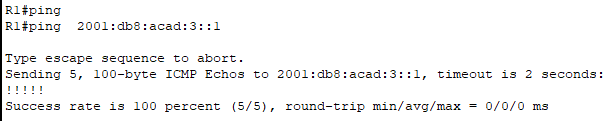
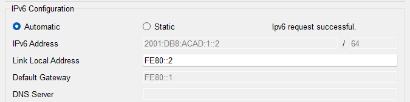
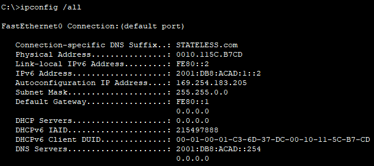
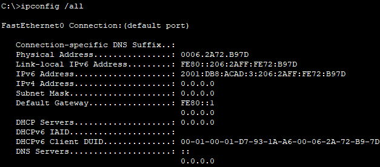
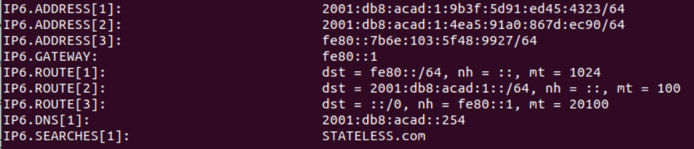
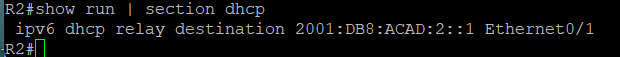
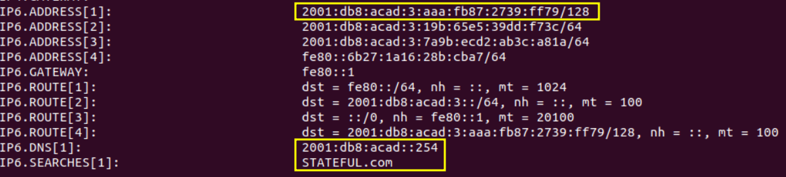

# ЛР 8. Настройка DHCPv6

## 1. Цели работы

Часть 1. Создание сети и настройка основных параметров устройства

Часть 2. Проверка назначения адреса SLAAC от R1

Часть 3. Настройка и проверка сервера DHCPv6 без гражданства на R1

Часть 4. Настройка и проверка состояния DHCPv6 сервера на R1

Часть 5. Настройка и проверка DHCPv6 Relay на R2

## 2. Топология сети


Рисунок 1. Топология сети

## 3. Таблица адресации

| Устройство | Интерфейс | IPv6 адрес |
| :-------------: | :------------- | :--: |
| R1 | G0/0/0 | 2001:db8:acad:2::1/64 |
| R1 | G0/0/0 | fe80::1 |
| R1 | G0/0/1 | 2001:db8:acad:1::1/64 |
| R1 | G0/0/1 | fe80::1 |
| R2 | G0/0/0 | 2001:db8:acad:2::2/64 |
| R2 | G0/0/0 | fe80::2 |
| R2 | G0/0/1 | 2001:db8:acad:3::1/64 |
| R2 | G0/0/1 | fe80::1 |
| PC-A | NIC | DHCP |
| PC-B | NIC | DHCP |


## 4. Выполнение работы

### Часть 1. Создание сети и настройка основных параметров устройства

#### Шаг 1. Создайте сеть согласно топологии

Собранная схема приведена на рисунке 1.

#### Шаг 2. Настройте базовые параметры каждого коммутатора. (необязательно)

Настройка S1:

```
hostname S1
no ip domain-lookup 
enable password class

line console 0
loggin synchronous 
password cisco
login

line vty 0 4
transport input ssh
password cisco
login local 

service password-encryption 

vlan 777
name UnusedPorts
int range fa0/1-4,fa0/7-24,g0/1-2
switchport mode access 
switchport access vlan 777
shutdown

spanning-tree mode rapid-pvst 
interface fa0/6
spanning-tree portfast
spanning-tree bpduguard enable 

clock set 14:53:00 19 may 2024

banner motd "This is S1"

wr
```

Настройка S2:

```
hostname S2
no ip domain-lookup 
enable password class

line console 0
loggin synchronous 
password cisco
login

line vty 0 4
transport input ssh
password cisco
login local 

service password-encryption 

vlan 777
name UnusedPorts
int range fa0/1-4,fa0/6-17,fa0/19-24,g0/1-2
switchport mode access 
switchport access vlan 777
shutdown

spanning-tree mode rapid-pvst 
interface fa0/18
spanning-tree portfast
spanning-tree bpduguard enable 

clock set 14:55:00 19 may 2024

banner motd "This is S2"

wr
```

#### Шаг 3. Произведите базовую настройку маршрутизаторов

Настройка R1:
```
hostname R1
no ip domain-lookup 
enable password class

line console 0
loggin synchronous 
password cisco
login

line vty 0 4
transport input ssh
password cisco
login local 

service password-encryption 

clock set 14:57:00 19 may 2024

banner motd "This is R1"

ipv6 unicast-routing 

wr
```

Настройка R2:
```
hostname R2
no ip domain-lookup 
enable password class

line console 0
loggin synchronous 
password cisco
login

line vty 0 4
transport input ssh
password cisco
login local 

service password-encryption 

clock set 14:59:00 19 may 2024

banner motd "This is R2"

ipv6 unicast-routing 

wr
```

#### Шаг 4. Настройка интерфейсов и маршрутизации для обоих маршрутизаторов

Настройка R1:
```
interface g0/0/0
ipv6 address 2001:db8:acad:2::1/64
ipv6 address fe80::1 link-local 


interface g0/0/1
ipv6 address 2001:db8:acad:1::1/64
ipv6 address fe80::1 link-local 

ipv6 route ::/0  gigabitEthernet 0/0/0 fe80::2
```

Настройка R2:
```
interface g0/0/0
ipv6 address 2001:db8:acad:2::2/64
ipv6 address fe80::2 link-local 


interface g0/0/1
ipv6 address 2001:db8:acad:3::1/64
ipv6 address fe80::1 link-local 

ipv6 route ::/0  gigabitEthernet 0/0/0 fe80::1
```

Пинг с роутера R1 адреса на интерфейсе Gi0/0/1 роутера R2, чтобы проверить маршрутизацию в сети:



Маршрутизация работает

### Часть 2. Проверка назначения адреса SLAAC от R1

На РС-А в настройках выбрано автоматическое получения IPv6 адреса:




Задан вручную Link-Local адрес `fe80::2`, также по технологии SLAAC сконфигурирован Global Unicast Address `2001:DB8:ACAD:1::2/64`

SLAAC работает.

### Часть 3. Настройка и проверка сервера DHCPv6 на R1

#### Шаг 1. Более подробно изучите конфигурацию PC-A

При выполнении команды `ipconfig /all` получен следующий результат:

  

Нет информации о DNS и о DHCP Server

#### Шаг 2. Настройте R1 для предоставления DHCPv6 без состояния для PC-A

Настройка DHCPv6 сервера на R1:

```
ipv6 dhcp pool R1-STATELESS
dns-server 2001:db8:acad::254
domain-name STATELESS.com
```

Настройка сервера на интерфейс gi0/0/1:

```
interface g0/0/1
ipv6 nd other-config-flag 
ipv6 dhcp server R1-STATELESS
```

На РС-А выполнена команда `ipconfig /renew`. Теперь сетевые настройки выглядят следующим образом:

  

РС-А теперь знает, кто является DNS сервером в сети, а также кто является DHCP сервером

С РС-А пущен пинг до интерфейса gi0/0/1 роутера R2 для проверки маршрутизации:


Пинг прошел успешно, маршрутизация работает.

### Часть 4. Настройка сервера DHCPv6 с сохранением состояния на R1

Настройка STATEFULL DHCPv6 сервера на R1:
```
ipv6 dhcp pool R2-STATEFULL
address prefix 2001:db8:acad:3:aaa::/80
dns-server 2001:db8:acad::254
domain-name STATEFULL.com
```

Настройка сервера на интерфейс gi0/0/0:

```
interface g0/0/0
ipv6 dhcp server R2-STATEFULL
```


### Часть 5. Настройка и проверка ретрансляции DHCPv6 на R2

#### Шаг 1. Включите PC-B и проверьте адрес SLAAC, который он генерирует

На РС-В включено автоматическое получение IPv6 адреса. Результат команды `ipconfig /all` следующий:



По технологии SLAAC РС-В сгенерировал себе IPv6 адрес `2001:DB8:ACAD:3:206:2AFF:FE72:B97D`

Пока нет никакой информации о DNS серверах.

#### Шаг 2. Настройте R2 в качестве агента DHCP-ретрансляции для локальной сети на G0/0/1

Так как в Packet Tracer нет возможности реализовать DHCPv6 Relay, собрана аналогичная схема в GNS3. В качестве РС сначала использовался встроенный VPCS, но почему-то он не получал DNS по DHCP, только адрес формировал по SLAAC. В урезанных вариантах Debian и Ubuntu без GUI как-то не разобрался, где информацию по DNS посмотреть, так как ряда команд там нет. Поэтому остановился на Ubuntu Desktop варианте.


Демонстрация работы STATELESS варианта присваивания адресов с использованием DHCPv6. Результат команды `nmcli dev show` на PC-A.



Получен нужный ДНС, а также сформированы 2 адреса по SLAAC.

Ниже представлен вывод команды `nmcli dev show` на PC-B, когда работает лишь SLAAC. Есть 2 адреса, но нет информации по DNS.


На R2 настроен DHCPv6 Relay на порту, который смотрит на PC-B с указанием адреса интерфейса G0/0/0 R1.



#### Шаг 3. Попытка получить адрес IPv6 из DHCPv6 на PC-B

Результат команды `nmcli dev show` на PC-B подтверждает, что DHCPv6 Relay сработал. Получен IPv6 адрес из сети `2001:db8:acad:3:aaa::/80`. Также получены данные по DNS.



Проверка доступности интерфейса g0/0/1 маршрутизатора R1 с PC-B выполнена успешно.

