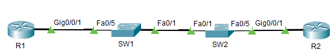
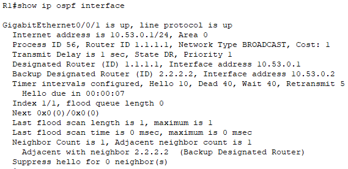
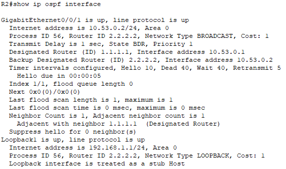
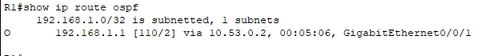
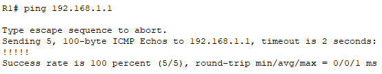
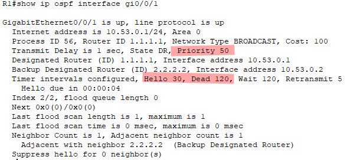
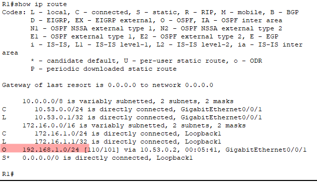

# ЛР 10. Настройка протокола OSPFv2 для одной области

## 1. Цели работы

Часть 1. Создание сети и настройка основных параметров устройства

Часть 2. Настройка и проверка базовой работы протокола  OSPFv2 для одной области

Часть 3. Оптимизация и проверка конфигурации OSPFv2 для одной области


## 2. Топология сети



Рисунок 1. Топология сети

## 3. Таблица адресации

| Устройство | Интерфейс | IP адрес | Маска подсети |
| :-------------: | :------------- | :--: | :--: |
| R1 | G0/0/1 | 10.53.0.1 | 255.255.255.0  |
| R1 | Loopback1 | 172.16.1.1 | 255.255.255.0 |
| R2 | G0/0/1 | 10.53.0.2 | 255.255.255.0 |
| R2 | Loopback1 | 192.168.1.1 | 255.255.255.0 |


## 4. Выполнение работы


### Часть 1. Создание сети и настройка основных параметров устройства


#### Шаг 1. Создайте сеть согласно топологии

Собранная схема представлена на рисунке 1.

#### Шаг 2. Произведите базовую настройку маршрутизаторов

Настройка R1:

```
hostname R1
no ip domain-lookup 
enable secret class

banner motd "This is R1"

line console 0
exec-timeout 0 0
password cisco
logging synchronous 
login

line vty 0 4
password cisco
exec-timeout 0 0
transport input ssh 
login
```

Настройка R2:

```
hostname R2
no ip domain-lookup 
enable secret class

banner motd "This is R2"

line console 0
exec-timeout 0 0
password cisco
logging synchronous 
login

line vty 0 4
password cisco
exec-timeout 0 0
transport input ssh 
login
```

#### Шаг 3. Настройте базовые параметры каждого коммутатора

Настройка S1:

```
hostname S2
no ip domain-lookup 
enable secret class

banner motd "This is S2"

line console 0
exec-timeout 0 0
password cisco
logging synchronous 
login

line vty 0 4
password cisco
exec-timeout 0 0
transport input ssh 
login

```

Настройка S1:

```
hostname S2
no ip domain-lookup 
enable secret class

banner motd "This is S2"

line console 0
exec-timeout 0 0
password cisco
logging synchronous 
login

line vty 0 4
password cisco
exec-timeout 0 0
transport input ssh 
login

```


### Часть 2. Настройка и проверка базовой работы протокола OSPFv2 для одной области

#### Шаг 1. Настройте адреса интерфейса и базового OSPFv2 на каждом маршрутизаторе

Настройки R1:

```
interface gi0/0/1
ip address 10.53.0.1 255.255.255.0
no shutdown 

interface loopback 1
ip address 172.16.1.1 255.255.255.0
no shutdown

router ospf 56
router-id 1.1.1.1
network 10.53.0.0 0.0.0.255 area 0
```


Настройки R2:

```
interface gi0/0/1
ip address 10.53.0.2 255.255.255.0
no shutdown 

interface loopback 1
ip add 192.168.1.1 255.255.255.0
no shutdown

router ospf 56
router-id 2.2.2.2
network 10.53.0.0 0.0.0.255 area 0
network 192.168.1.0 0.0.0.255 area 0
```

Результат команды `show ip ospf interface` на маршрутизаторах:





**Вопрос**. Какой маршрутизатор является DR? Какой маршрутизатор является BDR? Каковы критерии отбора?

**Ответ**. Маршрутизатора R1 стал DR, а R2 стал BDR. Выбор осущестлялся по RouterID. У R1 RouterID равен 1.1.1.1, а у R2 2.2.2.2


Результат команды `show ip route ospf` на маршрутизаторе R1. По OSPF получена инфомрацию о сети на Loopback интерфейса R2.



Проверка доступности Loopback интерфейса с R1:



Доступ есть.

### Часть 3. Оптимизация и проверка конфигурации OSPFv2 для одной области


#### Шаг 1. Реализация различных оптимизаций на каждом маршрутизаторе
Настрйока R1:

```
int gi0/0/1
ip ospf priority 50
ip ospf hello-interval 30
ip ospf dead-interval 120

ip route 0.0.0.0 0.0.0.0 loopback 1

route ospf 56
default-information originate
auto-cost reference-bandwidth 10000

clear ip ospf proc
```

Настройки R2:

```
int gi0/0/1
ip ospf hello-interval 30
ip ospf dead-interval 120

route ospf 56
passive-interface lo1
auto-cost reference-bandwidth 10000

clear ip ospf proc
```


#### Шаг 2. Убедитесь, что оптимизация OSPFv2 реализовалась

Результат команды `show ip ospf interface gi0/0/1` на R1:



Приоритет равен 50, таймеры 30/120

Так как в `show ip route ospf` маршрут до Loopback R2 был без маски указан, приложен скриншот команды `show ip route`, где видно, что сеть Loopback интерфейса с маской 24 представлена.

