# ЛР 11. Настройка и проверка расширенных списков контроля доступа

## 1. Цели работы

Часть 1. Создание сети и настройка основных параметров устройства

Часть 2. Настройка и проверка списков расширенного контроля доступа


## 2. Топология сети

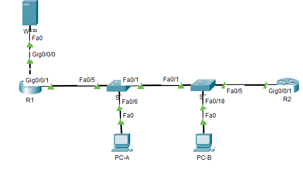

Рисунок 1. Топология сети

## 3. Таблица адресации

| Устройство | Интерфейс | IP адрес | Маска подсети | Шлюз по умолчанию |
| :--------: | :-------- | :------: | :-----------: | :---------------: |
| R1 | G0/0/0 | 10.50.0.1 | 255.255.255.0 | - |
| R1 | G0/0/1 | - | - | - |
| R1 | G0/0/1.20 | 10.20.0.1 | 255.255.255.0 | - |
| R1 | G0/0/1.30 | 10.30.0.1 | 255.255.255.0 | - |
| R1 | G0/0/1.40 | 10.40.0.1 | 255.255.255.0 | - |
| R1 | G0/0/1.1000 | - | - | - |
| R1 | Loopback1 | 172.16.1.1 | - | - |
| R2 | G0/0/1 | 10.20.0.4 | 255.255.255.0 | - |
| S1 | VLAN 20 | 10.20.0.2 | 255.255.255.0 | 10.20.0.1 |
| S2 | VLAN 20 | 10.20.0.3 | 255.255.255.0 | 10.20.0.1 |
| PC-A | NIC | 10.30.0.10 | 255.255.255.0 | 10.30.0.1 |
| PC-B | NIC | 10.40.0.10 | 255.255.255.0 | 10.40.0.1 |
| WEB | NIC | 10.50.0.2 | 255.255.255.0 | 10.50.0.1 |


## 3. Таблица VLAN

| VLAN | Имя | Назначенный интерфейс |
| :--------: | :-------- | :------ |
| 20 | Management | S2: F0/5 |
| 30 | Operations | S1: F0/6 |
| 40 | Sales | S2: F0/18 |
| 999 | ParkingLot | <div>S1: F0/2-4, F0/7-24, G0/1-2</div> <div>S2: F0/2-4, F0/6-17, F0/19-24, G0/1-2</div> |
| 1000 | Собственная | - |

## 5. Выполнение работы

### Часть 1. Создание сети и настройка основных параметров устройства

#### Шаг 1. Создайте сеть согласно топологии

Собранная схема представлена на рисунке 1.

#### Шаг 2. Произведите базовую настройку маршрутизаторов

Настройка R1

```
no ip domain-lookup 
hostname R1
enable secret class

line vty 0 4
password cisco
transport input ssh 
login

line console 0
exec-timeout 0 0
logging synchronous 
login

service password-encryption 
banner motd " This is R1 "

do wr
```

Настройка R2

```
no ip domain-lookup 
hostname R2
enable secret class

line vty 0 4
password cisco
transport input ssh 
login

line console 0
exec-timeout 0 0
logging synchronous 
password cisco
login

service password-encryption 
banner motd " This is R2 "

do wr
```


#### Шаг 3. Настройте базовые параметры каждого коммутатора

Настройка S1

```
no ip domain-lookup 
hostname S1
enable secret class

line vty 0 4
password cisco
transport input ssh 
login

line console 0
exec-timeout 0 0
logging synchronous 
password cisco
login

service password-encryption 
banner motd " This is S1 "

do wr
```

Настройка S2

```
no ip domain-lookup 
hostname S2
enable secret class

line vty 0 4
password cisco
transport input ssh 
login

line console 0
exec-timeout 0 0
logging synchronous 
password cisco
login

service password-encryption 
banner motd " This is S2 "

do wr
```

### Часть 2. Настройка сетей VLAN на коммутаторах

#### Шаг 1. Создайте сети VLAN на коммутаторах

Настройка S1:

```
vlan 20
name Management
vlan 30
name Operations
vlan 40
name Sales
vlan 999
name ParkingLot
vlan 1000
name Native

interface vlan 20
ip address 10.20.0.2 255.255.255.0

ip default-gateway 10.20.0.1

int range fa0/2-4,fa0/7-24,gi0/1-2
switchport mode access 
switchport access vlan 999
shutdown
```

Настройка S2:

```
vlan 20
name Management
vlan 30
name Operations
vlan 40
name Sales
vlan 999
name ParkingLot
vlan 1000
name Native
int vlan 20

interface vlan 20
ip address 10.20.0.3 255.255.255.0

ip default-gateway 10.20.0.1

int range fa0/2-4,fa0/6-17,fa0/19-24,gi0/1-2
switchport mode access 
switchport access vlan 999
shutdown
```


#### Шаг 2. Назначьте сети VLAN соответствующим интерфейсам коммутатора

Настройка S1:

```
int fa0/6
switchport mode access 
switchport access vlan 30
```


Настройка S2:

```
int fa0/5
switchport mode access
switchport access vlan 20

int fa0/18
switchport mode access 
switchport access vlan 40
```

Результат команды `do show vlan brief на S1`:

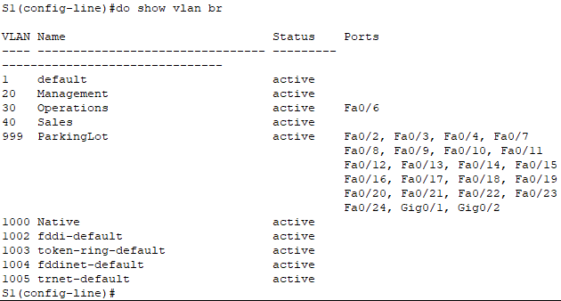

Результат команды `do show vlan brief на S2`:

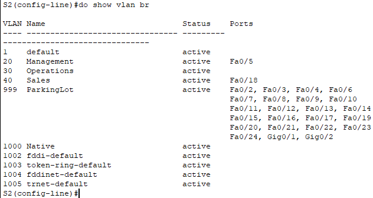

### Часть 3. Настройте транки (магистральные каналы)

#### Шаг 1. Вручную настройте магистральный интерфейс F0/1

Настройка S1 и S2:
```
int fa0/1
switchport mode trunk 
switchport trunk allowed vlan 20,30,40
switchport trunk native vlan 1000
```

Результат команды `show interface trunk на S1`:

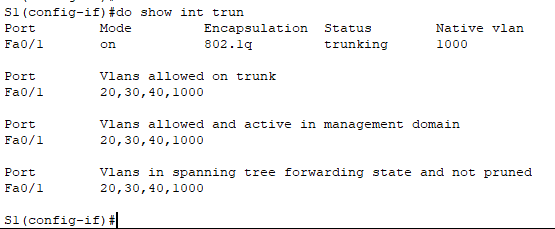

Результат команды `show interface trunk на S2`:

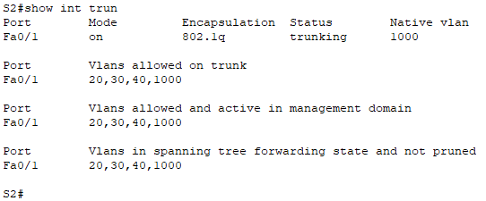

#### Шаг 2. Вручную настройте магистральный интерфейс F0/5 на коммутаторе S1

```
int fa0/5
switchport mode trunk
switchport trunk allowed vlan 20,30,40
switchport trunk native vlan 1000
```

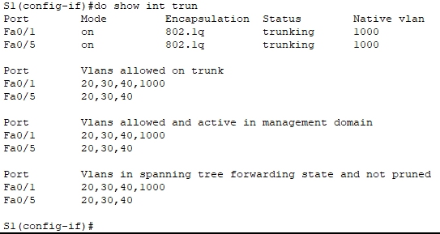

### Часть 4. Настройте маршрутизацию

#### Шаг 1. Настройка маршрутизации между сетями VLAN на R1

```
int gi0/0/1
no shutdown

int gi0/0/1.20
encapsulation dot1Q 20
ip address 10.20.0.1 255.255.255.0
description Management

int gi0/0/1.30
encapsulation dot1Q 30
ip address 10.30.0.1 255.255.255.0
description Operations

int gi0/0/1.40
encapsulation dot1Q 40
ip address 10.40.0.1 255.255.255.0
description Sales

int gi0/0/1.1000
encapsulation dot1Q 1000 native
description Native

interface loopback 1
ip address 172.16.1.1 255.255.255.0
```

Результат команды `show ip interface brief` на R1:

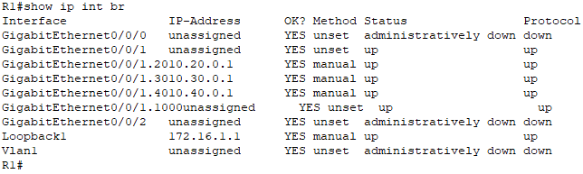

#### Шаг 2. Настройка интерфейса R2 g0/0/1 с использованием адреса из таблицы и маршрута по умолчанию с адресом следующего перехода 10.20.0.1

```
int gi0/0/1
ip address 10.20.0.4 255.255.255.0
no shutdown

ip route 0.0.0.0 0.0.0.0 10.20.0.1
```

### Часть 5. Настройте удаленный доступ

#### Шаг 1. Настройте все сетевые устройства для базовой поддержки SSH

Настройка R1, R2, S1, S2:
```
ip domain name ccna-lab.com 
username SSHadmin password $cisco123!
crypto key generate rsa general-keys modulus 1024
ip ssh version 2

line vty 0 4
login local
```

#### Шаг 2. Включите защищенные веб-службы с проверкой подлинности на R1

В Packet Tracer не удалось найти такие команды. Вместо этого в схему установлен WEB сервер, который подлючается к R1 gi0/0/0 и имеет адрес 10.50.0.2/24.

### Часть 6. Проверка подключения

#### Шаг 1. Настройте узлы ПК

ПК настроены в соответствии с заданием

#### Шаг 2. Выполните следующие тесты. Эхозапрос должен пройти успешно

Пинг с PC-A адреса 10.40.0.10

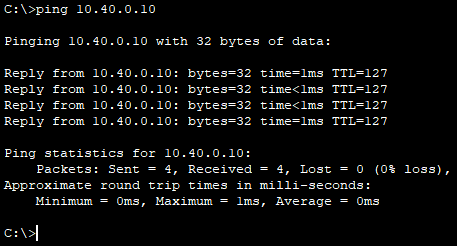

Пинг с PC-A адреса 10.20.0.1

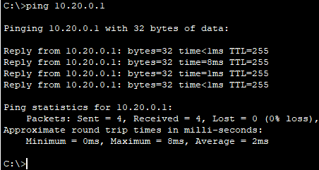

Пинг с PC-B адреса 10.30.0.10

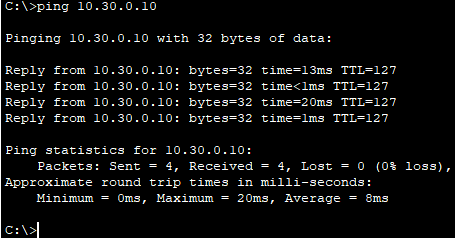

Пинг с PC-B адреса 10.20.0.1

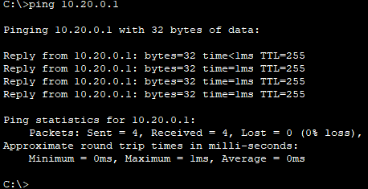

Пинг с PC-B адреса 172.16.1.1

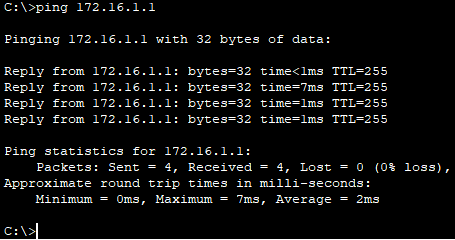

SSH с PC-B адреса 10.20.0.1

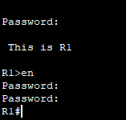

SSH с PC-B адреса 172.16.1.1


### Часть 7. Настройка и проверка списков контроля доступа (ACL)

#### Шаг 1. Проанализируйте требования к сети и политике безопасности для планирования реализации ACL

Правила касаются сетей SALES и OPERATIONS, поэтому будет 2 отдельных списка, которые будут применены к нужным подинтерфейсам на R1. Списки должны быть расширенные, так как необходима тонкая фильтрация трафика. Политика будет IN, чтобы маршрутизатор не тратил время на поиск по таблице маршрутизации адреса назначения, а сразу отрезал трафик.

#### Шаг 2. Разработка и применение расширенных списков доступа, которые будут соответствовать требованиям политики безопасности

Список для SALES сети:

```
ip access-list extended SALES-RULES

remark Block access for SALES to MANAGEMENT via SSH
deny tcp 10.40.0.0 0.0.0.255 10.20.0.0 0.0.0.255 eq 22

remark Block access for SALES to MANAGEMENT and WEB SERVER via HTTP/HTTPS
deny tcp 10.40.0.0 0.0.0.255 10.20.0.0 0.0.0.255 eq www
deny tcp 10.40.0.0 0.0.0.255 10.20.0.0 0.0.0.255 eq 443
deny tcp 10.40.0.0 0.0.0.255 10.50.0.0 0.0.0.255 eq www
deny tcp 10.40.0.0 0.0.0.255 10.50.0.0 0.0.0.255 eq 443

remark Block access for SALES to HTTP/HTTPS R1
deny tcp 10.40.0.0 0.0.0.255 host 10.30.0.1 eq www
deny tcp 10.40.0.0 0.0.0.255 host 10.30.0.1 eq 443
deny tcp 10.40.0.0 0.0.0.255 host 10.40.0.1 eq www
deny tcp 10.40.0.0 0.0.0.255 host 10.40.0.1 eq 443

remark Block ICMP traffic from SALES to OPERATIONS or to MANAGEMENT
deny icmp 10.40.0.0 0.0.0.255 10.20.0.0 0.0.0.255
deny icmp 10.40.0.0 0.0.0.255 10.30.0.0 0.0.0.255

permit ip any any
```

Список для сети OPERATIONS:

```
ip access-list extended OPERATIONS-RULES

remark Block ICMP from OPERATIONS to SALES
deny icmp 10.30.0.0 0.0.0.255 10.40.0.0 0.0.0.255

permit ip any any
```

Применение правил

```
int gi0/0/1.30
ip access-group OPERATIONS-RULES in

int gi0/0/1.40
ip access-group SALES-RULES in
```


#### Шаг 3. Убедитесь, что политики безопасности применяются развернутыми списками доступа

Пинг с PC-A на адрес 10.40.0.10 - **СБОЙ**

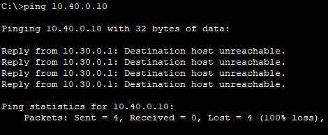

Пинг с PC-A на адрес 10.20.0.1 - **УСПЕХ**


Пинг с PC-В на адрес 10.30.0.10 - **СБОЙ**

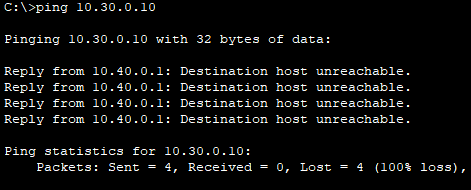

Пинг с PC-В на адрес 10.20.0.1 - **СБОЙ**

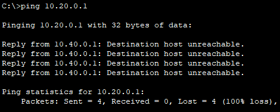

Пинг с PC-В на адрес 172.16.1.1 - **УСПЕХ**


Доступ через браузер на WEB сервер (10.50.0.2) с PC-B - **СБОЙ**

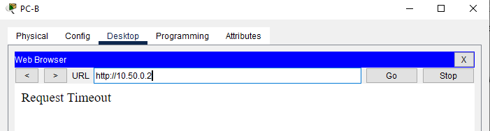

Так как на самом R1 нет WEB севера, следующим шагом сделана не проверка доступа с PC-B на 172.16.1.1, а доступ на WEB сервер с PC-A
Доступ через браузер на WEB сервер с PC-A - **УСПЕХ**

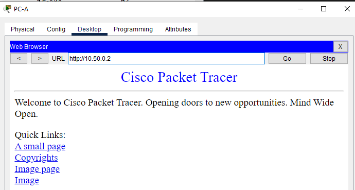

Доступ через SSH с PC-B на 10.20.0.4 - **СБОЙ**

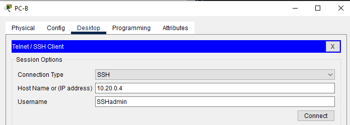

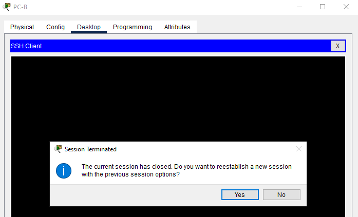

Доступ через SSH с PC-B на 172.16.1.1 - **УСПЕХ**

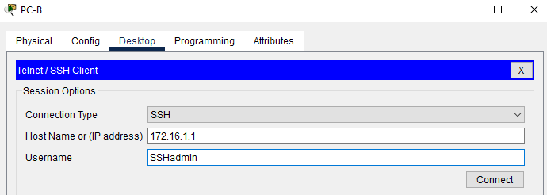

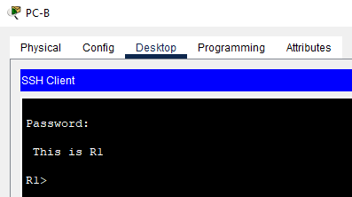