# ЛР 12. Настройка NAT для IPv4

## 1. Цели работы

Часть 1. Создание сети и настройка основных параметров устройства

Часть 2. Настройка и проверка NAT для IPv4

Часть 3. Настройка и проверка PAT для IPv4

Часть 4. Настройка и проверка статического NAT для IPv4

## 2. Топология сети

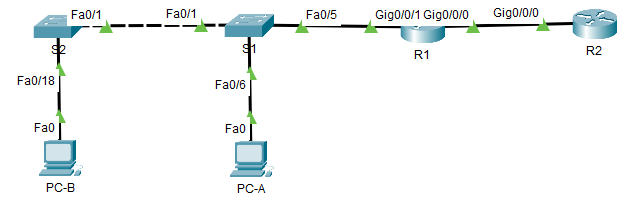

Рисунок 1. Топология сети

## 3. Таблица адресации

| Устройство | Интерфейс | IP адрес | Маска подсети |
| :--------: | :-------- | :------: | :-----------: |
| R1 | G0/0/0 | 209.165.200.230 | 255.255.255.248 | 
| R1 | G0/0/1 | 192.168.1.1 | 255.255.255.0 | 
| R2 | G0/0/0 | 209.165.200.225 | 255.255.255.248 | 
| R2 | Lo1 | 209.165.200.1 | 255.255.255.224 | 
| S1 | VLAN 1 | 192.168.1.11 | 255.255.255.0 | 
| S2 | VLAN 1 | 192.168.1.12 | 255.255.255.0 | 
| PC-A | NIC | 192.168.1.2 | 255.255.255.0 | 
| PC-B | NIC | 192.168.1.3 | 255.255.255.0 | 


## 4. Выполнение работы

### Часть 1. Создание сети и настройка основных параметров устройства

#### Шаг 1. Подключите кабели сети согласно приведенной топологии

Собранная схема представлена на рисунке 1.

#### Шаг 2. Произведите базовую настройку маршрутизаторов

Настройка R1:

```
hostname R1
no ip domain-lookup
enable secret class

line console 0
exec-timeout 0 0
password cisco
login

line vty 0 4
password cisco
transport input ssh 

service password-encryption
banner motd "This is R1"

int gi0/0/0
ip address 209.165.200.230 255.255.255.248
int gi0/0/1
ip address 192.168.1.1 255.255.255.0

ip route 0.0.0.0 0.0.0.0 209.165.200.225

do wr
```


Настройка R1:

```
hostname R2
no ip domain-lookup
enable secret class

line console 0
exec-timeout 0 0
password cisco
login

line vty 0 4
password cisco
transport input ssh 

service password-encryption
banner motd "This is R2"

int gi0/0/0
ip address 209.165.200.225 255.255.255.248
int loopback 1
ip address 209.165.200.1 255.255.255.224

ip route 0.0.0.0 0.0.0.0 209.165.200.230 

do wr
```

#### Шаг 3. Настройте базовые параметры каждого коммутатора

Настройка S1:

```
hostname S1
no ip domain-lookup
enable secret class

line console 0
exec-timeout 0 0
password cisco
login

line vty 0 4
password cisco
transport input ssh 

service password-encryption
banner motd "This is S1"

int range fa0/2-4,fa0/7-24,gi0/1-2
shutdown

interface vlan 1
ip address 192.168.1.11 255.255.255.0
no shutdown

ip default-gateway 192.168.1.1
```

Настройка S2:

```
hostname S2
no ip domain-lookup
enable secret class

line console 0
exec-timeout 0 0
password cisco
login

line vty 0 4
password cisco
transport input ssh 

service password-encryption
banner motd "This is S2"

int range fa0/2-17,fa0/19-24,gi0/1-2
shutdown

interface vlan 1
ip address 192.168.1.12 255.255.255.0
no shutdown

ip default-gateway 192.168.1.1
```

### Часть 2. Настройка и проверка NAT для IPv4

#### Шаг 1. Настройте NAT на R1, используя пул из трех адресов 209.165.200.226-209.165.200.228

Настройка R1:

```
access-list 1 permit 192.168.1.0 0.0.0.255
ip nat pool PUBLIC_ACCESS 209.165.200.226 209.165.200.228 netmask 255.255.255.248
ip nat inside source list 1 pool PUBLIC_ACCESS
interface g0/0/1
ip nat inside
interface g0/0/0
ip nat outside
```

#### Шаг 2. Проверьте и проверьте конфигурацию

Ping с PC-B до Lo1 R2 прошел успешно:

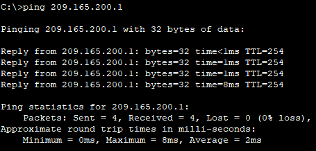

Результат команды `show ip nat translations` на R1:

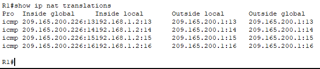

**Вопрос**. Во что был транслирован внутренний локальный адрес PC-B?

**Ответ**. Внутренний адрес был преобразован в 209.165.200.226 - один из белых адресов из пула PUBLIC_ACCESS


Ping с PC-A до Lo1 R2 прошел успешно:

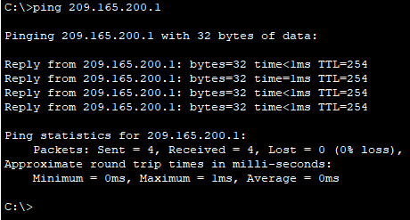

Результат команды `show ip nat translations` на R1:

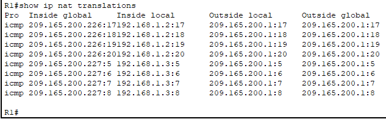

Адрес для PC-A уже поменялся, стал вторым доступным из пула PUBLIC_ACCESS. Ping с S1 до Lo1 R2 прошел успешно:

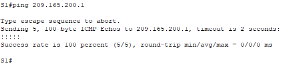

Результат команды `show ip nat translations` на R1:

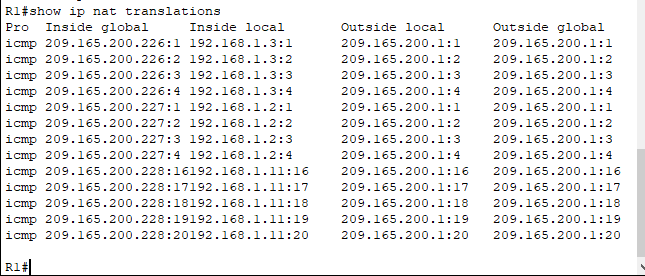

Теперь и третий адрес из пула PUBLIC_ACCESS используется. Ping с S2 до Lo1 R2 не прошел:

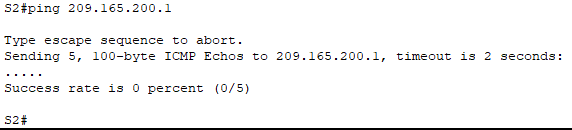

Очищена таблица преобразований:
```
clear ip nat translation *
```


### Часть 3. Настройка и проверка PAT для IPv4

#### Шаг 1. Удалите команду преобразования на R1

```
no ip nat inside source list 1 pool PUBLIC_ACCESS 
```

#### Шаг 2. Добавьте команду PAT на R1

```
ip nat inside source list 1 pool PUBLIC_ACCESS overload 
```

#### Шаг 3. Протестируйте и проверьте конфигурацию

Ping с PC-B о Lo1 R2 прошел успешно. Таблица NAT:

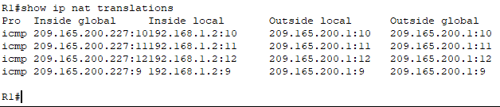

**Вопрос**. Во что был транслирован внутренний локальный адрес PC-B?

**Ответ**. Адрес РС-В транслирован в адрес 209.165.200.227

Ping с PC-A о Lo1 R2 прошел успешно. Таблица NAT:

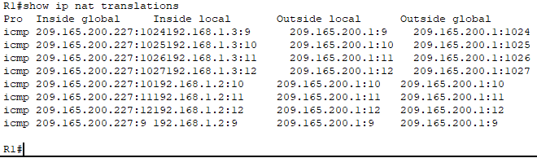

Ping с S1 о Lo1 R2 прошел успешно. Таблица NAT:

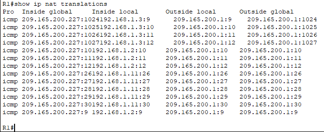

Ping с S2 о Lo1 R2 прошел успешно. Таблица NAT:

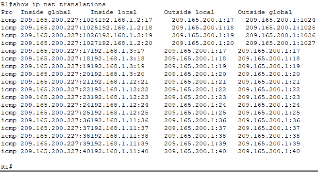

Все 4 устройства смогли пропинговать Lo1 R2. Inside Global адрес у них у всех одинаковый 209.165.200.227, отличается лишь порт.

**Вопросы**. Как маршрутизатор отслеживает, куда идут ответы? 

**Ответ**. В таблице NAT присутствует порт, который закреплен за нужнм хостом в локальной сети. По DST Port удается найти устройство, которое должно получить пакет, пришедший из другой сети.

#### Шаг 4. На R1 удалите команды преобразования nat pool

```
no ip nat inside source list 1 pool PUBLIC_ACCESS overload 
no ip nat pool PUBLIC_ACCESS
```

#### Шаг 5. Добавьте команду PAT overload, указав внешний интерфейс

```
ip nat inside source list 1 interface g0/0/0 overload 
```

#### Шаг 6. Протестируйте и проверьте конфигурацию

Пинк с PC-B на Lo1 R2 прошел успешно. Таблица NAT:

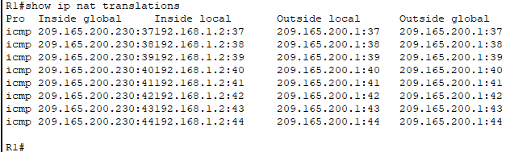

Одновременный пинг Lo1 R2 с PC-A, PC-B, S1, S2 прошел успешно. Таблица NAT:

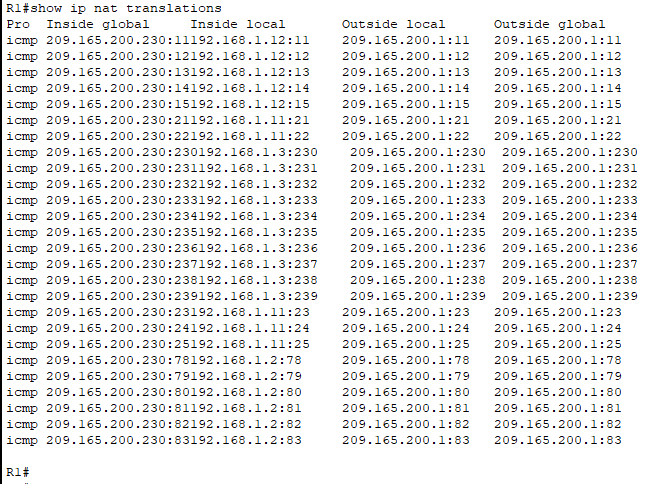

IP адрес в Inside Global соответствует IP адресу интерфейса R1, через который пакеты выходят за пределы своей локальной сети.

### Часть 4. Настройка и проверка статического NAT для IPv4

#### Шаг 1. На R1 очистите текущие трансляции и статистику

```
clear ip nat translations * 
```

#### Шаг 2. На R1 настройте команду NAT, необходимую для статического сопоставления внутреннего адреса с внешним адресом

```
ip nat inside source static 192.168.1.2 209.165.200.229
```

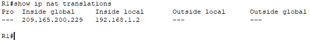

#### Шаг 3. Протестируйте и проверьте конфигурацию

Пинг с R2 на 209.165.200.229 выполнен успешно:

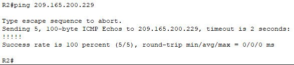

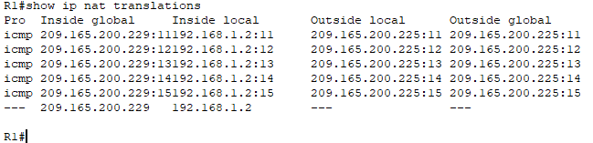

После R1 пакет направляется к РС-А, у которого адрес 192.168.1.2

