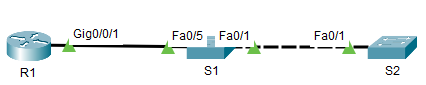
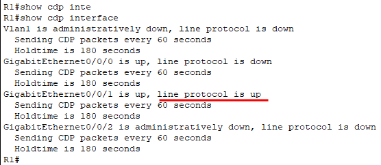
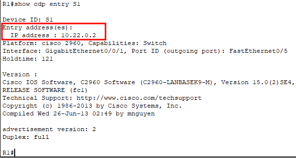
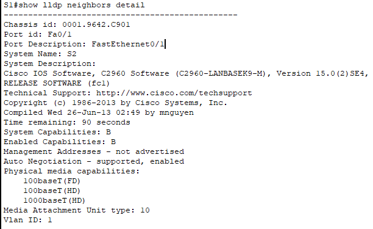
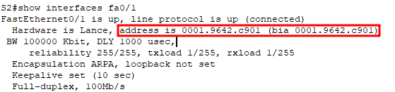
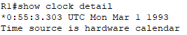
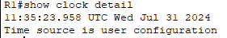
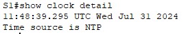
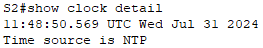

# ЛР 13. Настройка протоколов CDP, LLDP и NTP

## 1. Цели работы

Часть 1. Создание сети и настройка основных параметров устройства

Часть 2. Обнаружение сетевых ресурсов с помощью протокола CDP

Часть 3. Обнаружение сетевых ресурсов с помощью протокола LLDP

Часть 4. Настройка и проверка NTP


## 2. Топология сети



Рисунок 1. Топология сети

## 3. Таблица адресации

| Устройство | Интерфейс | IP адрес | Маска подсети | Шлюз по умолчанию |
| :--------: | :-------- | :------: | :-----------: | :-----------: |
| R1 | Loopback1 | 172.16.1.1 | 255.255.255.0 |  |
| R1 | G0/0/1 | 10.22.0.1 | 255.255.255.0 |  |
| S1 | SVI VLAN 1  | 10.22.0.2 | 255.255.255.0 | 10.22.0.1 |
| S2 | SVI VLAN 1 | 10.22.0.3 | 255.255.255.0 | 10.22.0.1 |


## 4. Выполнение работы

### Часть 1. Создание сети и настройка основных параметров устройства

#### Шаг 1. Создайте сеть согласно топологии.

Собранная схема представлена на рисунке 1.

#### Шаг 2. Настройте базовые параметры для маршрутизатора.

Настройка R1:

```
hostname R1
no ip domain-lookup
enable secret class

line console 0
exec-timeout 0 0
password cisco
login

line vty 0 4
password cisco
transport input ssh 

service password-encryption
banner motd "This is R1"

interface loopback 1
ip address 172.16.1.1 255.255.255.0

interface gi0/0/1
ip address 10.22.0.1 255.255.255.0

do wr
```

#### Шаг 3. Настройте базовые параметры каждого коммутатора.

Настройка S1:

```
hostname S1
no ip domain-lookup
enable secret class

line console 0
exec-timeout 0 0
password cisco
login

line vty 0 4
password cisco
transport input ssh 

service password-encryption
banner motd "Only authorized users!"

int range fa0/2-4,fa0/6-24,gi0/1-2
shutdown

interface vlan 1
ip address 10.22.0.2 255.255.255.0
no shutdown

ip default-gateway 10.22.0.1

do wr
```

Настройка S2:

```
hostname S2
no ip domain-lookup
enable secret class

line console 0
exec-timeout 0 0
password cisco
login

line vty 0 4
password cisco
transport input ssh 

service password-encryption
banner motd "Only authorized users!"

int range fa0/2-24,gi0/1-2
shutdown

interface vlan 1
ip address 10.22.0.3 255.255.255.0
no shutdown

ip default-gateway 10.22.0.1

do wr
```


### Часть 2. Обнаружение сетевых ресурсов с помощью протокола CDP

На R1 выполнена команда `show cdp interface`. На данный момент только на 1 порту gi0/0/1, через которй подключается S1, работает CDP:



**Вопрос**. Сколько интерфейсов участвует в объявлениях CDP? Какие из них активны?

**Ответ**. На данный момент только 1 порт R1 участвует в рассылке CDP сообщение - Gi0/0/1.


Результат команды `show cdp entry S1`. У S1 в качестве IOS используется Cisco IOS Software, C2960 Software (C2960-LANBASEK9-M), Version 15.0(2)SE4, RELEASE SOFTWARE (fc1):


Команды `show cdp traffic` нет в CPT.

После создания SVI на S1 в выводе `show cdp entry S1` появился IP адрес S1:



На каждом устройстве отключен CDP:

```
no cdp run 
```

### Часть 3. Обнаружение сетевых ресурсов с помощью протокола LLDP

На каждом устройстве включен протокол LLDP:

```
lldp run 
```

В CPT нет команды `show lldp entry`, поэтому информация по S2 взята из вывода команды `show lldp neighbors detail`:



**Вопрос**. Что такое chassis ID  для коммутатора S2?

**Ответ**. Это MAC адрес интерфейса Fa0/1 S2. Скриншот выполненной каманды `show interface fa0/1` на S2:



### Часть 4. Настройка NTP

#### Шаг 1. Выведите на экран текущее время.

Результат команды `show clock detail` на R1:



| Дата | Время | Часовой пояс | Источник времени |
| :---: | :---: | :---: | :---: |
| Mar 1 1993 | *0:54:35.822 |  | hardware calendar |

#### Шаг 2. Установите время.

На R1 вручную установлено время: 

```
clock set 11:35:00 july 31 2024 
```



#### Шаг 3. Настройте главный сервер NTP.

Настройка R1 в качестве NTP сервера с уровнем слоя 4:

```
ntp master 4
```

#### Шаг 4. Настройте клиент NTP.

| Устройство | Дата | Время | Часовой пояс | Источник времени |
| :---: | :---: | :---: | :---: | :---: |
| S1 | Mar 1 1993 | *1:3:10.808 |  | hardware calendar |
| S2 | Mar 1 1993 | *1:3:29.714 |  | hardware calendar |

На S1 и S2 настроен NTP Client. В качестве NTP сервера указан R1 (10.22.0.1):

```
ntp server 10.22.0.1 
```

#### Шаг 5. Проверьте настройку NTP.

Результат команды `show clock detail` на S1:



Результат команды `show clock detail` на S2:



Теперь время на коммутаторах синхронизируется с R1.

**Вопрос**. Для каких интерфейсов в пределах сети не следует использовать протоколы обнаружения сетевых ресурсов? Поясните ответ.

**Ответ**. С точки зрения безопасности не следует использовать данные протоколы на интерфейсах, за которыми находятся нам неподконтрольные устройства, например, клиентские PC или же оборудование оператора связи. Это поможет повысить безопасность нашего сетевого оборудования.