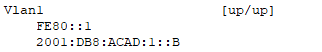
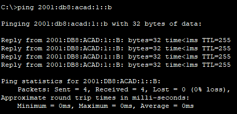

# ЛР 4. Настройка IPv6-адресов на сетевых устройствах

## 1. Цели работы

Часть 1. Настройка топологии и конфигурация основных параметров маршрутизатора и коммутатора    
Часть 2. Ручная настройка IPv6-адресов     
Часть 3. Проверка сквозного соединения


## 2. Топология сети
Топология сети для данной работы представлена на рисунке 1.

           
Рисунок 1. Топология сети

## 3. Таблица адресации

| Устройство | Интерфейс | IPv6 адрес | Длина префикса | Шлюз по умолчанию |
| :-------------: | :-------------: | :--: | :--: |  :--: |
| R1 | G0/0/0 | 2001:db8:acad:a::1 | 64 |  |
| R2 | G0/0/1 | 2001:db8:acad:1::1  | 64 |  |
| S1 | VLAN 1 | 2001:db8:acad:1::b | 64 |  |
| PC-A | NIC | 2001:db8:acad:1::3 | 64 | fe80::1 |
| PC-B | NIC | 2001:db8:acad:a::3 | 64 | fe80::1 |

## 4. Выполнение работы


**Часть 1. Настройка топологии и конфигурация основных параметров маршрутизатора и коммутатора**

Базовая настройка коммутатора S1:

```
sdm prefer dual-ipv4-and-ipv6 default

no ip domain-lookup
hostname S1
enable secret cisco

banner motd #This is S1#

line console 0
password pass

line vty 0 4
password pass
login
transport input telnet

service password-encryption
```

Базовая настройка маршрутизатора R1:

```
no ip domain-lookup
hostname R1
enable secret cisco

banner motd #This is R1#

line console 0
password pass

line vty 0 4
password pass
login
transport input telnet

service password-encryption
```

**Часть 2. Ручная настройка IPv6-адресов**

**Шаг 1. Назначьте IPv6-адреса интерфейсам Ethernet на R1.**
- Назначение адресов на R1:

```
int g0/0/0
ipv6 address 2001:db8:acad:a::1/64
ipv6 address fe80::1 link-local
no shutdown

int g0/0/1
ipv6 address 2001:db8:acad:1::1/64
ipv6 address fe80::1 link-local
no shutdown
```

Вывод команды ```show ipv6 interface brief```   
   

Адреса из задания присвоены нужным интерфейсам


**Шаг 2. Активируйте IPv6-маршрутизацию на R1.**
- Проверка IPv6 адреса на РС-В

   

У R1 есть локальный адрес, начинающийся на ```FE80::```
- Активируем IPv6 маршрутизацию на R1:

```
ipv6 unicast-routing 
```

- После указания автоматического получения IPv6 адреса на РС-В, он получил следующий адрес:

   

Префикс подсети совпадает с префиксом, который настраивали на маршрутизаторе на порту g0/0/0 
```2001:DB8:ACAD:A::/64```. Адрес хоста сформирован через алгоритм **EUI-64**, который выделяется по комбинации **FF:FE** в середине идентификатора интерфейса.

**Вопрос**. Почему PC-B получил глобальный префикс маршрутизации и идентификатор подсети, которые вы настроили на R1?           
**Ответ**. При подключении к сети РС-В он сделал запрос **Router Solicitation (RS)** по протоколу **NDP**, а роутер ему ответил сообщением **Router Advertisement (RA)**, указав свой адрес и префикс сети


**Шаг 3. Назначьте IPv6-адреса интерфейсу управления (SVI) на S1.**

На VLAN 1 S1 назначены адреса

```
interface vlan 1
ipv6 address 2001:db8:acad:1::b/64
ipv6 address fe80::1 link-local
no shutdown
```

   

**Шаг 4. Назначьте компьютерам статические IPv6-адреса.**

После назначения статического адреса на интерфейсе каждого из PC получаем в выводе ipconfig следующую информацию.

РС-А        
 

РС-В    
 

Адреса соответствуют тем, которые были заданы на интерфейсе

**Часть 3. Проверка сквозного подключения**

Пинг ``FE80::1`` с РС-А               
   

Пинг S1 с РС-А           
 

Tracert с PC-A до PC-B           
   

Пинг ```FE80::1``` с РС-B          
   

Tracert с PC-B до PC-A          
  

Тесты сквозного подключения прошли успешно, все устройства могут общаться друг с другом по протоколу IPv6

**Вопросы для повторения**        

**Вопрос**. Почему обоим интерфейсам Ethernet на R1 можно назначить один и тот же локальный адрес канала — FE80::1?           
**Ответ**. Локальные адреса существуют лишь в рамках данной подсети и не маршрутизирутся.

**Вопрос**. Какой идентификатор подсети в индивидуальном IPv6-адресе 2001:db8:acad::aaaa:1234/64?     
**Ответ**. 2001:db8:acad::/64