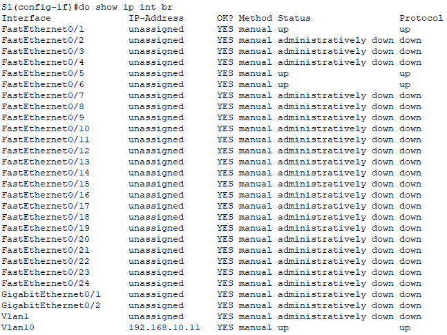
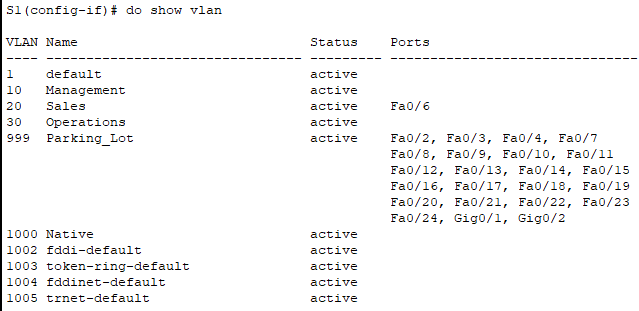
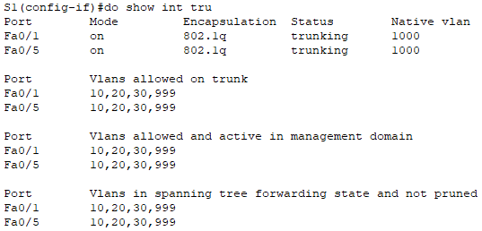
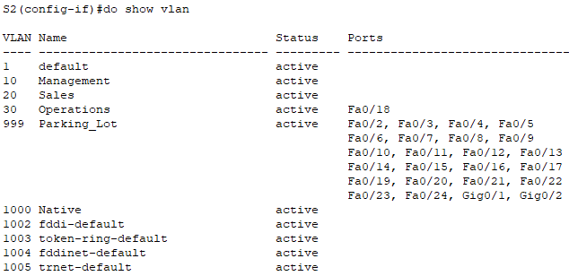
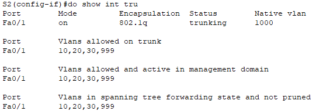
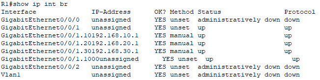
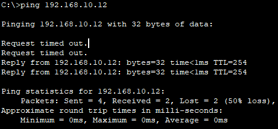

# ЛР 6. Внедрение маршрутизации между виртуальными локальными сетями

## 1. Цели работы

Часть 1. Создание сети и настройка основных параметров устройства     
Часть 2. Создание сетей VLAN и назначение портов коммутатора    
Часть 3. Настройка транка 802.1Q между коммутаторами    
Часть 4. Настройка маршрутизации между сетями VLAN     
Часть 5. Проверка, что маршрутизация между VLAN работает    
   

## 2. Топология сети

           
Рисунок 1. Топология сети


## 3. Таблица адресации

| Устройство | Интерфейс | IP адрес | Маска подсети | Шлюз по умолчанию |
| :-------------: | :------------- | :--: | :--: |  :--: |
| R1 | G0/0/1.10 | 192.168.10.1 |  255.255.255.0 | --- |
| R1 | G0/0/1.20 | 192.168.20.1 |  255.255.255.0 | --- |
| R1 | G0/0/1.30 | 192.168.30.1 |  255.255.255.0 | --- |
| R1 | G0/0/1.1000 | --- |  255.255.255.0 | --- |
| S1 | VLAN 10 | 192.168.10.11  |  255.255.255.0 | 192.168.10.1 |
| S2 | VLAN 10 | 192.168.11.12  |  255.255.255.0 | 192.168.10.1 |
| PC-A | NIC | 192.168.20.3 |  255.255.255.0 | 192.168.20.1 |
| PC-B | NIC | 192.168.30.3 |  255.255.255.0 | 192.168.30.1 |

## 4. Таблица VLAN

| VLAN | Имя | Назначенные интерфейсы | 
| :-------------: | :------------- | :-- |
| 10 | Management | S1: VLAN 10 | 
| 10 | Management | S2: VLAN 10 | 
| 20 | Sales | S1: F0/6 | 
| 30 | Operations | S2: F0/18 | 
| 999 | Parking_Lot | S1: F0/2-4, F0/7-24, G0/1-2 | 
| 999 | Parking_Lot | S2: F0/2-17, F0/19-24, G0/1-2 | 
| 1000 | Собственная | --- | 


## 5. Выполнение работы

### Часть 1. Создание сети и настройка основных параметров устройства

#### Шаг 1. Создайте сеть согласно топологии

Сеть создана согласно топологии и представлена на рисунке 1

#### Шаг 2. Настройте базовые параметры для маршрутизатора


```
enable
configure terminal

hostname R1
no ip domain-lookup
enable secret class

line console 0
password cisco
login

line vty 0 4
transport input ssh
password cisco
login local

service password-encryption 
banner motd " This is ROAS "

ip domain name lab6
crypto key generate rsa general-keys modulus 1024
ip ssh version 2
username admin password cisco

clock set 13:01:00 19 march 2024

copy running-config startup-config
```

#### Шаг 3. Настройте базовые параметры каждого коммутатора

**Настрйока S1**

```
enable
configure terminal

hostname S1
no ip domain-lookup
enable secret class

line console 0
password cisco
login

line vty 0 4
transport input ssh
password cisco
login local

service password-encryption 
banner motd " This is S1 "

clock set 13:09:00 19 march 2024

copy running-config startup-config
```

**Настрйока S2**

```
enable
configure terminal

hostname S2
no ip domain-lookup
enable secret class

line console 0
password cisco
login

line vty 0 4
transport input ssh
password cisco
login local

service password-encryption 
banner motd " This is S2 "

clock set 13:15:00 19 march 2024

copy running-config startup-config
```


#### Шаг 4. Настройте узлы ПК.

На ПК настроены адреса и шлюз по умолчанию в соответствии с таблицей адресации

### Часть 2. Создание сетей VLAN и назначение портов коммутатора

#### Шаг 1. Создайте сети VLAN на коммутаторах

На коммутаторе **S1** и **S2** выполнены следующие команды для создания VLANs:
```
vlan 10
name Management

vlan 20
name Sales

vlan 30
name Operations

vlan 999
name Parking_Lot

vlan 1000
name Native
```


#### Шаг 2. Назначьте сети VLAN соответствующим интерфейсам коммутатора

**Коммутатор S1**
```
interface vlan 10
ip address 192.168.10.11 255.255.255.0
exit
ip default-gateway 192.168.10.1

int range fa0/2-4,fa0/7-24,g0/1-2
switchport mode access 
switchport access vlan 999
shutdown

int fa0/6
switchport mode access
switchport access vlan 20
```

**Коммутатор S2**
```
interface vlan 10
ip address 192.168.10.12 255.255.255.0
exit
ip default-gateway 192.168.10.1

interface range f0/2-17,f0/19-24,g0/1-2
switchport mode access 
switchport access vlan 999
shutdown

int fa0/18
switchport mode access
switchport access vlan 30
```


### Часть 3. Конфигурация магистрального канала стандарта 802.1Q между коммутаторами

#### Шаг 1. Вручную настройте магистральный интерфейс F0/1 на коммутаторах S1 и S2

На коммутаторах **S1** и **S2** выполнены следующие команды:

```
int fa0/1
switchport mode trunk 
switchport trunk allowed vlan 10,20,30,999
switchport trunk native 1000
```


#### Шаг 2. Вручную настройте магистральный интерфейс F0/5 на коммутаторе S1

```
int fa0/5
switchport mode trunk 
switchport trunk allowed vlan 10,20,30,999
switchport trunk native vlan 1000
```

Назначенные VLANs на S1, а также состояние незадействованных портов:
    
  
  

Назначенные VLANs на S2, а также состояние незадействованных портов:
    
  
  


### Часть 4. Настройка маршрутизации между сетями VLAN

#### Шаг 1. Настройте маршрутизатор

```
int g0/0/1.10
encapsulation dot1Q 10
ip address 192.168.10.1 255.255.255.0
description Management

int g0/0/1.20
encapsulation dot1Q 20
ip address 192.168.20.1 255.255.255.0
description Sales

int g0/0/1.30
encapsulation dot1Q 30
ip address 192.168.30.1 255.255.255.0
description Operations

int g0/0/1.1000
encapsulation dot1Q 1000
description Native
```
Вывод команды ```show ip int br``` и кусок файла конфигурации, где видно описание интерфейсов

  
  

### Часть 5. Проверьте, работает ли маршрутизация между VLAN

#### Шаг 1. Выполните следующие тесты с PC-A. Все должно быть успешно

Пинг с PC-A до gateway успешный       
      

Пинг с PC-A до PC-B успешный       
  

Пинг с PC-A до S1 успешный       
  


#### Шаг 2. Пройдите следующий тест с PC-B

Выполнение команды tracert с PC-B до PC-A      
  

**Вопрос**. Какие промежуточные IP-адреса отображаются в результатах?     
**Ответ**.  Промежуточный IP адрес - 192.168.30.1 - это адрес Gateway для PC-B. Так как адрес PC-A находится в другой подсети, PC-B остается лишь отправить трафик на свой Default Gateway