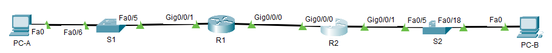
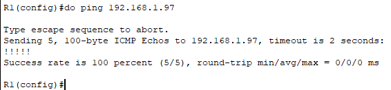
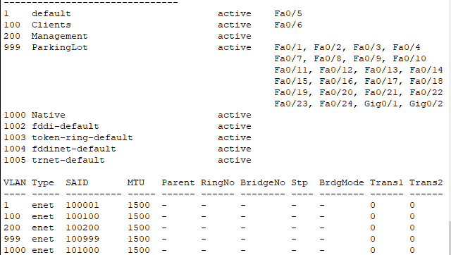
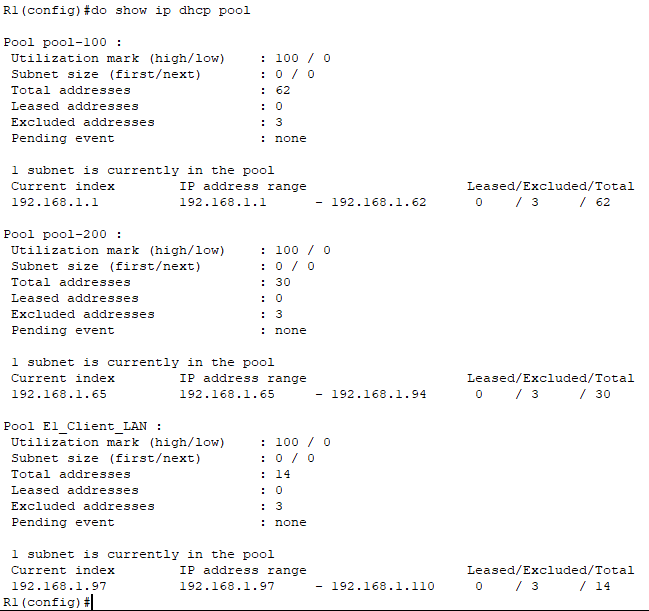
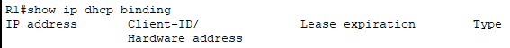
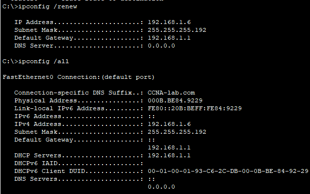
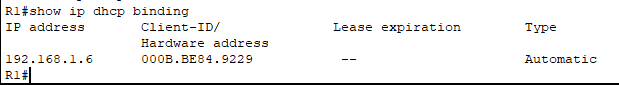
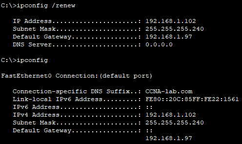
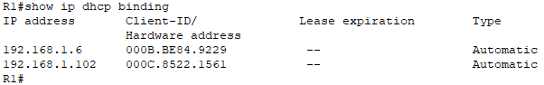

# ЛР 8. Настройка DHCPv6

## 1. Цели работы

Часть 1. Создание сети и настройка основных параметров устройства

Часть 2. Настройка и проверка двух серверов DHCPv4 на R1

Часть 3. Настройка и проверка DHCP-ретрансляции на R2


## 2. Топология сети



Рисунок 1. Топология сети

## 3. Таблица адресации

| Устройство | Интерфейс | IP адрес | Маска подсети | Шлюз по умолчанию |
| :-------------: | :------------- | :--: | :--: | :--: |
| R1 | G0/0/0 | 10.0.0.1 | 255.255.255.252  | - |
| R1 | G0/0/1 | - | -  | - |
| R1 | G0/0/1.100 | 192.168.1.1 | 255.255.255.192  | - |
| R1 | G0/0/1.200 | 192.168.1.65 | 255.255.255.224  | - |
| R1 | G0/0/0.1000 | - | -  | - |
| R2 | G0/0/0 | 10.0.0.2 |  255.255.255.252 | - |
| R2 | G0/0/1 | 192.168.1.97 | 255.255.255.240  | - |
| S1 | VLAN 200 | 192.168.1.66 | 255.255.255.224  | 192.168.1.65 |
| S2 | VLAN 1 | 192.168.1.98 | 255.255.255.240  | 192.168.1.97 |
| PC-A | NIC | DHCP | DHCP  |  DHCP |
| PC-B | NIC | DHCP | DHCP  |  DHCP |


## 4. Таблица VLAN

| VLAN | Имя | Назначенный интерфейс | 
| :--: | :-- | :-------------------: |
| 1 | Нет  | S2: F0/18 |
| 100 | Клиенты | S1: F0/6  |
| 200 | Управление | S1: VLAN 200 |
| 999 | Parking_Lot | S1: F0/1-4, F0/7-24, G0/1-2  |
| 1000 | Собственная | - |


## 5. Выполнение работы

### Часть 1.	Создание сети и настройка основных параметров устройства


#### Шаг 1.	Создание схемы адресации

Имеется подсеть `192.168.1.0/24 `. В соответствии с заданием получены следующие подсети:

| Требуется хостов | Маршрутизатор | VLAN | Первый адрес | Последний адрес | Маска | SVI | Шлюз |
| :--: | :-- | :---: | :-- | :-- | :-- | :-- | :-- |
| 58 | R1 | 100 | 192.168.1.1 | 192.168.1.62 | 26 | - |  |
| 28 | R1 | 200 | 192.168.1.65 | 192.168.1.94 | 27 | 192.168.1.66 | 192.168.1.65 |
| 12 | R2 | 100 | 192.168.1.97 | 192.168.1.110 | 28 | - | - |

#### Шаг 2.	Создайте сеть согласно топологии

Собранная схема представлена на рисунке 1.

#### Шаг 3.	Произведите базовую настройку маршрутизаторов

Настройка R1:

```
hostname R1
no ip domain-lookup 
enable secret class

line console 0
password cisco
login

line vty 0 4
password cisco
transport input ssh
login

service password-encryption 
banner motd " This is R1 "

clock set 14:10:00 may 28 2024

wr
```

Настройка R2:

```
hostname R2
no ip domain-lookup 
enable secret class

line console 0
password cisco
login

line vty 0 4
password cisco
transport input ssh
login

service password-encryption 
banner motd " This is R2 "

clock set 14:10:00 may 28 2024

wr
```

#### Шаг 4.	Настройка маршрутизации между сетями VLAN на маршрутизаторе R1

Активация интерфейса `g0/0/1` на R1 и настройка подинтерфейсов.
```
interface g0/0/1
no shutdown

int g0/0/1.100
encapsulation dot1Q 100
description "Clients"
ip address 192.168.1.1 255.255.255.192

int g0/0/1.200
encapsulation dot1Q 200
description "Management"
ip address 192.168.1.65 255.255.255.224
```

Подинтерфейсы в состоянии `UP UP`:


#### Шаг 5.	Настройте G0/0/1 на R2, затем G0/0/0 и статическую маршрутизацию для обоих маршрутизаторов

Настройка R1:

```
interface g0/0/0
ip address 10.0.0.1 255.255.255.252

ip route 0.0.0.0 0.0.0.0 10.0.0.2
do wr
```

Настройка R2:

```
interface g0/0/1
ip address 192.168.1.97 255.255.255.240
interface g0/0/0
ip address 10.0.0.2 255.255.255.252

ip route 0.0.0.0 0.0.0.0 10.0.0.1
do wr
```

Проверка связанности R1 и R2:



#### Шаг 6.	Настройте базовые параметры каждого коммутатора.

Настройка S1:

```
hostname S1
no ip domain-lookup 
enable secret class

line console 0
password cisco
login

line vty 0 4
password cisco
transport input ssh
login

service password-encryption 
banner motd " This is S1 "

clock set 14:38:00 may 28 2024

wr
```

Настройка S2:

```
hostname S2
no ip domain-lookup 
enable secret class

line console 0
password cisco
login

line vty 0 4
password cisco
transport input ssh
login

service password-encryption 
banner motd " This is S2 "

clock set 14:38:00 may 28 2024

wr
```

#### Шаг 7.	Создайте сети VLAN на коммутаторе S1.

Настройка S1:
```
vlan 100
name Clients
vlan 200
name Management
vlan 999
name ParkingLot
vlan 1000
name Native

interface vlan 200
ip address 192.168.1.66 255.255.255.224

ip default-gateway 192.168.1.65

int range fa0/1-4,fa0/7-24,g0/1-2
switchport mode access 
switchport access vlan 999
shutdown
```

Настройка S2:
```
interface vlan 1
ip address 192.168.1.98 255.255.255.240

ip default-gateway 192.168.1.97

int range fa0/1-4,fa0/6-17,fa0/19-24,gi0/1-2
shutdown
```

#### Шаг 8.	Назначьте сети VLAN соответствующим интерфейсам коммутатора.

Настройка S1:

```
int fa0/6
switchport mode access 
switchport access vlan 100
```

Распределение портов по VLAN на S1 следующее:    


**Вопрос**. Почему интерфейс F0/5 указан в VLAN 1?     
**Ответ**. Потому что изначально все порты коммутатора находятся в VLAN 1, он же Native VLAN. До этого момента были распределены по своим VLAN все порты, кроме F0/5. Он до сих пор находится в своем дефолтном состоянии с момента загрузки коммутатора.

#### Шаг 9.	Вручную настройте интерфейс S1 F0/5 в качестве транка 802.1Q.

Настройка S1:

```
interface fa0/5
switchport mode trunk
switchport trunk native vlan 1000
switchport trunk allowed vlan 100,200,1000
```

Состояние TRUNK порта на S1:


**Вопрос**. Какой IP-адрес был бы у ПК, если бы он был подключен к сети с помощью DHCP?    
**Ответ**. ПК сейчас находится за access портом с VLAN 100, поэтому у него был бы IP адрес из подсети 192.168.1.0/26.

### Часть 2.	Настройка и проверка двух серверов DHCPv4 на R1


#### Шаг 1.	Настройте R1 с пулами DHCPv4 для двух поддерживаемых подсетей

Настройка R1:

```
# Исключить первые 5 адресов из каждого пула
ip dhcp excluded-address 192.168.1.1 192.168.1.5
ip dhcp excluded-address 192.168.1.65 192.168.1.69
ip dhcp excluded-address 192.168.1.97 192.168.1.101

# DHCP для VLAN 100
ip dhcp pool pool-100
network 192.168.1.0 255.255.255.192
domain-name CCNA-lab.com
default-router 192.168.1.1

# Команды lease нет на маршрутизаторе в Packet Tracer

# DHCP для VLAN 200
ip dhcp pool pool-200
network 192.168.1.64 255.255.255.224
domain-name CCNA-lab.com
default-router 192.168.1.65

# DHCP для локальной сети за R2
ip dhcp pool E1_Client_LAN
network 192.168.1.96 255.255.255.240
default-router 192.168.1.97
domain-name CCNA-lab.com

```

#### Шаг 2.	Сохраните конфигурацию.

```
wr
```

#### Шаг 3.	Проверка конфигурации сервера DHCPv4




Таблица выданных адресов пока что пуста:



#### Шаг 4.	Попытка получить IP-адрес от DHCP на PC-A

После выполнения команды `ipconfig /renew` PC-A получил адрес от сервера. Адрес из пула 192.168.1.0/26 с нужным gateway и domain name



Теперь вывод команды show `ip dhcp binbing` следующий:


### Часть 3.	Настройка и проверка DHCP-ретрансляции на R2


#### Шаг 1.	Настройка R2 в качестве агента DHCP-ретрансляции для локальной сети на G0/0/1

На интерфейсе g0/0/1 R2 выполнена команда:

```
interface g0/0/1
ip helper-address 10.0.0.1

do wr
```

#### Шаг 2.	Попытка получить IP-адрес от DHCP на PC-B

На PC-B обновлена сетевая инфомрация через команду `ipconfig /renew`. PC-B получил адрес из пула E1_Client_LAN, который предназначен именно для клиентов R2.



Проверка связанности PC-B с адресами подинтерфейсов на R1 прошла успешно. Оба интерфейса пингуются:


Результат команды `show ip dhcp binding` на R1:



Команды `show ip dhcp server statistics` нет в Packet Tracer.