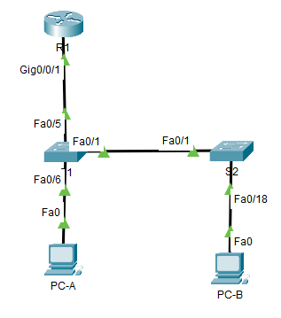

# ЛР 8. Настройка DHCPv4

## 1. Цели работы

Часть 1. Настройка основного сетевого устройства

Часть 2. Настройка сетей VLAN

Часть 3: Настройки безопасности коммутатора

## 2. Топология сети

Рисунок 1. Топология сети

## 3. Таблица адресации

| Устройство | Интерфейс | IP адрес | Маска подсети |
| :-------------: | :------------- | :--: | :--: |
| R1 | G0/0/1 | 192.168.10.1 | 255.255.255.0  |
| R1 | Loopback | 10.10.1.1 | 255.255.255.0 |
| S1 | VLAN 10 | 192.168.10.201 | 255.255.255.0 |
| S1 | VLAN 10 | 192.168.10.202 | 255.255.255.0 |
| PC-A | NIC | DHCP | 255.255.255.0 |
| PC-B | NIC | DHCP | 255.255.255.0 |

## 4. Выполнение работы

### Часть 1. Настройка основного сетевого устройства

#### Шаг 1. Создайте сеть.

Собранная схема представлена на рисунке 1.

#### Шаг 2. Настройте маршрутизатор R1

#### Шаг 3. Настройка и проверка основных параметров коммутатора

### Часть 2. Настройка сетей VLAN на коммутаторах

#### Шаг 1. Сконфигруриуйте VLAN 10

#### Шаг 2. Сконфигруриуйте SVI для VLAN 10

#### Шаг 3. Настройте VLAN 333 с именем Native на S1 и S2

#### Шаг 4. Настройте VLAN 999 с именем ParkingLot на S1 и S2

### Часть 3. Настройки безопасности коммутатора

#### Шаг 1. Релизация магистральных соединений 802.1Q

#### Шаг 2. Настройка портов доступа

#### Шаг 3. Безопасность неиспользуемых портов коммутатора

#### Шаг 4. Документирование и реализация функций безопасности порта

#### Шаг 5. Реализовать безопасность DHCP snooping

#### Шаг 6. Реализация PortFast и BPDU Guard

#### Шаг 7. Проверьте наличие сквозного подключения

### Вопросы для повторения

**Вопрос 1**. 1.	С точки зрения безопасности порта на S2, почему нет значения таймера для оставшегося возраста в минутах, когда было сконфигурировано динамическое обучение - sticky?   
**Ответ**.

**Вопрос 2**. 2.	Что касается безопасности порта на S2, если вы загружаете скрипт текущей конфигурации на S2, почему порту 18 на PC-B никогда не получит IP-адрес через DHCP?   
**Ответ**.

**Вопрос 3**. 3.	Что касается безопасности порта, в чем разница между типом абсолютного устаревания и типом устаревание по неактивности?   
**Ответ**.