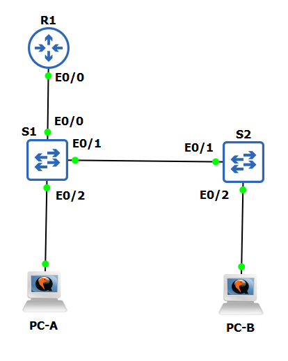

# ЛР 8. Настройка DHCPv4

## 1. Цели работы

Часть 1. Настройка основного сетевого устройства

Часть 2. Настройка сетей VLAN

Часть 3: Настройки безопасности коммутатора


## 2. Топология сети



Рисунок 1. Топология сети

## 3. Таблица адресации

| Устройство | Интерфейс | IP адрес | Маска подсети |
| :-------------: | :------------- | :--: | :--: |
| R1 | G0/0/1 | 192.168.10.1 | 255.255.255.0  |
| R1 | Loopback | 10.10.1.1 | 255.255.255.0 |
| S1 | VLAN 10 | 192.168.10.201 | 255.255.255.0 |
| S1 | VLAN 10 | 192.168.10.202 | 255.255.255.0 |
| PC-A | NIC | DHCP | 255.255.255.0 |
| PC-B | NIC | DHCP | 255.255.255.0 |

## 4. Выполнение работы

### Часть 1. Настройка основного сетевого устройства

#### Шаг 1. Создайте сеть

Так как ряд команд не удалось обнаружить в Packet Tracer, работа ведется в GNS3. Собранная схема представлена на рисунке 1.

#### Шаг 2. Настройте маршрутизатор R1

На маршрутизаторе R1 выполнены следующие команды:

```
enable
configure terminal
hostname R1
no ip domain lookup
ip dhcp excluded-address 192.168.10.1 192.168.10.9
ip dhcp excluded-address 192.168.10.201 192.168.10.202

ip dhcp pool Students
network 192.168.10.0 255.255.255.0
default-router 192.168.10.1
domain-name CCNA2.Lab-11.6.1

interface Loopback0
ip address 10.10.1.1 255.255.255.0

interface Ethernet 0/0
description Link to S1
ip dhcp relay information trusted
ip address 192.168.10.1 255.255.255.0
no shutdown

line con 0
logging synchronous
exec-timeout 0 0
```

Конфигурация Loopback интерфейса прошла успешно:


Интерфейсы находятся в состоянии UP/UP.

#### Шаг 3. Настройка и проверка основных параметров коммутатора

Настройка S1:

```
hostname S1

no ip domain-lookup

interface eth0/0
description "To R1"
interface eth0/2
description "To PC-A"
interface eth0/1
description "To S2"

ip default-gateway 192.168.10.1
```

Настройка S2:

```
hostname S2

no ip domain-lookup

interface e0/1
description "To S2"
interface e0/2
description "To PC-B"

ip default-gateway 192.168.10.1

```

### Часть 2. Настройка сетей VLAN на коммутаторах


#### Шаг 1. Сконфигруриуйте VLAN 10

Настройка S1:
```
vlan 10
name Management
```

Настройка S2:
```
vlan 10
name Management
```

#### Шаг 2. Сконфигруриуйте SVI для VLAN 10

Настройка S1:
```
interface vlan 10
ip address 192.168.10.201 255.255.255.0
description Management
no shutdown
```

Настройка S2:
```
interface vlan 10
ip address 192.168.10.202 255.255.255.0
description Management
no shutdown
```

#### Шаг 3. Настройте VLAN 333 с именем Native на S1 и S2

Настройка S1:
```
vlan 333
name Native
```

Настройка S2:
```
vlan 333
name Native
```


#### Шаг 4. Настройте VLAN 999 с именем ParkingLot на S1 и S2

Настройка S1:
```
vlan 999
name ParkingLot
```

Настройка S2:
```
vlan 999
name ParkingLot
```

### Часть 3. Настройки безопасности коммутатора

#### Шаг 1. Релизация магистральных соединений 802.1Q

Настройка S1:
```
interface ethernet0/1
switchport trunk encapsulation dot1q
switchport mode trunk
switchport trunk native vlan 333
```

Настройка S2:
```
interface ethernet0/1
switchport trunk encapsulation dot1q
switchport mode trunk
switchport trunk native vlan 333
```

Результат команды `show interface trunk` для двух коммутаторов одинаковый:


На каждом коммутаторе откючено согласование DTP:

```
interface ethernet0/1
switchport nonegotiate
```

Результат команды `show interface ethernet 0/1 switchport | include Negotitaion` на двух коммутаторах одинаковый - OFF:


#### Шаг 2. Настройка портов доступа

На S1 порт на R1 и на PC-A (Ethernet 0/0 и Ethernet 0/2) переведены в режим ACCESS и назначены в VLAN 10:

```
interface range ethernet0/0,ethernet0/2
switchport mode access
switchport access vlan 10
```

На S2 порт на PC-B (Ethernet 0/2) переведен в режим ACCESS и назначен в VLAN 10:

```
interface ethernet0/2
switchport mode access
switchport access vlan 10
```

#### Шаг 3. Безопасность неиспользуемых портов коммутатора

Настройка S1:

```
interface range eth0/3,eth1/0-3,eth2/0-3,eth3/0-3
switchport mode access
switchport access vlan 999
shutdown
```

Настройка S2:

```
interface range eth0/0,eth0/3,eth1/0-3,eth2/0-3,eth3/0-3
switchport mode access
switchport access vlan 999
shutdown
```

Результат команды `show interface status` на S1:


Результат команды `show interface status` на S2:


#### Шаг 4. Документирование и реализация функций безопасности порта

Из вывода команды `show port-security interface eth0/2` на S1 получены следующие данные по умолчанию:

| Функция | Настройка по умолчанию |
| :-------------: | :------------- |
| Защита портов | Disabled |
| Максимальное количество записей MAC-адресов | 1 |
| Режим проверки на нарушение безопасности | Shutdown | 
| Aging Time | 0 mins |
| Aging Type | Absolute |
| Secure Static Address Aging | Disabled |
| Sticky MAC Address | 0 |

На S1 настроены следующие команды в разделе `port-security`:

```
interface ethernet0/2
switchport port-security
switchport port-security maximum 3
switchport port-security violation restrict
switchport port-security aging time 60
switchport port-security aging type inactivity
```

Теперь настройки port-security на Ethernet0/2 коммутатора S1 следующие:


А после включения хоста PC-A в базу данных Port Security занесена информация по подключенному MAC адресу устройства:


MAC адрес РС-А:


На S2 настроены следующие команды в разделе `port-security`:

```
interface ethernet0/2
switchport port-security
switchport port-security maximum 2
switchport port-security violation protect
switchport port-security aging time 60
switchport port-security mac-address sticky
```
Теперь настройки port-security на Ethernet0/2 коммутатора S2 следующие:


Вывод команды `show port-security address` на S2:


MAC адрес РС-В:


#### Шаг 5. Реализовать безопасность DHCP snooping

Настройка S2:

```
ip dhcp snooping
ip dhcp snooping vlan 10

interface ethernet0/1
ip dhcp snooping trust
ip dhcp snooping limit rate 5

no ip dhcp snooping information option
```


После обновления адреса на PC-B в базу данных DHCP попал МАС адрес хоста:


#### Шаг 6. Реализация PortFast и BPDU Guard

Настройка S1:
```
interface ethernet0/2
spanning-tree portfast edge
spanning-tree bpduguard enable
```


Настройка S2:
```
interface ethernet0/2
spanning-tree portfast edge
spanning-tree bpduguard enable
```

Вывод команды `show spanning-tree interface ethernet0/2 detail` на двух коммутаторах одинаковый:

На S1:         


На S2:          


#### Шаг 7. Проверьте наличие сквозного подключения

С PC-A пропингованы S1, S2, R1, PC-B (адрес 192.168.10.10). Пинг прошел успешно:


С PC-B пропингованы S1, S2, R1, PC-A (адрес 192.168.10.11). Пинг прошел успешно:


### Вопросы для повторения

**Вопрос 1**. 1.	С точки зрения безопасности порта на S2, почему нет значения таймера для оставшегося возраста в минутах, когда было сконфигурировано динамическое обучение - sticky?   
**Ответ**. Метод sticky предназначен для изучения N-ного количества МАС адресов, которым позволено подключаться к данному порту. В данном методе предполагается, что эти адреса в течение всей работы коммутатора могут подключиться к порту и работать через него неограниченное количество времени

**Вопрос 2**. 2.	Что касается безопасности порта на S2, если вы загружаете скрипт текущей конфигурации на S2, почему порту 18 на PC-B никогда не получит IP-адрес через DHCP?   
**Ответ**. После сохранения конфигурации на коммутаторе и перезагрузки всего проекта удалось получить по DHCP адрес на РС-В. Возможно, из-за метода sticky, если включить другое устройство в сеть с другим МАС адресом, будет превышено число доступных для подключения МАС адресов, поэтому новые устройства не смогут работать через данный порт.

**Вопрос 3**. 3.	Что касается безопасности порта, в чем разница между типом абсолютного устаревания и типом устаревание по неактивности?   
**Ответ**. При абсолютном устаревании счетчик времени запускается с момента изучения МАС адреса. Даже если устройство еще активно, когда таймер достигнет 0, МАС адрес удалится из базы данных. При устаревании по неактивности счетчик времени начнет увеличиваться лишь когда устройство перестанет работать через порт.