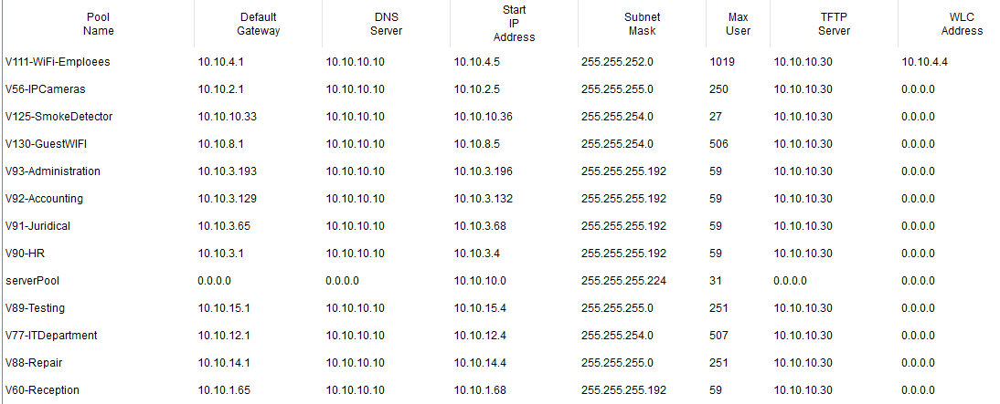

## Настройка DHCP сервера

Для ряда VLAN, определенных в [задании](zadanie.md#4-адреса-в-vlan-должны-быть-выданы-следующим-образом), получение адресов и настроек сети происходит с помощью DHCP сервера.

Для этих целей в схему в серверную добавлен сервер, на котором прописаны следующие настройки:



В качестве маршрута по умолчанию указан адрес виртуального маршрутизатора, который был настроен в пункте [HSRP](./hsrp_settings.md).

Чтобы устройства в разных VLAN смогли получить доступ к данному серверу, на L3 коммутаторах прописаны для каждого VLAN, который работает через DHCP, следующие настройки:

```
interface Vlan56
ip helper-address 10.10.10.20

interface Vlan60
ip helper-address 10.10.10.20

interface Vlan77
ip helper-address 10.10.10.20

interface Vlan88
ip helper-address 10.10.10.20

interface Vlan89
ip helper-address 10.10.10.20

interface Vlan90
ip helper-address 10.10.10.20

interface Vlan91
ip helper-address 10.10.10.20

interface Vlan92
ip helper-address 10.10.10.20

interface Vlan93
ip helper-address 10.10.10.20

interface Vlan111
ip helper-address 10.10.10.20

interface Vlan125
ip helper-address 10.10.10.20

interface Vlan130
ip helper-address 10.10.10.20
```

После добавления этих настроек и включения автоматического получения адреса на клиентских устройсвах в сети стали успешно распространяться DHCP запросы.

Далее: [Настройка SSH доступа](./ssh_settings.md)

Назад: [Настройка головного офиса](./main_office.md)