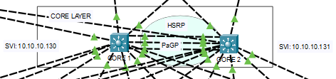
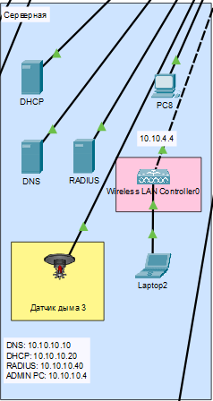

## Полная схема компании

- В данной работе рассматривается компания, которая занимается разработкой и продажей некого оборудования. Для этих целей у неё есть головной офис, где располагается технический и административный центры компании. Компания держит на своих внутренних ресурсах сайт магазина, на который покупатели могут получит доступ в любой момент времени.

- Головной офис состоит из 3х этажей, на каждом из которых находится тот или иной отдел. По всей территории работает видеонаблюдение, а также датчики дыма и система СКУД.
- В сети головного офиса в качестве уровня ядра используются 2 L3 коммутатора, которые объединены друг с другом через протокол PaGP. Для повышения надежности сети на них настроен HSRP протокол. Трафик в зависимости от VLAN выходит в Интернет через разных провайдеров.

- Уровень распределения состоит из 1 коммутатора на каждый отдел.

- На уровне доступа находятся рабочие ПК, принтеры и прочая периферия, камеры, СКУД и датчики дыма.
- В офисе организован DHCP, DNS и FTP сервера для нужд работников.

Пример серверной

- В DMZ зоне располагается сервер с сайтом компании, а также почтовый сервер.

- На территории офиса работает WiFi.
- Для разделение работы на серые и белые адреса в PC сделана [имитация Интернета](../docs/Описание%20Интернета)

- Для сетевого инженера есть удаленный доступ на ресурсы компании
- Списками ACL пресекается доступ некоторых VLAN в другие

Предыдущая страница: [Задание](../zadanie.md)

Далее: [Описание реализации Интернета](./internet_descroption.md)