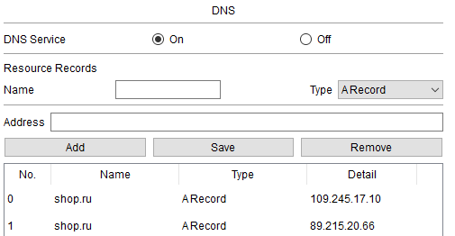

## Описание Интернета

В данной работе имитируется Интернет для взаимодействия разных частей компании по белым адресам с помощью нескольких роутеров. Сама компания в качестве избыточности работает сразу через 2х провайдеров, которые также входят в блок Интернета.


Данные о маршрутах передаются через протокол OSPF. В "Интернете" есть имитация DNS сервера 8.8.8.8, с помощью которого покупатель сможет получить доступ к сайту компании.

## Настройка маршрутизаторов


### Настройка маршрутизатора INTERNET

```
hostname INTERNET
line console 0
exec-timeout 0 0

router ospf 10
router-id 10.10.10.10
passive-interface default
no passive-interface GigabitEthernet1/0/2 # На ROSTELECOM
no passive-interface GigabitEthernet1/0/3 # На MTS


interface GigabitEthernet1/0/1 # На DNS 8.8.8.8
no switchport
ip address 8.8.8.1 255.255.255.0
ip ospf 10 area 0

interface GigabitEthernet1/0/2 # На ROSTELECOM
no switchport
ip address 109.250.12.9 255.255.255.252
ip ospf 10 area 0

interface GigabitEthernet1/0/3 # На MTS
no switchport
ip address 89.215.30.21 255.255.255.252
ip ospf 10 area 0

interface GigabitEthernet1/0/5 # На СКЛАД
no switchport
ip address 89.215.40.1 255.255.255.252
ip ospf 10 area 0

interface GigabitEthernet1/0/6 # На дом инженера
no switchport
ip address 109.245.27.25 255.255.255.252
ip ospf 10 area 0

interface GigabitEthernet1/0/7 # На покупателя
no switchport
ip address 89.216.2.9 255.255.255.252
ip ospf 10 area 0
```
### Настройка маршрутизатора ROSTELECOM

```
hostname ROSTELECOM
line console 0
exec-timeout 0 0

router ospf 10
router-id 1.1.1.1
passive-interface default
no passive-interface GigabitEthernet1/0/3

interface GigabitEthernet1/0/1 # На CORE 1
no switchport
ip address 109.245.17.9 255.255.255.252
ip ospf 10 area 0

interface GigabitEthernet1/0/2 # На CORE 2
no switchport
ip address 109.245.17.13 255.255.255.252
ip ospf 10 area 0

interface GigabitEthernet1/0/3 # На INTERNET
no switchport
ip address 109.250.12.10 255.255.255.252
ip ospf 10 area 0
```
### Настройка маршрутизатора MTS

```
hostname MTS
line console 0
exec-timeout 0 0

router ospf 10
router-id 2.2.2.2
passive-interface default
no passive-interface GigabitEthernet1/0/3

interface GigabitEthernet1/0/1 # На CORE 2
no switchport
ip address 89.215.20.65 255.255.255.252
ip ospf 10 area 0

interface GigabitEthernet1/0/2 # На CORE 1
no switchport
ip address 89.215.20.69 255.255.255.252
ip ospf 10 area 0

interface GigabitEthernet1/0/3 # На INTERNET
no switchport
ip address 89.215.30.22 255.255.255.252
ip ospf 10 area 0
```
### Настройка DNS

Настройки маршрутизации для DNS сервера


Настройки записей DNS для сайта company.com




Предыдущая страница: [Полная схема компании](./full_schema.md)

Далее: [Распределение адресного пространства](./addressing.md)