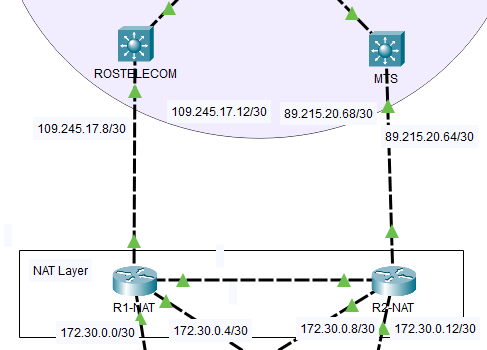

## Настройка NAT

Так как на L3 коммутаторах в CPT не удалось на интерфейсы подключить NAT, для реализации трансляции адресов введен еще один уровень NAT Layer, функции которого заключаются только в натировании трафика.



Данная схема предполагает, что R1-NAT и R2-NAT в случае недоступности основного маршрута по умолчанию отнатируют трафик на другого провайдера на другой интерфейс. В CPT нет функции route-map, с которой удалось бы это сделать, поэтому настройка идет лишь на 1 провайдера. Также в CPT не удалось построить балансировку нагрузки, поэтому реализовано лишь резервирование маршрута. Основным роутером, через который идет весь трафик, является R1-NAT, R2-NAT настроен в качестве резервного.

На каждом маршрутизаторе NAT Layer порты fa0/0-1 смотрят на провайдера - outside сторона, а fa1/0-1 смотрят в локальную сеть - inside сторона.

Настройка R1-NAT:

```
interface FastEthernet0/0
ip address 109.245.17.10 255.255.255.252

interface FastEthernet0/1
ip address 89.215.20.70 255.255.255.252
shutdown

ip access-list standard LOCAL-NET
permit 10.10.0.0 0.0.15.255

ip nat inside source list LOCAL-NET interface FastEthernet0/0 overload


interface range fa1/0-1
ip nat inside

interface range fa0/0
ip nat outside
```

Настройка R2-NAT:

```
interface FastEthernet0/0
ip address 109.245.17.14 255.255.255.252
shutdown

interface FastEthernet0/1
ip address 89.215.20.66 255.255.255.252

ip access-list standard LOCAL-NET
permit 10.10.0.0 0.0.15.255

ip nat inside source list LOCAL-NET interface FastEthernet0/1 overload

interface range fa1/0-1
ip nat inside

interface fa0/1
ip nat outside
```

Реализация DNAT для доступа на сайт компании:

Настройка R1-NAT
```
ip nat inside source static tcp 109.245.17.10 21 10.10.1.37 21 
ip nat inside source static tcp 109.245.17.10 80 10.10.1.36 80 
ip nat inside source static tcp 109.245.17.10 443 10.10.1.36 443 
ip nat inside source static tcp 10.10.1.36 80 109.245.17.10 80 
ip nat inside source static tcp 10.10.1.36 443 109.245.17.10 443 
ip nat inside source static tcp 10.10.1.37 21 109.245.17.10 21 
```

Настройка R2-NAT
```
ip nat inside source static tcp 109.245.17.10 21 10.10.1.37 21 
ip nat inside source static tcp 109.245.17.10 80 10.10.1.36 80 
ip nat inside source static tcp 109.245.17.10 443 10.10.1.36 443 
ip nat inside source static tcp 10.10.1.36 80 109.245.17.10 80 
ip nat inside source static tcp 10.10.1.36 443 109.245.17.10 443 
ip nat inside source static tcp 10.10.1.37 21 109.245.17.10 21 
```


Далее: [Настройка маршрутизации](./routing_settings.md)

Назад: [Настройка головного офиса](./main_office.md)