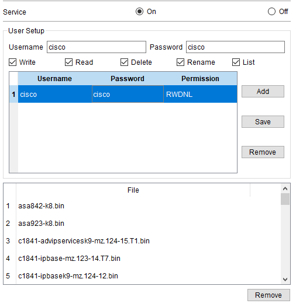
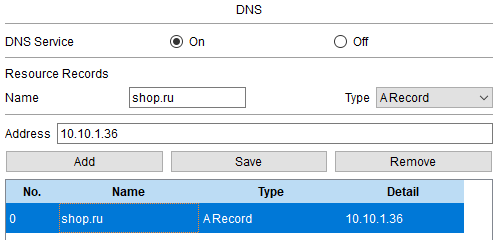
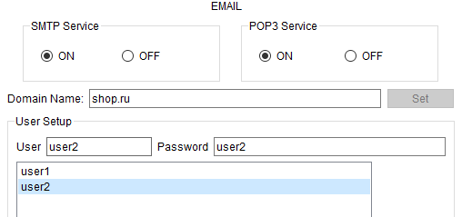
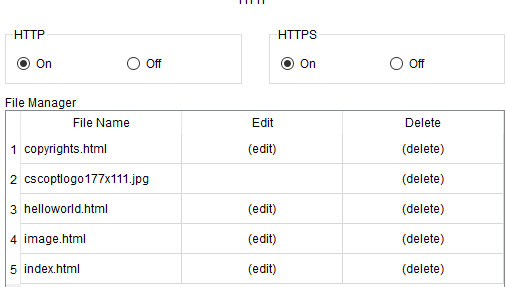

## Настройка прочих сервисов

Для интереса настроены FTP, DNS, WEB и EMAIL сервера в рамках компании

- FTP

- DNS

- EMAIL
Созданы 2 УЗ

| Логин | Пароль |
| --- | --- |
| user1 | user1 |
| user2 | user2 |

- WEB

Далее: [Настройка клиента](./client_settings.md)

Назад: [Настройка головного офиса](./main_office.md)