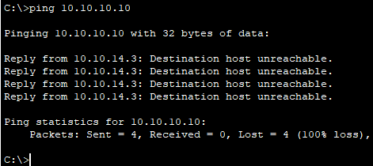

## Тестирование сети

Финальное тестирование всей сети.

### Тестирование DHCP сервера
--- 
Из разных VLAN с клиентских устройств сделан запрос на автоматическое получение IP адреса. Все запросы прошли успешно:

VLAN 56

VLAN 60

VLAN 77

VLAN 88

VLAN 89

VLAN 90

VLAN 91

VLAN 92

VLAN 93

VLAN 125

DHCP работает корректно во всей сети.

### Тестирование межвлановой маршрутизации
--- 
Сервер DNS располагается в серверной с адресом 10.10.10.10/27. РС в сети ремонтного отдела по DHCP получил адрес 10.10.14.5/24. Устройства в разных подсетях и разных VLAN. Пинг с PC до сервера DNS прошел успешно

### Тестирование HSRP
--- 
Так как на каждом виртуальном интерфейсе задавался приоритет для того или иного VLAN, таблица standby на CORE1-SW и CORE2-SW выглядят следующим образом:

CORE1-SW:

CORE2-SW:

За счет опции preempt, если Active интерфейс недоступен в схеме, то Standby интерфейс перейдет в статус Active. Например, на CORE2-SW, который является Active для VLAN 77, отключили данный интерфейс. Через несколько секунд на CORE1-SW появилась инфомрация, что теперь интерфейс VLAN 77 является Active:

Таблица Standby теперь поменялась, интерфейс для 77 VLAN теперь Active, а информации о Standby устройстве нет:

После активации интерфейса на CORE2-SW работа схемы возвращается в начальное состояние.

Также у всех клиентских устройств

### Тестирование ACL
---

1. Тестирование DMZ

1.1 Доступность WEB браузера

Со стороны посетителя сайта извне, а также из локальной сети доступ на нужные порты есть

1.2 Доступ к почте

С РС Ресепшн на РС в Серверной отправлено и успешно получено письмо
Отправленное письмо

Полученное письмо

Почтовый сервис работает

1.3 FTP сервер

С РС Охраны идет подключение на FTP сервер 10.10.1.37 успешно

1. Тестирование Серверной

1.1 Доступ по Email уже проверен в тестировании DMZ

1.2 Результат доступа на FTP сервер 

1.3 DHCP сервер уже был проверен при автоматическом получении IP адрес устройствами в сети

1.4 Внешняя сеть из серверной пингуется

Пропинговать сервера внутри серверной из IT Department получается

Пропинговать сервера внутри серверной из другой подсети уже не получается

### Тестирование распределения нагрузки через STP
--- 
Для примера взят VLAN 90, который должен выходить в сеть через CORE1-SW и VLAN 80, который выходит в сеть через CORE20SW

VLAN 90

VLAN 80

### Тестирование Bpduguard STP
--- 
На каждом коммутаторе настроен на access портах portfast и bpduguaed. Если к такому порту подключить коммутатор с Trunk портом, порт должен перейти в состояние down

Подключение клиента к такому порту проходит успешно

Подключение стороннего коммутатора транковым портом в наш коммутатор приводит к отключению порта

### Тестирование NAT
--- 
Маршрутизатор INTERNET, который имитирует внешнюю сеть, ничего не знает о сети 10.10.0.0/20.

Соответственно, пинги до 8.8.8.8 в сети не проходят ни с одного узла в сети.

После активации NAT на маршрутизаторах NAT Layer есть связь с 8.8.8.8.

На маршрутизаторе NAT есть запись в таблице NAT.

NAT работает корректно.

### Тестирование доступности WEB сервера из Интернета
--- 
С PC клиента делается запрос на сайт магазина company.com. DNS указан 8.8.8.8, поэтому IP адрес клиентскому PC выдает именно он.

Сайт доступен извне.

### Тестирование туннеля и SSH доступа
--- 
Подключение с домашнего РС инженера по SSH к оборудованию в офисе. Например, L3 коммутатор CORE1-SW, у которого адрес 10.10.10.130.

Доступ есть

### Тестирование отказоустойчивости
--- 
Для тестирования отказостойчивости был пущен пинг с флагом -t из сети VLAN 80. Затем отключены все порты на CORE2-SW, через который дложен проходить трафик из данной сети. Видно на картинке, что было потеряно 7 пакетов до того, как всю работу на себя взял CORE1-SW. Затем порты на CORE2-SW влкючены снова, что повлекло еще к 6 потерянным пакетам. Далее трафик нача идти так, как и должен

Аналогичный пример, только в этот раз отключался NAT коммутатор. Логика работы схемы перестраивалась уже заметно быстрее.

### Тестирование WiFi подключения
--- 
После настройки контроллера на всех точках доступа появились нужные сети. Пример подключенных смартфонов к точке доступа

Далее: [Дальнейшее улучшение схемы офиса](./next_steps.md)

Предыдущая страница: [Настройка клиента](./client_settings.md)
