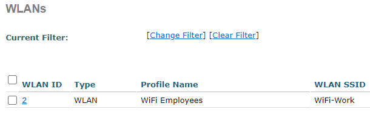
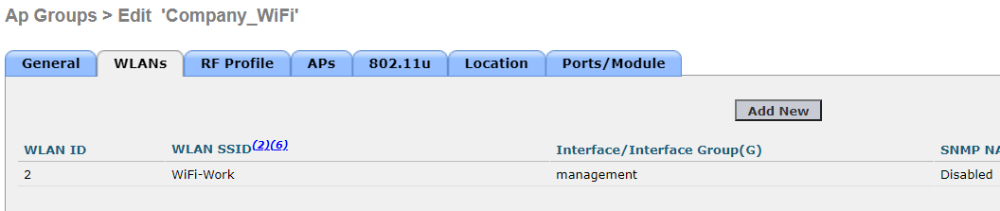
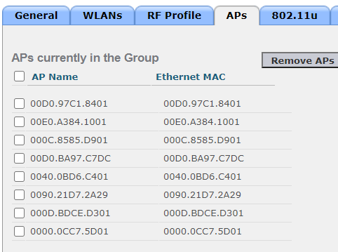
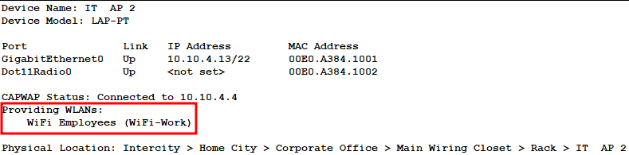

## Настройка WiFi в офисе

Для настройки WiFi используется WLC контроллер. Так как в CPT функционал WLC контролера очень сильно урезан, настройка WiFi ограничивается лишь тем, что создана 1 сеть под названием WiFi-Work, которая доступа на всех AP.

Создан WLAN с WPA2 и PSK **cisco123**.

Создана группа company_WiFI, в которую добвлена данная сеть и добавлены все точки доступа компании.

На всех точках доступа появилась данная сеть.

Далее: [Настройка прочих сервисов](./other_settings.md)

Назад: [Настройка головного офиса](./main_office.md)