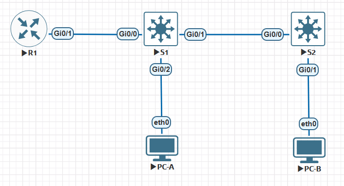
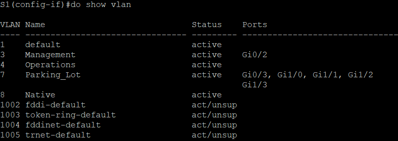
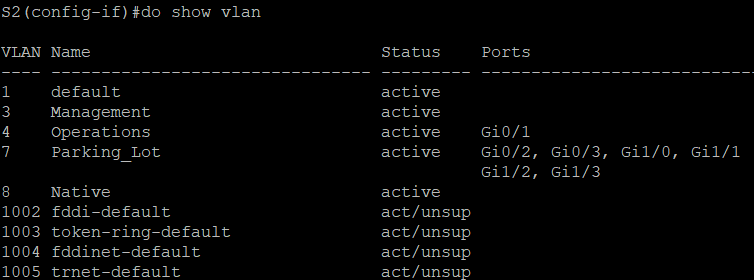
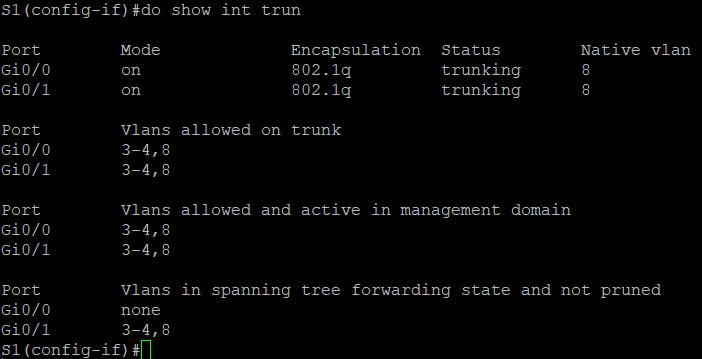
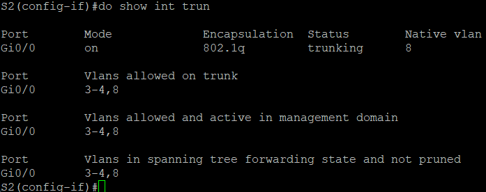
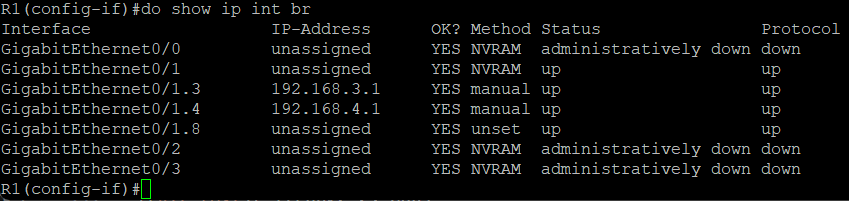
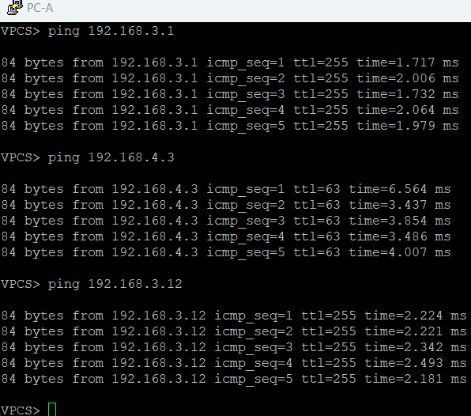
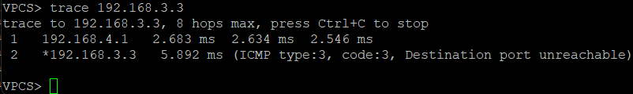

# ЛР 6. Внедрение маршрутизации между виртуальными локальными сетями

## 1. Цели работы

Часть 1. Создание сети и настройка основных параметров устройства     
Часть 2. Создание сетей VLAN и назначение портов коммутатора    
Часть 3. Настройка транка 802.1Q между коммутаторами    
Часть 4. Настройка маршрутизации между сетями VLAN     
Часть 5. Проверка, что маршрутизация между VLAN работает    
   

## 2. Топология сети

           
Рисунок 1. Топология сети


## 3. Таблица адресации

| Устройство | Интерфейс | IP адрес | Маска подсети | Шлюз по умолчанию |
| :-------------: | :------------- | :--: | :--: |  :--: |
| R1 | G0/1.3 | 192.168.3.1 | 255.255.255.0 | --- |
| R1 | G0/1.4 | 192.168.4.1 | 255.255.255.0 | --- |
| R1 | G0/1.8 | --- | --- | --- |
| S1 | VLAN 3 | 192.168.3.11 | 255.255.255.0 | 192.168.3.1 |
| S2 | VLAN 3 | 192.168.3.12 | 255.255.255.0 | 192.168.3.1 |
| PC-A | NIC | 192.168.3.3 | 255.255.255.0 | 192.168.3.1 |
| PC-B | NIC | 192.168.4.3 | 255.255.255.0 | 192.168.4.1 |

## 4. Таблица VLAN

| VLAN | Имя | Назначенные интерфейсы | 
| :-------------: | :------------- | :-- |
| 3 | Management | <div>S1: VLAN 3</div><div>S1: Gi0/2</div><div>S2: VLAN 3</div> | 
| 4 | Operations | S2: Gi0/1 | 
| 7 | ParkingLot | <div>S1:Gi0/2-3, Gi1/0-3<div> <div>S2:Gi0/3, Gi1/0-3<div> | 
| 8 | Native | --- | 


## 5. Выполнение работы

### Часть 1. Создание сети и настройка основных параметров устройства

#### Шаг 1. Создайте сеть согласно топологии

Сеть создана согласно топологии и представлена на рисунке 1

#### Шаг 2. Настройте базовые параметры для маршрутизатора


```
enable
configure terminal

hostname R1
no ip domain-lookup
enable secret class

line console 0
password cisco
login

line vty 0 4
exec-timeout 0 0
transport input ssh
password cisco
login local

service password-encryption 
banner motd " This is ROAS "

exit

clock set 17:00:00 14 october 2024

copy running-config startup-config
```

#### Шаг 3. Настройте базовые параметры каждого коммутатора

**Настрйока S1**

```
enable
configure terminal

hostname S1
no ip domain-lookup
enable secret class

line console 0
password cisco
login

line vty 0 4
exec-timeout 0 0
transport input ssh
password cisco
login local

service password-encryption 
banner motd " This is S1 "

exit

clock set 17:00:00 14 october 2024

copy running-config startup-config
```

**Настрйока S2**

```
enable
configure terminal

hostname S2
no ip domain-lookup
enable secret class

line console 0
password cisco
login

line vty 0 4
transport input ssh
password cisco
login local

service password-encryption 
banner motd " This is S2 "

exit

clock set 17:00:00 14 october 2024

copy running-config startup-config
```


#### Шаг 4. Настройте узлы ПК.

На ПК настроены адреса и шлюз по умолчанию в соответствии с таблицей адресации

PC-A

```
ip 192.168.3.3 255.255.255.0 192.168.3.1
```

PC-B

```
ip 192.168.4.3 255.255.255.0 192.168.4.1
```

### Часть 2. Создание сетей VLAN и назначение портов коммутатора

#### Шаг 1. Создайте сети VLAN на коммутаторах

На коммутаторе **S1** и **S2** выполнены следующие команды для создания VLANs:
```
vlan 3
name Management

vlan 4
name Operations

vlan 7
name Parking_Lot

vlan 8
name Native
```


#### Шаг 2. Назначьте сети VLAN соответствующим интерфейсам коммутатора

**Коммутатор S1**
```
interface vlan 3
ip address 192.168.3.11 255.255.255.0
no shutdown
exit
ip default-gateway 192.168.3.1

int range Gi0/3,Gi1/0-3
switchport mode access 
switchport access vlan 7
shutdown

int Gi0/2
switchport mode access
switchport access vlan 3
```

**Коммутатор S2**
```
interface vlan 3
ip address 192.168.3.12 255.255.255.0
no shutdown
exit
ip default-gateway 192.168.3.1

int range Gi0/2-3,Gi1/0-3
switchport mode access 
switchport access vlan 7
shutdown

int Gi0/1
switchport mode access
switchport access vlan 4
```

  


### Часть 3. Конфигурация магистрального канала стандарта 802.1Q между коммутаторами

#### Шаг 1. Вручную настройте магистральный интерфейс Gi0/1 на коммутаторе S1 и интерфейс Gi0/0 S2

На коммутаторе **S1**:

```
int Gi0/1
switchport mode trunk 
switchport trunk allowed vlan 3,4,8
switchport trunk native 8
```

На коммутаторе **S2**:
```
int Gi0/0
switchport mode trunk 
switchport trunk allowed vlan 3,4,8
switchport trunk native 8
```

 

#### Шаг 2. Вручную настройте магистральный интерфейс Gi0/0 на коммутаторе S1

```
int Gi0/0
switchport mode trunk 
switchport trunk allowed vlan 3,4,8
switchport trunk native vlan 8
```

    
 

### Часть 4. Настройка маршрутизации между сетями VLAN

#### Шаг 1. Настройте маршрутизатор

```
int g0/1.3
encapsulation dot1Q 3
ip address 192.168.3.1 255.255.255.0
description Management

int g0/1.4
encapsulation dot1Q 4
ip address 192.168.4.1 255.255.255.0
description Operations

int g0/1.8
encapsulation dot1Q 8 native
description Native
```

Вывод команды ```show ip int br```:



### Часть 5. Проверьте, работает ли маршрутизация между VLAN

#### Шаг 1. Выполните следующие тесты с PC-A. Все должно быть успешно

Пинг с PC-A до всех устройств успешный:



#### Шаг 2. Пройдите следующий тест с PC-B

Выполнение команды tracert с PC-B до PC-A
  

**Вопрос**. Какие промежуточные IP-адреса отображаются в результатах?

**Ответ**.  Промежуточный IP адрес - 192.168.4.1 - это адрес Gateway для PC-B. Так как адрес PC-A находится в другой подсети, PC-B остается лишь отправить трафик на свой Default Gateway