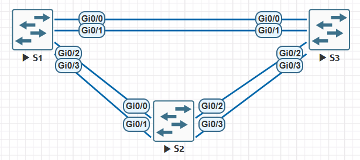
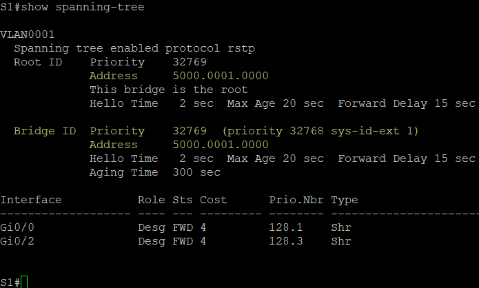
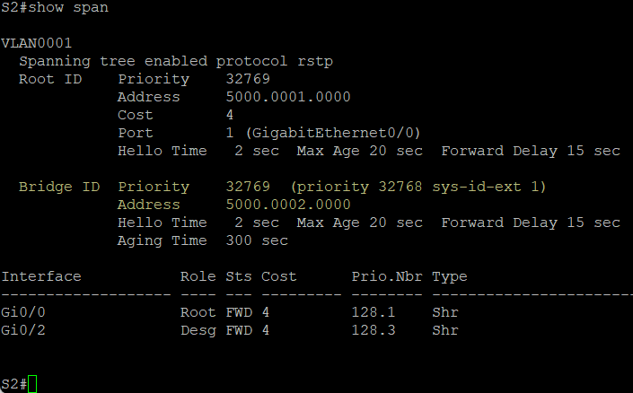
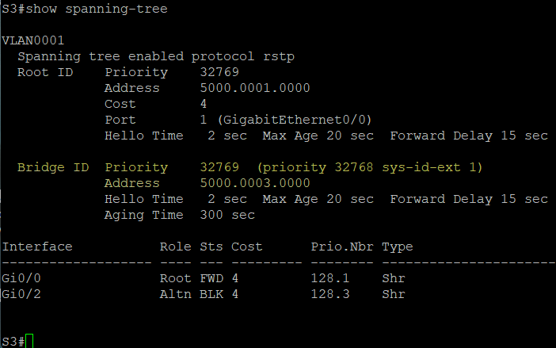
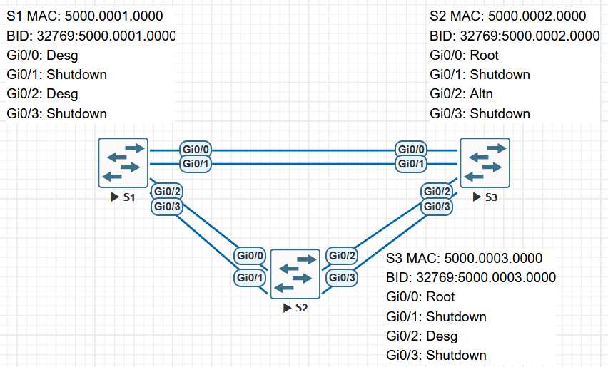
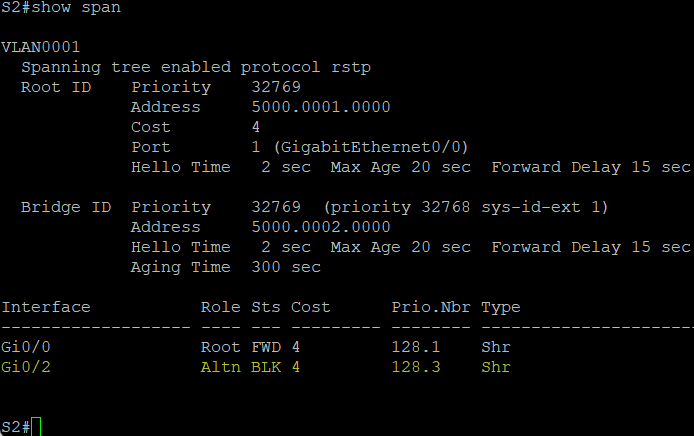
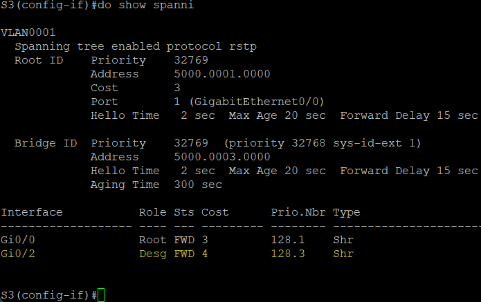
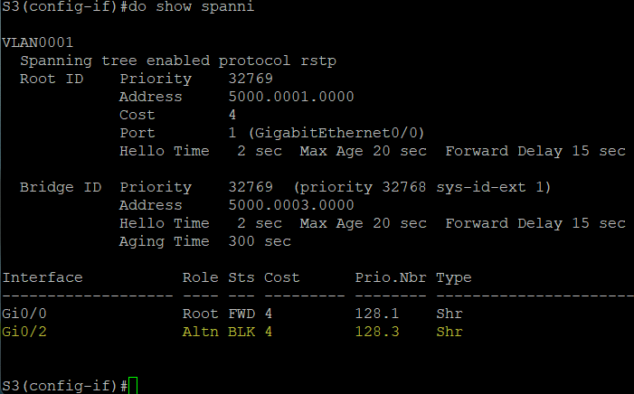
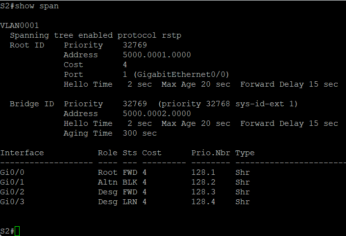
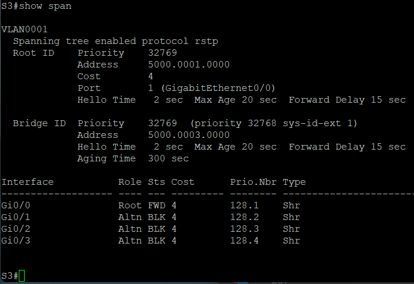

# ЛР 2. Развертывание коммутируемой сети с резервными каналами

## 1. Цели работы

Часть 1. Создание сети и настройка основных параметров устройства

Часть 2. Выбор корневого моста

Часть 3. Наблюдение за процессом выбора протоколом STP порта, исходя из стоимости портов

Часть 4. Наблюдение за процессом выбора протоколом STP порта, исходя из приоритета портов


## 2. Топология сети



Рисунок 1. Топология сети

## 3. Таблица адресации

| Устройство | Интерфейс | IP адрес | Маска подсети |
| :-------------: | :------------- | :--: | :--: |
| S1 | VLAN 1 | 192.168.1.1 |  255.255.255.0 |
| S2 | VLAN 1 | 192.168.1.2 |  255.255.255.0 |
| S3 | VLAN 1 | 192.168.1.3 |  255.255.255.0 |

## 4. Выполнение работы

### Часть 1. Создание сети и настройка основных параметров устройства

#### Часть 1. Создайте сеть согласно топологии

Созданная сеть приведена на рисунке 1

#### Часть 2. Выполните инициализацию и перезагрузку коммутаторов

Каждый коммутатор был перезагружен командой

```
enable
reload
```

#### Шаг 3. Настройте базовые параметры каждого коммутатора

Настройка **S1**:

```
no ip domain-lookup
hostname S1

line console 0
password cisco
login
logging synchronous
exec-timeout 0 0

service password-encryption 

banner motd "This is S1"

interface vlan 1
ip address 192.168.1.1 255.255.255.0
description SVI
no shutdown

write
```

Настройка **S2**:

```
no ip domain-lookup
hostname S2

line console 0
password cisco
login
logging synchronous
exec-timeout 0 0

service password-encryption 

banner motd "This is S2"

interface vlan 1
ip address 192.168.1.2 255.255.255.0
description SVI
no shutdown

write
```


Настройка **S3**:

```
no ip domain-lookup
hostname S3

line console 0
password cisco
login
logging synchronous
exec-timeout 0 0

service password-encryption 

banner motd "This is S3"

interface vlan 1
ip address 192.168.1.3 255.255.255.0
description SVI
no shutdown

write
```


#### Шаг 4. Проверьте связь

Выполнение команды ```ping``` с **S1** до **S2**

   

Выполнение команды ```ping``` с **S1** до **S3**

 

Выполнение команды ```ping``` с **S2** до **S3**

  

### Часть 2. Определение корневого моста

#### Шаг 1. Отключите все порты на коммутаторах.

Для этого через ```interface range``` выделены все интерфейсы и отключены через ```shutdown```

```
interface range Gi0/0-3,Gi1/0-3
shutdown
```


#### Шаг 2. Настройте подключенные порты в качестве транковых.

На каждом коммутаторе выполнена команда ```switchport mode trunk``` на портах ```Gi0/0-3```

```
interface range  Gi0/0-3
switchport trunk encapsulation dot1q
switchport mode trunk
```

#### Шаг 3. Включите порты Gi0/0 и Gi0/2 на всех коммутаторах.

Включены указанные интерфейсы через команду

```
interface range Gi0/0,Gi0/2
no shutdown 
```

#### Шаг 4. Отобразите данные протокола spanning-tree.

Вывод результатов команды ```show spanning-tree``` на **S1**

  

Вывод результатов команды ```show spanning-tree``` на **S2**

  

Вывод результатов команды ```show spanning-tree``` на **S3**

  

По результатам команды ```show spanning-tree``` видно, что коммутатор S1 выбран в качестве **ROOT BRIDGE**. Приоритет у всех коммутаторов одинаковый, поэтому сравнение идет по МАС адресам, а у S1 он меньше при прямом сравнении значений

МАС S1: 5000.000**1**.0000   
МАС S2: 5000.000**2**.0000    
МАС S3: 5000.000**3**.0000    

В шаге 3 были включены лишь интерфейсы ```Gi0/0``` и ```Gi0/2```, поэтому ```Gi0/1``` и ```Gi0/4``` в выключенном состоянии, они **disabled** для STP логики.

  

**Вопрос**. Какой коммутатор является корневым мостом?        
**Ответ**. В данной схеме коммутутор **S1** является корневым (**Root Bridge**).    

**Вопрос**. Почему этот коммутатор был выбран протоколом spanning-tree в качестве корневого моста?    
**Ответ**. При сравнении **Bridge ID** у всех коммутаторов одинаковый приоритет,но у ```S1``` МАС адрес меньше всего. 

**Вопрос**. Какие порты на коммутаторе являются корневыми портами?    
**Ответ**. На **S2** **Root портом** является ```Gi0/0```, так как у него **Root Cost** меньше, чем у ```Gi0/2``` (4 у Gi0/0 против 8 у Gi0/2).

На **S3** **Root портом** также является ```Gi0/0```, так как у него **Root Cost** меньше, чем у ```Gi0/2``` (4 у Gi0/0 против 8 у Gi0/2).

**Вопрос**. Какие порты на коммутаторе являются назначенными портами?    
**Ответ**. Так как **S1** является **Root Bridge**, все его порты в статусе **Designated**. На **S2** есть **Designated** порт ```Gi0/2```.   

**Вопрос**. Какой порт отображается в качестве альтернативного и в настоящее время заблокирован?   
**Ответ**. Такой порт сейчас на **S3** порт ```Gi0/2```.

**Вопрос**. Почему протокол spanning-tree выбрал этот порт в качестве невыделенного (заблокированного) порта?    
**Ответ**. Алгоритм выбора следующий:   
1. Сначала был выбран **Root Bridge** (S1) по значениям **Bridge ID**
2. **S1** перевел все свои невыключенные порты в состояние **Designated**
3. Далее **S2** и **S3** начали вычислять свой **Root порт**. Для этого первым делом рассматривался **Root Cost** до **Root Bridge**. Так как схема работает на порта GigabitEthernet, у всех линий стоимость одинаковая и равна 4. Порты ```Gi0/0``` на **S2** и **S3** смотрят непосредственно на коммутатор **S1**, который присылает им свой **BPDU** с указанием **Cost 0**. К этой цене **S2** и **S3** прибавляют свою стоимость 4. Полученные **BPDU** с портов ```Gi0/2``` дают стоимость 8, поэтому выбор однозначен - ```Gi0/0``` **является Root портом для S2 и S3**    
4. Далее надо расставить **Designated** порты. Остался линк между **S2** и **S3** на портах **Gi0/2**. Сначала сравнивается **Root Cost**, но в данном случае он одинаковый для двух коммутаторов и равен 8. Далее сравнивается **Bridge ID** каждого коммутатор:  
S2: 32769:5000.000**2**.0000   
S3: 32769:5000.000**3**.0000   
**Bridge ID** у **S2** меньше, поэтому именно он в **Designated** состояние переводит свой порт ```Gi0/2```
5. **S3** вынужден перевести свой порт в **Alternate** состояние 

### Часть 3. Наблюдение за процессом выбора протоколом STP порта, исходя из стоимости портов


#### Шаг 1. Определите коммутатор с заблокированным портом.

В части 2 выяснили, что коммутатор **S3** вынужден перевести свой порт ```Gi0/2``` в состояние **Alternate**.

#### Шаг 2. Измените стоимость порта.

На **Root порту** **S3** изменим стоимость на 3:   
```
interface Gi0/0
spanning-tree vlan 1 cost 3
```

Стоимость **Root порта** теперь 3 вместо стандартного значения 4

#### Шаг 3. Просмотрите изменения протокола spanning-tree

Вывод команды ```show spanning-tree``` на **S2**



Вывод команды ```show spanning-tree``` на **S3**



Теперь у **S2** ```Gi0/2``` перешел в состояние **Alternate**, а у **S3** ```Gi0/2``` перешел в состояние **Designated**


**Вопрос**. Почему протокол spanning-tree заменяет ранее заблокированный порт на назначенный порт и блокирует порт, который был назначенным портом на другом коммутаторе?

**Ответ**. На **S3** было указано, что стоимость пути до **Root Bridge** теперь 3. Когда **S2** и **S3** решали, кто же из них свой порт ```Gi0/2``` переведет в состояние **Designated**, а кто в состояние **Alternate**, победил **S3**, так как **Root Cost** у него 3, а у **S2** стандартные 4

#### Шаг 4. Удалите изменения стоимости порта.

На коммутаторе **S3** отменяем предыдущие изменения стоимости:

```
interface Gi0/0
no spanning-tree vlan 1 cost 3
```

Вывод команды ```show spanning-tree``` на **S3** следующий

 

Порт ```Gi0/2``` снова станл **Alternate**, так как теперь при одинаковой стоимости **Root Cost** выбор **Designated** порта между **S2** и **S3** осуществляется на основании **Bridge ID**, который меньше у **S2**.

### Часть 4. Наблюдение за процессом выбора протоколом STP порта, исходя из приоритета портов

На каждом коммутаторе включены порты ```Gi0/1``` и```Gi0/3```

```
interface range Gi0/1,Gi0/3
no shutdown
```

Результат ```show spanning-tree``` на **S2**



Результат ```show spanning-tree``` на **S3**




**Вопрос**. Какой порт выбран протоколом STP в качестве порта корневого моста на каждом коммутаторе некорневого моста?

**Ответ**. В качестве **Root порта** на **S2** и **S3** выбраны порты `Gi0/0`

**Вопрос**. Почему протокол STP выбрал эти порты в качестве портов корневого моста на этих коммутаторах?

**Ответ**. Алгоритм выбора **Root порта**:  

1. Сначала выбирается на основании **Root Cost**, но оба линка являются GigabitEthernet со стоимостью 4, поэтому равенство
2. Теперь надо по **Bridge ID** выбирать, но он тоже равен для двух портов
3. Теперь идет сравнение приоритета порта соседа. **S2** получает BPDU на порты ```Gi0/0``` и ```Gi0/1```, в которых указан порт **S1**. BPDU, пришедшие с порта ```Gi0/2```, считаются приоритетными, поэтому порт ```Gi0/0``` **S2** переходит в состояние **Root порта**, а ```Gi0/1``` в состояние **Alternate**. Аналогичная логика для **S3**, только ему BPDU приходят с портов ```Gi0/0``` и ```Gi0/1``` **S1**. Приоритет ```Gi0/0``` меньше, чем у ```Gi0/1```, поэтому ```Gi0/0``` **S3**, который непосредственно подключен к ```Gi0/0``` **S1**, будет в состоянии **Root порта**, а ```Gi0/1``` перейдет в **Alternate**. 

### Вопросы для повторения

**Вопрос**. Какое значение протокол STP использует первым после выбора корневого моста, чтобы определить выбор порта?

**Ответ**. Чтобы определить **Root порты** на коммутаторах, STP ориентируется на **Root Cost**. С какого порта он меньше, тот и приоритетнее.

**Вопрос**. Если первое значение на двух портах одинаково, какое следующее значение будет использовать протокол STP при выборе порта?

**Ответ**. Если **Root Cost** одинаковый, STP смотрит на **Bridge Id**. Чем меньше, тем приоритетнее направление.

**Вопрос**. Если оба значения на двух портах равны, каким будет следующее значение, которое использует протокол STP при выборе порта?

**Ответ**. Если и **Bridge Id** одинаковый, сравниваться будут уже **приоритеты портов** соседа. Чем ниже, тем приоритетнее.