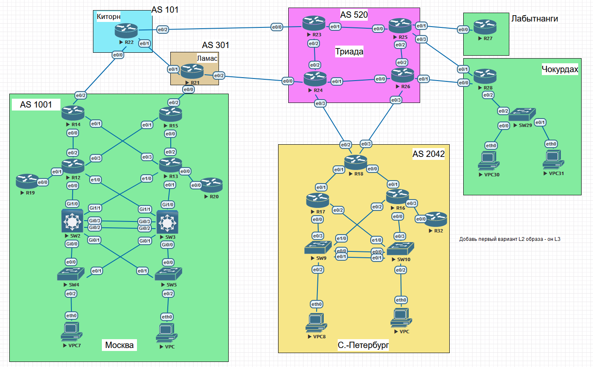
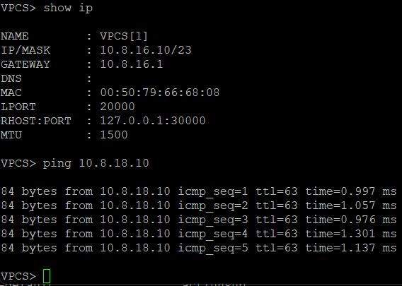
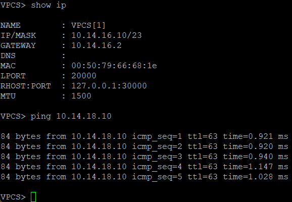

# ЛР 4. Планирование сети

## 1. Цели работы

Часть 1. Разработать план адресного пространства

Часть 2. Настроить IP дареса на всех активных портах устройств

## 2. Топология сети



Рисунок 1. Топология сети

## 3. Планирование адресации

### Количество офисов

В данной работе у компании есть 4 офиса:

- Москва
- Санкт-Петербург
- Чокурдах  
- Лабытнанги

Офис в Москве будет считаться центральным, от которого уже идут филиалы в другие населенные пункты.

### Блоки IP адресов, закрепленные за AS

| AS | Сеть | Маска |
| :---:| :----: | :--- |
| 101 | 192.0.2.0 | 24 |
| 301 | 198.51.100.0 | 24 |
| 520 | 203.0.113.0 | 24 |
| 1001 | 204.11.12.0 | 24 |
| 2042 | 185.82.208.0 | 24 |

### Внутренние IP адреса в сети компании

Для обеспечения связи в офисах будет использован пул адресов 10.0.0.0/8.

Когда из каждого оифса потребуется получить доступ в другой филиал, у нас до этого филиала будет 1 единственный маршрут.
Москва и Санкт-Петербург могут быть расширены до /14, если это когда-то потребуется.

| Офис | Сеть | Маска |
| :---| :---- | :---: |
| Лабытнанги | 10.13.0.0 | 16 |
| Москва | 10.4.0.0 | 16 |
| Санкт-Петербург | 10.8.0.0 | 16 |
| Чокурдах | 10.14.0.0 | 16 |

### Линковые сети в офисах

| Офис | Сеть | Маска |
| :---:| :----: | :--- |
| Лабытнанги | 10.13.0.0 | 23 |
| Москва | 10.4.0.0 | 22 |
| Санкт-Петербург | 10.8.0.0 | 22 |
| Чокурдах | 10.14.0.0 | 23 |

### Подсеть для loopback интерфейсов

| Офис | Сеть | Маска |
| :---:| :----: | :--- |
| Лабытнанги | 10.13.2.0 | 24 |
| Москва | 10.4.4.0 | 23 |
| Санкт-Петербург | 10.8.4.0 | 23 |
| Чокурдах | 10.14.2.0 | 24 |

### Список VLAN

Так как на схеме не очень много VPC установлено, то количество VLAN на 1 офис будет выбрано в соответствии с количеством устройств.

| Офис | Номер VLAN | Название VLAN | Подсеть | Количество адресов |
| :---: | :---: | :--- | :---: | :--- |
| Москва | 10 | Direction | 10.4.16.0 | 23 |
| Москва | 20 | Accounting | 10.4.18.0 | 23 |
| Москва | 99 | Management | 10.4.128.0 | 22 |
| Москва | 101 | Native | - | - |
| Москва | 100 | Parking_vlan | - | - |
| Москва | 11-19,21-98,102-199 | Зарезервировано | - | - |
| Санкт-Петербург | 200 | Engineers | 10.8.16.0 | 23 |
| Санкт-Петербург | 201 | Managers | 10.8.18.0 | 23 |
| Санкт-Петербург | 99 | Management | 10.8.128.0 | 22 |
| Санкт-Петербург | 301 | Native | - | - |
| Санкт-Петербург | 300 | Parking_vlan | - | - |
| Санкт-Петербург | 202-299,302-399 | Зарезервировано | - | - |
| Чокурдах | 400 | Engineers | 10.14.16.0 | 23 |
| Чокурдах | 401 | Managers | 10.14.18.0 | 23 |
| Чокурдах | 402 | Native | - | - |
| Чокурдах | 99 | Management | 10.14.128.0 | 23 |
| Чокурдах | 410 | Parking_vlan | - | - |
| Чокурдах | 402-409 | Зарезервировано | - | - |

### Распределение IP адресов

| Офис | Устройство | Порт | IPv4 адрес | Маска | VLAN |
| :---:| :----: | :--- | :--: | :--: | :--: |
| Лабытнанги | R27 | loopback | 10.13.2.1 | 32 | - |
| Лабытнанги | R27 | e0/0 | 203.0.113.18 | 30 | - |
| Москва | R12 | loopback | 10.4.4.1 | 32 | - |
| Москва | R12 | e0/0 | 10.4.0.1 | 30 | - |
| Москва | R12 | e0/1 | 10.4.0.5 | 30 | - |
| Москва | R12 | e0/2 | 10.4.0.9 | 30 | - |
| Москва | R12 | e0/3 | 10.4.0.13 | 30 | - |
| Москва | R12 | e1/0 | 10.4.0.17 | 30 | - |
| Москва | R13 | loopback | 10.4.4.2 | 32 | - |
| Москва | R13 | e0/0 | 10.4.0.21 | 30 | - |
| Москва | R13 | e0/1 | 10.4.0.25 | 30 | - |
| Москва | R13 | e0/2 | 10.4.0.29 | 30 | - |
| Москва | R13 | e0/3 | 10.4.0.33 | 30 | - |
| Москва | R13 | e1/0 | 10.4.0.37 | 30 | - |
| Москва | R14 | loopback | 10.4.4.3 | 32 | - |
| Москва | R14 | e0/0 | 10.4.0.10 | 30 | - |
| Москва | R14 | e0/1 | 10.4.0.34 | 30 | - |
| Москва | R14 | e0/2 | 192.0.2.2 | 30 | - |
| Москва | R14 | e0/3 | 10.4.0.41 | 30 | - |
| Москва | R15 | loopback | 10.4.4.4 | 32 | - |
| Москва | R15 | e0/0 | 10.4.0.30 | 30 | - |
| Москва | R15 | e0/1 | 10.4.0.14 | 30 | - |
| Москва | R15 | e0/2 | 198.51.100.2 | 30 | - |
| Москва | R15 | e0/3 | 10.4.0.42 | 30 | - |
| Москва | R19 | loopback | 10.4.4.5 | 32 | - |
| Москва | R19 | e0/0 | 10.4.0.6 | 30 | - |
| Москва | R19 | e0/1 | 10.4.20.1 | 24 | - |
| Москва | R19 | e0/2 | 10.4.21.1 | 24 | - |
| Москва | R19 | e0/3 | 10.4.22.1 | 24 | - |
| Москва | R20 | loopback | 10.4.4.6 | 32 | - |
| Москва | R20 | e0/0 | 10.4.0.22 | 30 | - |
| Москва | R20 | e0/1 | 10.4.23.1 | 24 | - |
| Москва | R20 | e0/2 | 10.4.24.1 | 24 | - |
| Москва | R20 | e0/3 | 10.4.25.1 | 24 | - |
| Москва | SW2 | loopback | 10.4.4.7 | 32 | - |
| Москва | SW2 | gi0/0.10 | 10.4.16.2 | 23 | - |
| Москва | SW2 | gi0/1.20 | 10.4.18.2 | 23 | - |
| Москва | SW2 | gi1/0 | 10.4.0.2 | 30 | - |
| Москва | SW2 | gi1/1 | 10.4.0.38 | 30 | - |
| Москва | SW3 | loopback | 10.4.4.8 | 32 | - |
| Москва | SW3 | gi0/0.20 | 10.4.18.3 | 23 | - |
| Москва | SW3 | gi0/1.10 | 10.4.16.3 | 23 | - |
| Москва | SW3 | gi1/0 | 10.4.0.26 | 30 | - |
| Москва | SW3 | gi1/1 | 10.4.0.18 | 30 | - |
| Москва | SW4 | loopback | 10.4.4.9 | 32 | - |
| Москва | SW5 | loopback | 10.4.4.10 | 32 | - |

| Офис | Устройство | Порт | IPv4 адрес | Маска | VLAN |
| :---:| :----: | :--- | :--: | :--: | :--: |
| Санкт-Петербург | R16 | loopback | 10.8.4.1 | 32 | - |
| Санкт-Петербург | R16 | e0/0.201 | 10.8.18.2 | 23 | 200 |
| Санкт-Петербург | R16 | e0/0.301 | - | - |Native- |
| Санкт-Петербург | R16 | e0/1 | 10.8.0.1 | 30 | - |
| Санкт-Петербург | R16 | e0/2.200 | 10.8.16.2 | 23 | 201 |
| Санкт-Петербург | R16 | e0/2.301 | - | - | Native |
| Санкт-Петербург | R16 | e0/3 | 10.8.0.5 | 30 | - |
| Санкт-Петербург | R17 | loopback | 10.8.4.2 | 32 | - |
| Санкт-Петербург | R17 | e0/0.200 | 10.8.16.3 | 23 | 200 |
| Санкт-Петербург | R17 | e0/0.301 | - | - | Native |
| Санкт-Петербург | R17 | e0/1 | 10.8.0.9 | 30 | - |
| Санкт-Петербург | R17 | e0/2.201 | 10.8.18.3 | 23 | 201 |
| Санкт-Петербург | R17 | e0/2.301 | - | - | Native |
| Санкт-Петербург | R18 | loopback | 10.8.4.3 | 32 | - |
| Санкт-Петербург | R18 | e0/0 | 10.8.0.2 | 30 | - |
| Санкт-Петербург | R18 | e0/1 | 10.8.0.10 | 30 | - |
| Санкт-Петербург | R18 | e0/2 | 203.0.113.2 | 30 | - |
| Санкт-Петербург | R18 | e0/3 | 203.0.113.6 | 30 | - |
| Санкт-Петербург | R32 | loopback | 10.8.4.4 | 32 | - |
| Санкт-Петербург | R32 | e0/0 | 10.8.0.6 | 30 | - |
| Санкт-Петербург | R32 | e0/1 | 10.8.20.1 | 24 | - |
| Санкт-Петербург | R32 | e0/2 | 10.8.21.1 | 24 | - |
| Санкт-Петербург | R32 | e0/3 | 10.8.22.1 | 24 | - |
| Санкт-Петербург | SW9 | loopback | 10.8.4.5 | 32 | - |
| Санкт-Петербург | SW10 | loopback | 10.8.4.6 | 32 | - |

| Офис | Устройство | Порт | IPv4 адрес | Маска | VLAN |
| :---:| :----: | :--- | :--: | :--: | :--: |
| Чокурдах | R28 | loopback | 10.14.2.1 | 32 | - |
| Чокурдах | R28 | e0/0 | 203.0.113.10 | 30 | - |
| Чокурдах | R28 | e0/1 | 203.0.113.14 | 30 | - |
| Чокурдах | R28 | e0/2 | - | - | - |
| Чокурдах | R28 | e0/2.400 | 10.14.16.2 | 23 | 400 |
| Чокурдах | R28 | e0/2.401 | 10.14.18.2 | 23 | 401 |
| Чокурдах | R28 | e0/2.402 | - | - | 402 |
| Чокурдах | SW29 | vlan 99 | 10.14.2.2 | 32 | 99 |

### Адреса HSRP протокола

| Офис | Устройство | Порты | Адрес | VLAN |
| :---:| :----: | :--- | :--: | :--: |
| Москва | SW4 | VLAN10 | 10.4.16.1 | 10 |
| Москва | SW4 | VLAN20 | 10.4.18.1 | 20 |
| Москва | SW5 | VLAN10 | 10.4.16.1 | 10 |
| Москва | SW5 | VLAN20 | 10.4.18.1 | 20 |
| Санкт-Петербург | SW9 | VLAN200 | 10.8.16.1 | 200 |
| Санкт-Петербург | SW9 | VLAN201 | 10.8.18.1 | 201 |
| Санкт-Петербург | SW10 | VLAN200 | 10.8.16.1 | 200 |
| Санкт-Петербург | SW10 | VLAN201 | 10.8.18.1 | 201 |

### Настройка провайдеров

| Провайдер | Устройство | Интерфейс | Сеть | Адрес |
| :---:| :----: | :--- | :--: | :--: |
| Китрон | R22 | e0/0 | 192.0.2.1 | 30 |
| Китрон | R22 | e0/1 | 192.0.2.5 | 30 |
| Китрон | R22 | e0/2 | 192.0.2.9 | 30 |
| Ламас | R21 | e0/0 | 198.51.100.1 | 30 |
| Ламас | R21 | e0/1 | 192.0.2.6 | 30 |
| Ламас | R21 | e0/2 | 198.51.100.5 | 30 |
| Триада | R23 | e0/0 | 192.0.2.10 | 30 |
| Триада | R23 | e0/1 | 172.20.0.1 | 30 |
| Триада | R23 | e0/2 | 172.20.0.5 | 30 |
| Триада | R23 | e0/3 | - | - |
| Триада | R24 | e0/0 | 198.51.100.6 | 30 |
| Триада | R24 | e0/1 | 172.20.0.9 | 30 |
| Триада | R24 | e0/2 | 172.20.0.6 | 30 |
| Триада | R24 | e0/3 | 203.0.113.1 | 30 |
| Триада | R25 | e0/0 | 172.20.0.2 | 30 |
| Триада | R25 | e0/1 | 203.0.113.17 | 30 |
| Триада | R25 | e0/2 | 172.20.0.13 | 30 |
| Триада | R25 | e0/3 | 203.0.113.13 | 30 |
| Триада | R26 | e0/0 | 172.20.0.10 | 30 |
| Триада | R26 | e0/1 | 203.0.113.9 | 30 |
| Триада | R26 | e0/2 | 172.20.0.14 | 30 |
| Триада | R26 | e0/3 | 203.0.113.5 | 30 |

## Настройка адресов на оборудовании

### Лабытнанги

#### R27

```shell
hostname R27

interface loopback 1
ip address 10.13.2.1 255.255.255.255

interface e0/0
ip address 203.0.113.18 255.255.255.252
```

### Москва

#### R12

```shell
hostname R12

interface loopback 1
ip address 10.4.4.1 255.255.255.255

interface Ethernet0/0
ip address 10.4.0.1 255.255.255.252

interface Ethernet0/1
ip address 10.4.0.5 255.255.255.252

interface Ethernet0/2
ip address 10.4.0.9 255.255.255.252

interface Ethernet0/3
ip address 10.4.0.13 255.255.255.252

interface Ethernet1/0
ip address 10.4.0.17 255.255.255.252

```

#### R13

```shell
hostname R13

interface loopback 1
ip address 10.4.4.2 255.255.255.255

interface Ethernet0/0
ip address 10.4.0.21 255.255.255.252

interface Ethernet0/1
ip address 10.4.0.25 255.255.255.252

interface Ethernet0/2
ip address 10.4.0.29 255.255.255.252

interface Ethernet0/3
ip address 10.4.0.33 255.255.255.252

interface Ethernet1/0
ip address 10.4.0.37 255.255.255.252
```

#### R14

```shell
hostname R14

interface loopback 1
ip address 10.4.4.3 255.255.255.255

interface Ethernet0/0
ip address 10.4.0.10 255.255.255.252

interface Ethernet0/1
ip address 10.4.0.34 255.255.255.252

interface Ethernet0/2
ip address 192.0.2.2 255.255.255.252

```

#### R15

```shell
hostname R15

interface loopback 1
ip address 10.4.4.4 255.255.255.255

interface Ethernet0/0
ip address 10.4.0.30 255.255.255.252

interface Ethernet0/1
ip address 10.4.0.14 255.255.255.252

interface Ethernet0/2
ip address 198.51.100.2 255.255.255.252
```

#### R19

```shell
hostname R19

interface loopback 1
ip address 10.4.4.5 255.255.255.255

interface Ethernet0/0
ip address 10.4.0.6 255.255.255.252

interface Ethernet0/1
ip address 10.4.20.1 255.255.255.0

interface Ethernet0/2
ip address 10.4.21.1 255.255.255.0

interface Ethernet0/3
ip address 10.4.22.1 255.255.255.0
```

#### R20

```shell
hostname R20

interface loopback 1
ip address 10.4.4.6 255.255.255.255

interface Ethernet0/0
ip address 10.4.0.22 255.255.255.252

interface Ethernet0/1
ip address 10.4.23.1 255.255.255.0

interface Ethernet0/2
ip address 10.4.24.1 255.255.255.0

interface Ethernet0/3
ip address 10.4.25.1 255.255.255.0

```

#### SW2

```shell
hostname SW2

spanning-tree mode rapid-pvst

vlan 10
name Direction
vlan 20
name Accounting
vlan 101
name Native

interface Loopback1
ip address 10.4.4.7 255.255.255.255

interface Port-channel1
switchport trunk allowed vlan 10,20
switchport trunk encapsulation dot1q
switchport trunk native vlan 101
switchport mode trunk

interface GigabitEthernet0/2
switchport trunk allowed vlan 10,20
switchport trunk encapsulation dot1q
switchport trunk native vlan 101
switchport mode trunk
channel-group 1 mode desirable

interface GigabitEthernet0/3
switchport trunk allowed vlan 10,20
switchport trunk encapsulation dot1q
switchport trunk native vlan 101
switchport mode trunk
channel-group 1 mode desirable

interface GigabitEthernet0/0.10
encapsulation dot1Q 10
ip address 10.4.16.2 255.255.254.0
standby version 2
standby 10 ip 10.4.16.1
standby 10 priority 150
standby 10 preempt

interface GigabitEthernet0/1.20
encapsulation dot1Q 20
ip address 10.4.18.2 255.255.254.0
standby version 2
standby 20 ip 10.4.18.1
standby 20 preempt

interface GigabitEthernet1/0
no switchport
ip address 10.4.0.2 255.255.255.252

interface GigabitEthernet1/1
no switchport
ip address 10.4.0.38 255.255.255.252
```

#### SW3

```shell
hostname SW3

spanning-tree mode rapid-pvst

vlan 10
name Direction
vlan 20
name Accounting
vlan 101
name Native

interface Loopback1
ip address 10.4.4.8 255.255.255.255

interface Port-channel1
switchport trunk allowed vlan 10,20
switchport trunk encapsulation dot1q
switchport trunk native vlan 101
switchport mode trunk

interface GigabitEthernet0/2
switchport trunk allowed vlan 10,20
switchport trunk encapsulation dot1q
switchport trunk native vlan 101
switchport mode trunk
channel-group 1 mode desirable

interface GigabitEthernet0/3
switchport trunk allowed vlan 10,20
switchport trunk encapsulation dot1q
switchport trunk native vlan 101
switchport mode trunk
channel-group 1 mode desirable

interface GigabitEthernet0/0.20
encapsulation dot1Q 20
ip address 10.4.18.3 255.255.254.0
standby version 2
standby 20 ip 10.4.18.1
standby 20 priority 150
standby 20 preempt

interface GigabitEthernet0/1.10
encapsulation dot1Q 10
ip address 10.4.16.3 255.255.254.0
standby version 2
standby 10 ip 10.4.16.1
standby 10 preempt
```

#### SW4

```shell
hostname SW4

ip routing 

spanning-tree mode rapid-pvst

vlan 10
name Direction
vlan 20
name Accounting
vlan 101
name Native

interface loopback 1
ip address 10.4.4.9 255.255.255.255

interface Ethernet0/0
switchport trunk allowed vlan 10,20
switchport trunk encapsulation dot1q
switchport trunk native vlan 101
switchport mode trunk

interface Ethernet0/1
switchport trunk allowed vlan 10,20
switchport trunk encapsulation dot1q
switchport trunk native vlan 101
switchport mode trunk

interface Ethernet0/2
switchport access vlan 10
switchport mode access
spanning-tree portfast
spanning-tree bpduguard enable
```

#### SW5

```shell
hostname SW5

ip routing 

spanning-tree mode rapid-pvst

vlan 10
name Direction
vlan 20
name Accounting
vlan 101
name Native

interface loopback 1
ip address 10.4.4.10 255.255.255.255

interface Ethernet0/0
switchport trunk allowed vlan 10,20
switchport trunk encapsulation dot1q
switchport trunk native vlan 101
switchport mode trunk

interface Ethernet0/1
switchport trunk allowed vlan 10,20
switchport trunk encapsulation dot1q
switchport trunk native vlan 101
switchport mode trunk

interface Ethernet0/2
switchport access vlan 20
switchport mode access
spanning-tree portfast
spanning-tree bpduguard enable
```

Межвлановая маршрутизация работает. PC1 может пинговать PC7


### Санкт-Петербург

#### R16

```shell
hostname R16

interface Loopback1
ip address 10.8.4.1 255.255.255.255

interface Ethernet0/0.201
encapsulation dot1Q 201
ip address 10.8.18.2 255.255.254.0
standby version 2
standby 201 ip 10.8.18.1
standby 201 priority 150
standby 201 preempt

interface Ethernet0/0.301
encapsulation dot1Q 301 native

interface Ethernet0/1
ip address 10.8.0.1 255.255.255.252

interface Ethernet0/2.200
encapsulation dot1Q 200
ip address 10.8.16.2 255.255.254.0
standby version 2
standby 200 ip 10.8.16.1
standby 200 preempt

interface Ethernet0/3
ip address 10.8.0.5 255.255.255.252
```

#### R17

```shell
hostname R17

interface Loopback1
ip address 10.8.4.2 255.255.255.255

interface Ethernet0/0.200
encapsulation dot1Q 200
ip address 10.8.16.3 255.255.254.0
standby version 2
standby 200 ip 10.8.16.1
standby 200 priority 150
standby 200 preempt

interface Ethernet0/0.301
encapsulation dot1Q 301 native

interface Ethernet0/1
ip address 10.8.0.9 255.255.255.252

interface Ethernet0/2.201
encapsulation dot1Q 201
ip address 10.8.18.3 255.255.254.0
standby version 2
standby 201 ip 10.8.18.1
standby 201 preempt
```

#### R18

```shell
hostname R18

interface Loopback1
ip address 10.8.4.3 255.255.255.255

interface Ethernet0/0
ip address 10.8.0.2 255.255.255.252

interface Ethernet0/1
ip address 10.8.0.10 255.255.255.252

interface Ethernet0/2
ip address 203.0.113.2 255.255.255.252

interface Ethernet0/3
ip address 203.0.113.6 255.255.255.252
```

#### R32

```shell
hostname R32

interface Loopback1
ip address 10.8.4.4 255.255.255.255

interface Ethernet0/0
ip address 10.8.0.6 255.255.255.252

interface Ethernet0/1
ip address 10.8.20.1 255.255.255.0

interface Ethernet0/2
ip address 10.8.21.1 255.255.255.0

interface Ethernet0/3
ip address 10.8.22.1 255.255.255.0
```

#### SW9

```shell
hostname SW9

spanning-tree mode rapid-pvst

vlan 200
name Engineers
vlan 201
name Managers
vlan 301
name Native

interface Loopback1
ip address 10.8.4.5 255.255.255.255

interface Port-channel1
switchport trunk allowed vlan 200,201
switchport trunk encapsulation dot1q
switchport trunk native vlan 301
switchport mode trunk

interface Ethernet0/0
switchport trunk allowed vlan 200,201
switchport trunk encapsulation dot1q
switchport trunk native vlan 301
switchport mode trunk
channel-group 1 mode desirable

interface Ethernet0/1
switchport trunk allowed vlan 200,201
switchport trunk encapsulation dot1q
switchport trunk native vlan 301
switchport mode trunk
channel-group 1 mode desirable

interface Ethernet0/2
switchport access vlan 200
switchport mode access
spanning-tree portfast
spanning-tree bpduguard enable

interface Ethernet0/3
switchport trunk allowed vlan 200,201
switchport trunk encapsulation dot1q
switchport trunk native vlan 301
switchport mode trunk

interface Ethernet1/0
switchport trunk allowed vlan 200,201
switchport trunk encapsulation dot1q
switchport trunk native vlan 301
switchport mode trunk
```

#### SW10

```shell
hostname SW10

spanning-tree mode rapid-pvst

vlan 200
name Engineers
vlan 201
name Managers
vlan 301
name Native

interface Loopback1
ip address 10.8.4.6 255.255.255.255

interface Port-channel1
switchport trunk allowed vlan 200,201
switchport trunk encapsulation dot1q
switchport trunk native vlan 301
switchport mode trunk

interface Ethernet0/0
switchport trunk allowed vlan 200,201
switchport trunk encapsulation dot1q
switchport trunk native vlan 301
switchport mode trunk
channel-group 1 mode desirable

interface Ethernet0/1
switchport trunk allowed vlan 200,201
switchport trunk encapsulation dot1q
switchport trunk native vlan 301
switchport mode trunk
channel-group 1 mode desirable

interface Ethernet0/2
switchport access vlan 201
switchport mode access
spanning-tree portfast
spanning-tree bpduguard enable

interface Ethernet0/3
switchport trunk allowed vlan 200,201
switchport trunk encapsulation dot1q
switchport trunk native vlan 301
switchport mode trunk

interface Ethernet1/0
switchport trunk allowed vlan 200,201
switchport trunk encapsulation dot1q
switchport trunk native vlan 301
switchport mode trunk
```

Межвлановая маршрутизация работает. PC8 может пинговать PC



### Чокурдах

#### R28

```shell
hostname R28

interface Loopback1
ip address 10.14.2.1 255.255.255.255

interface Ethernet0/0
ip address 203.0.113.10 255.255.255.252

interface Ethernet0/1
ip address 203.0.113.14 255.255.255.252

interface Ethernet0/2
no ip address

interface Ethernet0/2.400
encapsulation dot1Q 400
ip address 10.14.16.1 255.255.254.0

interface Ethernet0/2.401
encapsulation dot1Q 401
ip address 10.14.18.1 255.255.254.0
```

#### SW29

```shell
hostname sw29

spanning-tree mode rapid-pvst

vlan 400
name Engineers
vlan 401
name Managers
vlan 402
name Native
vlan 99
name Management

interface Loopback1
ip address 10.14.2.2 255.255.255.255

interface Ethernet0/0
switchport access vlan 400
switchport mode access
spanning-tree portfast
spanning-tree bpduguard enable

interface Ethernet0/1
switchport access vlan 401
switchport mode access
spanning-tree portfast
spanning-tree bpduguard enable

interface Ethernet0/2
switchport trunk allowed vlan 400,401
switchport trunk encapsulation dot1q
switchport trunk native vlan 402
switchport mode trunk
```

Межвлановая маршрутизация работает. PC30 может пинговать PC31



### Китрон

```shell
hostname kitorn

interface Ethernet0/0
ip address 192.0.2.1 255.255.255.252

interface Ethernet0/1
ip address 192.0.2.5 255.255.255.252

interface Ethernet0/2
ip address 192.0.2.9 255.255.255.252
```

### Ламас

```shell
hostname lamas

interface Ethernet0/0
ip address 198.51.100.1 255.255.255.252

interface Ethernet0/1
ip address 192.0.2.6 255.255.255.252

interface Ethernet0/2
ip address 198.51.100.5 255.255.255.252
```

### Триада

#### R23

```shell
interface Ethernet0/0
ip address 192.0.2.10 255.255.255.252

interface Ethernet0/1
ip address 172.20.0.1 255.255.255.252

interface Ethernet0/2
ip address 172.20.0.5 255.255.255.252
```

#### R24

```shell
interface Ethernet0/0
ip address 198.51.100.6 255.255.255.252

interface Ethernet0/1
ip address 172.20.0.9 255.255.255.252

interface Ethernet0/2
ip address 172.20.0.6 255.255.255.252

interface Ethernet0/3
ip address 203.0.113.1 255.255.255.252
```

#### R25

```shell
interface Ethernet0/0
ip address 172.20.0.2 255.255.255.252

interface Ethernet0/1
ip address 203.0.113.17 255.255.255.252

interface Ethernet0/2
ip address 172.20.0.13 255.255.255.252

interface Ethernet0/3
ip address 203.0.113.13 255.255.255.252
```

#### R26

```shell
interface Ethernet0/0
ip address 172.20.0.10 255.255.255.252

interface Ethernet0/1
ip address 203.0.113.9 255.255.255.252

interface Ethernet0/2
ip address 172.20.0.14 255.255.255.252

interface Ethernet0/3
ip address 203.0.113.5 255.255.255.252
```
