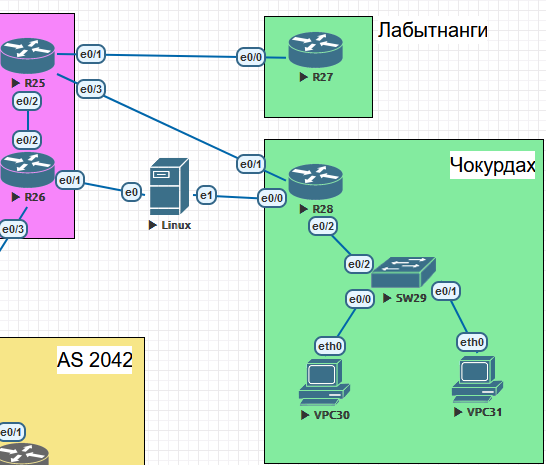
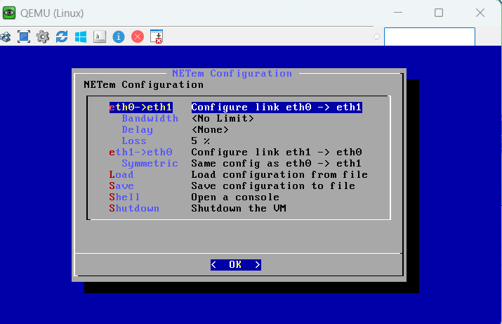
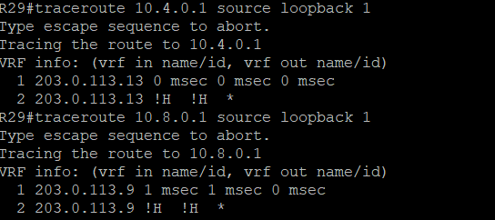
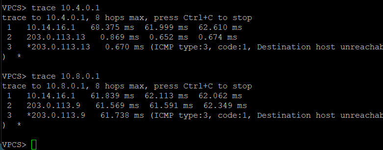
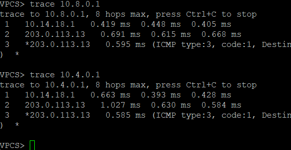
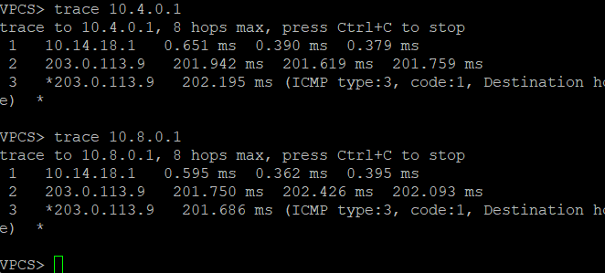

# ЛР 5. PBR и IP SLA

## 1. Цели работы

Настроить политику маршрутизации в офисе Чокурдах. Распределить трафик между 2 линками.

1. Настроите политику маршрутизации для сетей офиса.

2. Распределите трафик между двумя линками с провайдером.

3. Настроите отслеживание линка через технологию IP SLA.(только для IPv4)

4. Настройте для офиса Лабытнанги маршрут по-умолчанию

## 2. Топология сети



Рисунок 1. Топология сети

В качестве эмулятора сети добавлен Linux хост, который может вносить задержки в работу сети



## 3. Настройка офиса Лабытнанги

В ЛР 4 были выбраны адреса для всех линковых сетей. Подсеть между Лабытнанги и Триада на R25 e0/1 и R27 e0/0 выбрана следующая:

| Устройство | Интерфейс | Адрес сети | Маска |
| -- | -- | -- | -- |
| R25 | e0/1 | 203.0.113.17 | 30 |
| R27 | e0/0 | 203.0.113.18 | 30 |

Маршрут по умолчанию на R27:

```bash
ip route 0.0.0.0 0.0.0.0 203.0.113.17
```

Gateway пингуется успешно


## 4. Настройка офиса Чокурдах

| Устройство | Интерфейс | Адрес сети | Маска |
| -- | -- | -- | -- |
| R25 | e0/3 | 203.0.113.13 | 30 |
| R26 | e0/1 | 203.0.113.9 | 30 |
| R28 | e0/0 | 203.0.113.10 | 30 |
| R28 | e0/1 | 203.0.113.14 | 30 |

Какие правила будут в офисе Чокурдах:

1. Трафик до офиса в Москве (10.4.0.0/16) и Лабытнанги (10.13.0.0/16) будет идти через R25
2. Трафик до офиса в Санкт-Петербурге (10.8.0.0/16) будет идти через R26
3. Если RTT на линии выше 100 мс, то надо перенаправлять трафик на другую линию при условии, что там RTT лучше
4. Если потери на линии выше 1%, надо перенаправить трафик на другую линию при условии, что там потери не хуже

### 4.1 Распределение трафика между провайдером в Чокурдах

На R28 есть маршрут по умолчанию, который ведет на маршрутизатор R26 провайдера.

```bash
ip route 0.0.0.0 0.0.0.0 203.0.113.9
```

Создан расширенный ACL, в который попадают все пакеты с DST IP из сетей 10.4.0.0/16 и 10.13.0.0/16

```bash

ip access-list extended MOSKOW_ROUTE
 permit ip any 10.4.0.0 0.0.255.255
 permit ip any 10.13.0.0 0.0.255.255
 permit icmp any any

```

Далее создается маршрутная карта, где в качестве match используется созданный ACL MOSKOW_ROUTE, а в качестве действия идет установка next-hop на маршрутизатор R25

```bash
route-map ROUTE_SELECTOR permit 10
match ip address MOSKOW_ROUTE
set ip next-hop 203.0.113.13
```

И в завершении данная маршрутная карта применяется к подинтерфейсам e0/2.400 и e0/2.401, так как именно сюда приходит трафик из локальной сети. Такая же маршрутная карта применена к исходящему от самого маршрутизатора трафику.

```bash
interface Ethernet0/2.400
 ip policy route-map ROUTE_SELECTOR

interface Ethernet0/2.401
 ip policy route-map ROUTE_SELECTOR

ip local policy route-map ROUTE_SELECTOR
```

Проверка. Так как еще не налажена маршрутизация между сетями, то для проверки работы PBR на R25 и R26 я прописал статические маршруты до сети Чокурдах.
R25:

```bash
ip route 10.14.0.0 255.255.0.0 203.0.113.14
```

R26:

```bash
ip route 10.14.0.0 255.255.0.0 203.0.113.10
```

Проверка traceroute с PC30:


Дальше узла провайдера трафик не идет, но зато видно, что из R28 пакеты выходят через нужные нам линки

Проверка traceroute с loopback R28:



Аналогичный результат и для исходящего трафика.

### 4.2 Настройка SLA в Чокурдах

Логика работы следующая:

1. Проверять доступность гейтвея (203.0.113.9) раз в 10 секунд
2. Граница принятия решения для переключения на другой линк составляет 90 мс
3. Перед переключением проверить, нет ли подобных проблем на втором линке. Если там тоже все плохо, оставить работу через 203.0.113.9. Если там условия лучше, то перевести трафик

Для этого создается 2 SLA. Проверяется icmp-ping до устройств провайдера со своего loopback интерфейса.

```bash
ip sla 100
 icmp-echo 203.0.113.9 source-ip 10.14.2.1
 threshold 90
 frequency 10

ip sla 200
 icmp-echo 203.0.113.13 source-ip 10.14.2.1
 threshold 10
 frequency 10

ip sla schedule 200 life forever start-time now
ip sla schedule 100 life forever start-time now
```

Настраивается 2 track для отслеживания доступности адресов провайдера.

```bash
track 100 ip sla 100 reachability
track 200 ip sla 200 reachability
```

Переделывается route-map ROUTE_SELECTOR так, что перед принятием решения проверяется доступность next-hop.

```bash
route-map ROUTE_SELECTOR permit 10
match ip address MOSKOW_ROUTE
set ip next-hop verify-availability 203.0.113.9 1 track 100
set ip next-hop verify-availability 203.0.113.13 2 track 200

route-map ROUTE_SELECTOR permit 20
set ip next-hop verify-availability 203.0.113.9 1 track 100
set ip next-hop verify-availability 203.0.113.13 2 track 200
```

К подинтерфейсам данная маршрутная карта уже привязана.

Проверка.

1. Оба линка с провайдером работают отлично, потерь и задержек нет

    Трафик на 10.4.0.0/16 и 10.13.0.0/16 идет через 203.0.113.13, а 10.8.0.0/16 идет на 203.0.113.9

    

2. С помощью эмулятора сети настроим на линии между R26 и R28 среднюю задержку в 100 мс. Потерь нет, поэтому до граничного значения в 100 мс не дойдем, трафик должен идти через 203.0.113.13

    

3. Отключим интерфейс e0/3 на R25

    Весь трафик должен пойти на 203.0.113.9

    

Заданная логика выполняется.
