# ЛР 8. EIGRP

## 1. Цели работы

Настроить EIGRP в С.-Петербург;
Использовать named EIGRP

1. В офисе С.-Петербург настроить EIGRP.
2. R32 получает только маршрут по умолчанию.
3. R16-17 анонсируют только суммарные префиксы.
4. Использовать EIGRP named-mode для настройки сети.

## 2. Топология сети

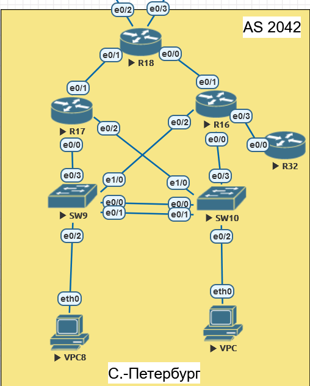

Рисунок 1. Топология сети

## 3. Настройка EIGRP

- R18 будет распространять непосредственно подключенные маршруты (на провайдера), которые для него являются маршрутом по умолчанию в Интернет.
- R16-17 будут отсылать суммарный маршрут на R18. R17 не имеет других подключений, кроме как R18 и коммутаторы. Он будет суммарный маршрут 10.8.16.0/22 сообщать на R18, а у R16 есть еще 1 сосед. Чтобы его сети анонсировать, будет суммарный маршрут 10.8.16.0/21 будет анонсироваться. Получается, R17 будет по дефолту обрабатывать маршруты на устройства в локальной сети (PC), R16 останется резервом для данных маршрутов, но также будет транзитным узлом для сетей R32.
- R16-17 своим соседям, кроме R18, рассылает лишь маршрут по умолчанию
- R32 будет STUB роутером

R18

```bash
ip route 0.0.0.0 0.0.0.0 203.0.113.1
ip route 0.0.0.0 0.0.0.0 203.0.113.5 100

router eigrp R18
 
 address-family ipv4 unicast autonomous-system 1
  
  topology base
   redistribute connected
   redistribute static
  exit-af-topology
  network 10.8.0.0 0.0.3.255
```

R16

```bash
router eigrp R16
 
 address-family ipv4 unicast autonomous-system 1

  af-interface Ethernet0/3
   summary-address 0.0.0.0 0.0.0.0

  af-interface Ethernet0/1
   summary-address 10.8.16.0 255.255.248.0

  topology base
   redistribute connected

  network 10.8.0.0 0.0.3.255

```

R17

```bash
router eigrp R17
 
 address-family ipv4 unicast autonomous-system 1

  af-interface Ethernet0/3
   summary-address 0.0.0.0 0.0.0.0
  
  af-interface Ethernet0/1
   summary-address 10.8.16.0 255.255.252.0
  
  topology base
   redistribute connected

  network 10.8.0.0 0.0.3.255
```

R32

```bash
router eigrp R32
 
 address-family ipv4 unicast autonomous-system 1
  
  topology base
   redistribute connected

  network 10.8.0.6 0.0.0.0
  eigrp stub connected summary
```

## 4. Проверка

Все соседи на R18

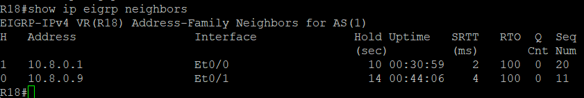

Все соседи на R16

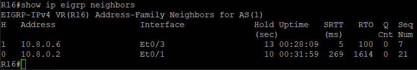

Все соседи на R17

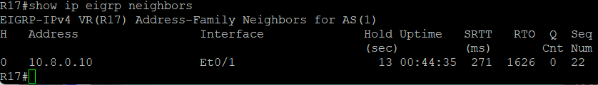

Все соседи на R32

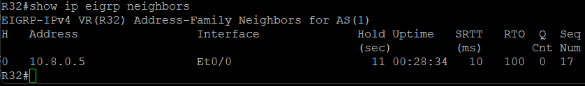


Все маршрутизаторы установили нужные соседства.

Полученные маршруты на R18. Получаем суммаризованные маршруты от соседей

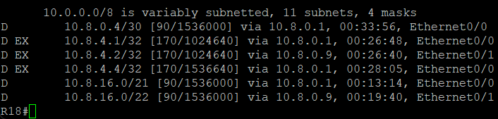

Полученные маршруты на R16. Получаем все маршруты от R18

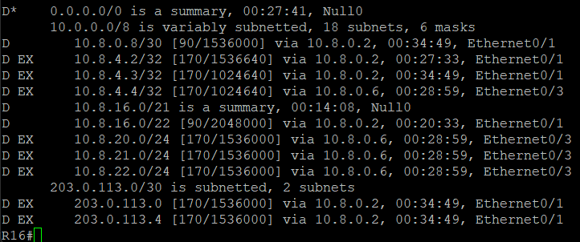

Полученные маршруты на R17. Получаем все маршруты от R18

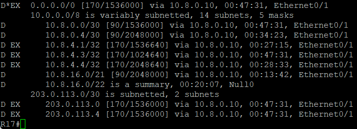

Полученные маршруты на R32. Получаем лишь маршрут по умолчанию от R16

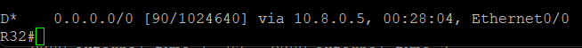

Пинги с R18 и R17 до e0/1 R32 (10.8.20.1) прошли успешно

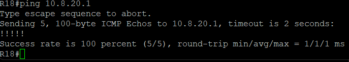

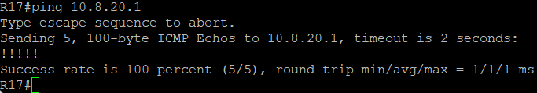
