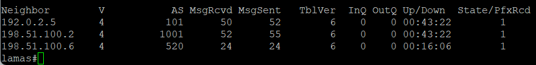
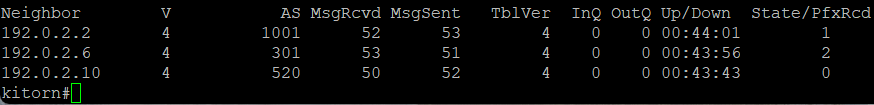
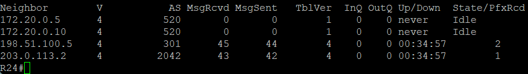
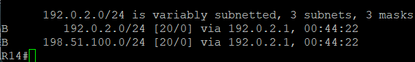
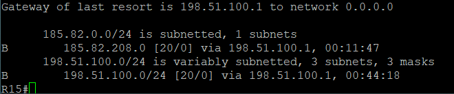

# ЛР 9. eBGP

## 1. Цели работы

1. Настроить eBGP между автономными системами
2. Организовать доступность между офисами Москва и С.-Петербург

## 2. Топология сети


Рисунок 1. Топология сети

## 3. Настройка eBGP

На каждом пограничном маршрутизаторе в Москве и Санкт-Петербурге создается Loopback интерфейс с адресом для данной AS, а также маршрут до сети своей же AS в Null 0

Москва - R14:

```bash
router bgp 1001
 bgp log-neighbor-changes
 network 204.11.12.0
 neighbor 192.0.2.1 remote-as 101

interface Loopback2
 ip address 204.11.12.1 255.255.255.252

ip route 204.11.12.0 255.255.255.0 Null0
```

Москва - R15:

```bash
router bgp 1001
 bgp log-neighbor-changes
 network 204.11.12.0
 neighbor 198.51.100.1 remote-as 301

interface Loopback2
 ip address 204.11.12.5 255.255.255.252

ip route 204.11.12.0 255.255.255.0 Null0
```

Санкт-Петербург - R18:

```bash
router bgp 2042
 bgp log-neighbor-changes
 network 185.82.208.0 mask 255.255.255.0
 neighbor 203.0.113.1 remote-as 520
 neighbor 203.0.113.5 remote-as 520

ip route 185.82.208.0 255.255.255.0 Null0
```

Провайдеры через prefix-list анонсируют сети своим соседям

Китрон - R22:

```bash
router bgp 101
 bgp log-neighbor-changes
 network 192.0.2.0
 neighbor 192.0.2.2 remote-as 1001
 neighbor 192.0.2.2 route-map TO_R14 out
 neighbor 192.0.2.6 remote-as 301
 neighbor 192.0.2.6 route-map TO_OTHER_PROVIDERS out
 neighbor 192.0.2.10 remote-as 520
 neighbor 192.0.2.10 route-map TO_OTHER_PROVIDERS out

ip route 192.0.2.0 255.255.255.0 Null0

ip prefix-list TO_OTHER_PROVIDERS seq 5 permit 204.11.12.0/24

ip prefix-list TO_R14 seq 5 permit 192.0.2.0/24
ip prefix-list TO_R14 seq 10 permit 198.51.100.0/24

route-map TO_OTHER_PROVIDERS permit 10
 match ip address prefix-list TO_OTHER_PROVIDERS

route-map TO_R14 permit 10
 match ip address prefix-list TO_R14

```

Ламас - R21:

```bash
router bgp 301
 bgp log-neighbor-changes
 network 192.0.2.0
 network 198.51.100.0
 neighbor 192.0.2.5 remote-as 101
 neighbor 192.0.2.5 route-map TO_OTHER_PROVIDERS out
 neighbor 198.51.100.2 remote-as 1001
 neighbor 198.51.100.2 route-map TO_R15 out
 neighbor 198.51.100.6 remote-as 520
 neighbor 198.51.100.6 route-map TO_OTHER_PROVIDERS out

ip route 198.51.100.0 255.255.255.0 Null0

ip prefix-list TO_OTHER_PROVIDERS seq 5 permit 204.11.12.0/24
ip prefix-list TO_OTHER_PROVIDERS seq 10 permit 198.51.100.0/24

ip prefix-list TO_R15 seq 5 permit 198.51.100.0/24
ip prefix-list TO_R15 seq 10 permit 192.0.2.0/24
ip prefix-list TO_R15 seq 15 permit 185.82.208.0/24

route-map TO_OTHER_PROVIDERS permit 10
 match ip address prefix-list TO_OTHER_PROVIDERS

route-map TO_R15 permit 10
 match ip address prefix-list TO_R15
```

Триада - R23

```bash
router bgp 520
 bgp log-neighbor-changes
 neighbor 192.0.2.9 remote-as 101

```

Триада - R24

```bash
router bgp 520
 bgp log-neighbor-changes
 neighbor 172.20.0.5 remote-as 520
 neighbor 172.20.0.10 remote-as 520
 neighbor 198.51.100.5 remote-as 301
 neighbor 198.51.100.5 route-map TO_R21 out
 neighbor 203.0.113.2 remote-as 2042
 neighbor 203.0.113.2 route-map TO_R18 out

ip prefix-list TO_R18 seq 5 permit 204.11.12.0/24
ip prefix-list TO_R18 seq 10 permit 198.51.100.0/24

ip prefix-list TO_R21 seq 5 permit 185.82.208.0/24

route-map TO_R21 permit 10
 match ip address prefix-list TO_R21

route-map TO_R18 permit 10
 match ip address prefix-list TO_R18
```

Триада - R26

```bash
router bgp 520
 bgp log-neighbor-changes
 neighbor 203.0.113.6 remote-as 2042
```

## Проверка

Результат команды `show ip bgp summary` на Ламас:



Результат команды `show ip bgp summary` на Китрон:



Результат команды `show ip bgp summary` на Триада R24:



Маршруты BGP на R14:



Маршруты BGP на R15:



Маршруты BGP на R18:


Маршруты по BGP от провайдеров также получены

Пинг с R15 (Москва) до R18 (Санкт-Петербург). Пингуется адрес на Loopback2 в Санкт-Петербурге с Loopback адреса R15, чтобы сымитировать доступность сети AS 2042 из AS 1001.


AS 1001 и AS 2042 имеют связанность. Пинг прошел успешно.
