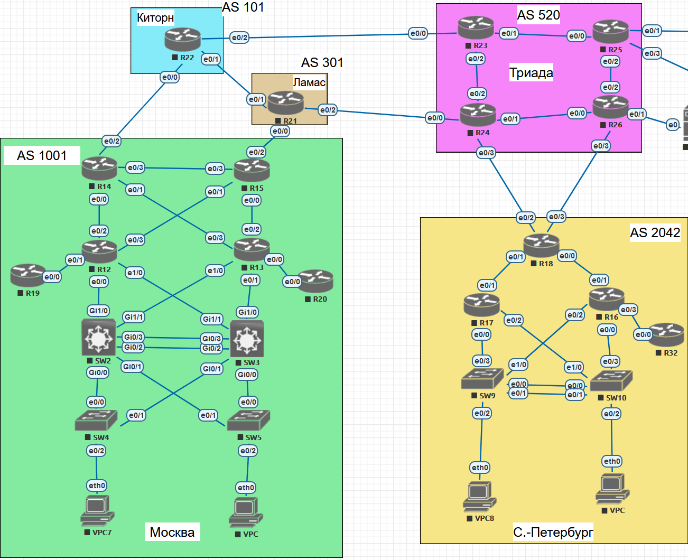
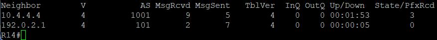
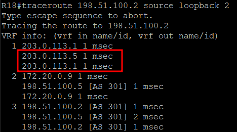
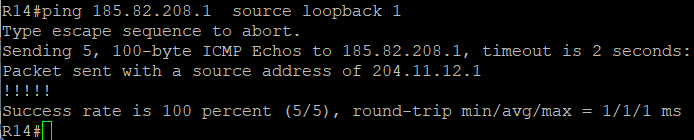
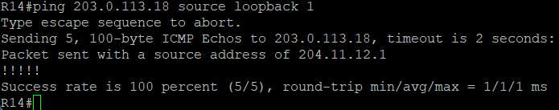
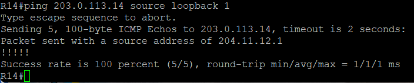
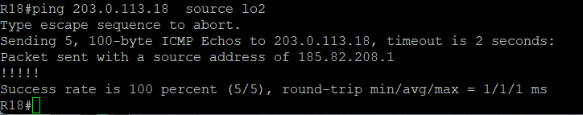
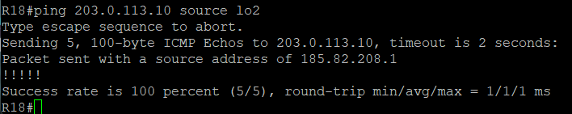
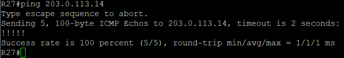

# ЛР 10. iBGP

## 1. Цели работы

1. Настроите iBGP в офисом Москва между маршрутизаторами R14 и R15.
2. Настроите iBGP в провайдере Триада, с использованием RR.
3. Настройте офиса Москва так, чтобы приоритетным провайдером стал Ламас.
4. Настройте офиса С.-Петербург так, чтобы трафик до любого офиса распределялся по двум линкам одновременно.
5. Все сети в лабораторной работе должны иметь IP связность.

## 2. Топология сети



Рисунок 1. Топология сети

## 3. Настройка iBGP

### 3.1 Настройка iBGP в московском офисе

Через OSPF протокол два маршрутизатора знают про Loopback адреса друг друга, поэтому соседство iBGP будет строиться на них

R14:

```bash
router bgp 1001
 bgp log-neighbor-changes
 network 204.11.12.0
 neighbor 10.4.4.4 remote-as 1001
 neighbor 10.4.4.4 update-source Loopback2
 neighbor 10.4.4.4 next-hop-self
 neighbor 192.0.2.1 remote-as 101

```

R15:

```bash
router bgp 1001
 bgp log-neighbor-changes
 network 204.11.12.0
 neighbor 10.4.4.3 remote-as 1001
 neighbor 10.4.4.3 update-source Loopback2
 neighbor 10.4.4.3 next-hop-self
 neighbor 198.51.100.1 remote-as 301
```

Соседство установлено

R14:



R15:


### 3.2 Настройка iBGP у оператора Триада

В качестве Router Reflector выбран маршрутизатор R23. За счет IS-IS все маршрутизаторы данной AS знают про Loopback адреса друг друга.

R23:

```bash
router bgp 520
 bgp cluster-id 1
 bgp log-neighbor-changes
 neighbor 192.168.200.2 remote-as 520
 neighbor 192.168.200.2 update-source Loopback1
 neighbor 192.168.200.2 route-reflector-client
 neighbor 192.168.200.3 remote-as 520
 neighbor 192.168.200.3 update-source Loopback1
 neighbor 192.168.200.3 route-reflector-client
 neighbor 192.168.200.4 remote-as 520
 neighbor 192.168.200.4 update-source Loopback1
 neighbor 192.168.200.4 route-reflector-client

```

R24:

```bash
router bgp 520
 bgp log-neighbor-changes
 neighbor 192.168.200.1 remote-as 520
 neighbor 192.168.200.1 update-source Loopback1
 neighbor 192.168.200.4 remote-as 520
 neighbor 192.168.200.4 update-source Loopback1
```

R25:

```bash
router bgp 520
 bgp log-neighbor-changes
 neighbor 192.168.200.1 remote-as 520
 neighbor 192.168.200.1 update-source Loopback1
 neighbor 192.168.200.4 remote-as 520
 neighbor 192.168.200.4 update-source Loopback1
```

R26:

```bash
router bgp 520
 bgp log-neighbor-changes
 neighbor 192.168.200.1 remote-as 520
 neighbor 192.168.200.1 update-source Loopback1
 neighbor 192.168.200.2 remote-as 520
 neighbor 192.168.200.2 update-source Loopback1
 neighbor 192.168.200.3 remote-as 520
 neighbor 192.168.200.3 update-source Loopback1
```

Все маршрутизаторы установили соседство с R23, а также со своими непосредственно подключенными соседями.

R23:


R24:


R25:


R26:


### 3.3 Настройка iBGP в офисе Санкт-Петербурга

В данном офисе есть 2 линка в AS 520. Чтобы равномерно нагружать данные линки, используется команда `maximum-paths`.

```bash
router bgp 2042
 bgp log-neighbor-changes
 network 185.82.208.0 mask 255.255.255.0
 neighbor 203.0.113.1 remote-as 520
 neighbor 203.0.113.5 remote-as 520
 maximum-paths 2
```



Пакеты чередуются по линкам.

### 3.4 Проверка IP связанности сетей

Пинг из офиса в Москве до Санкт-Петербурга



Пинг из офиса в Москве до Лабытнанги



Пинг из офиса в Москве до Чокурдах



Пинг из Санкт-Петербурга до Лабытнанги



Пинг из Санкт-Петербурга до Чокурдах



Пинг из Лабытнанги до Чокурдах



Все сети офисов имеют связанность.