# ЛР 11. Управление анонсами BGP

## 1. Цели работы

1. Настроить фильтрацию в офисе Москва так, чтобы не появилось транзитного трафика(As-path).
2. Настроить фильтрацию в офисе С.-Петербург так, чтобы не появилось транзитного трафика(Prefix-list).
3. Настроить провайдера Киторн так, чтобы в офис Москва отдавался только маршрут по умолчанию.
4. Настроить провайдера Ламас так, чтобы в офис Москва отдавался только маршрут по умолчанию и префикс офиса С.-Петербург.

## 2. Топология сети

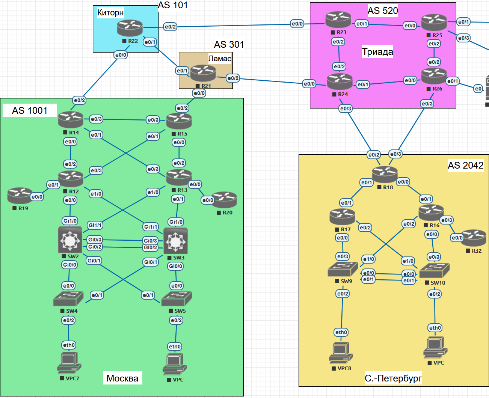

Рисунок 1. Топология сети

## 3. Настройка офиса в Москве и провайдеров Китрон и Ламас

Транзитным будет трафик, в AS-PATH которого где-то в середине есть номер нашей автономной системы, поэтому будем отфильтровывать все, что в середине AS-PATH соедржит 1001.

R14:

```bash
router bgp 1001
 neighbor 192.0.2.1 remote-as 101
 neighbor 192.0.2.1 route-map FILTER-TRANSIT in

ip as-path access-list 1 deny _1001_
ip as-path access-list 1 permit .*

route-map FILTER-TRANSIT permit 10
 match as-path 1
```

R15:

```bash
router bgp 1001
 neighbor 198.51.100.1 remote-as 301
 neighbor 198.51.100.1 route-map FILTER-TRANSIT in

ip as-path access-list 1 deny _1001_
ip as-path access-list 1 permit .*

route-map FILTER-TRANSIT permit 10
 match as-path 1
```

Китрон - R22:

```bash
router bgp 101
 network 0.0.0.0
 neighbor 192.0.2.2 remote-as 1001
 neighbor 192.0.2.2 route-map DEFAULT-ROUTE-TO-R14 out

ip route 0.0.0.0 0.0.0.0 Null0

ip prefix-list DEFAULT-ROUTE-TO-R14 seq 5 permit 0.0.0.0/0

route-map DEFAULT-ROUTE-TO-R14 permit 10
 match ip address prefix-list DEFAULT-ROUTE-TO-R14
```

Ламас - R21:

```bash
router bgp 301
 network 0.0.0.0 mask 0.0.0.0
 network 185.82.208.0 mask 255.255.255.0
 neighbor 198.51.100.2 remote-as 1001
 neighbor 198.51.100.2 route-map DEFAULT-ROUTE-TO-R15 out

ip route 0.0.0.0 0.0.0.0 Null0

ip prefix-list DEFAULT-ROUTE-TO-R15 seq 5 permit 0.0.0.0/0
ip prefix-list DEFAULT-ROUTE-TO-R15 seq 10 permit 185.82.208.0/24

route-map DEFAULT-ROUTE-TO-R15 permit 10
 match ip address prefix-list DEFAULT-ROUTE-TO-R15
```

Настройка провайдера Китрон. Анонсирование маршрута по умолчанию:

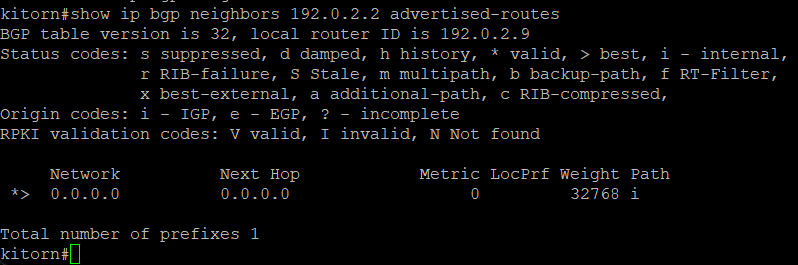

Настройка провайдера Китрон. Анонсирование маршрута по умолчанию и префикса Санкт-Петербурга (185.82.208.0/24):

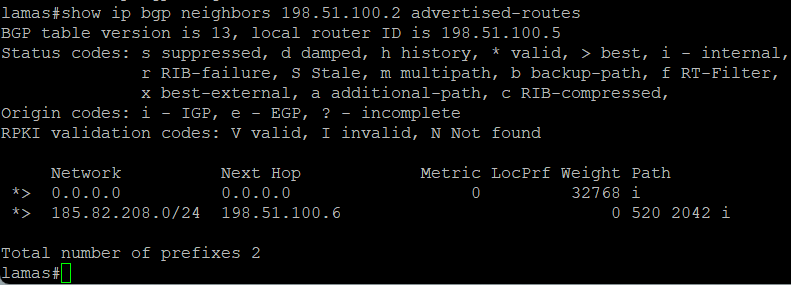

Настройка R14. Фильтрация транзитного трафика настроена, но на анонсы от провайдера это не влияет:

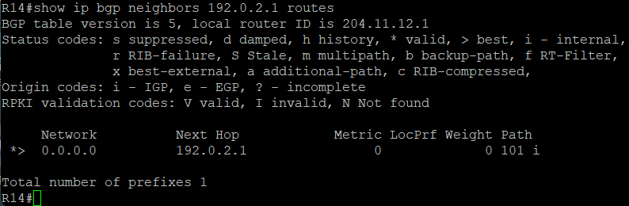

Настройка R15. Фильтрация транзитного трафика настроена, но на анонсы от провайдера это не влияет:

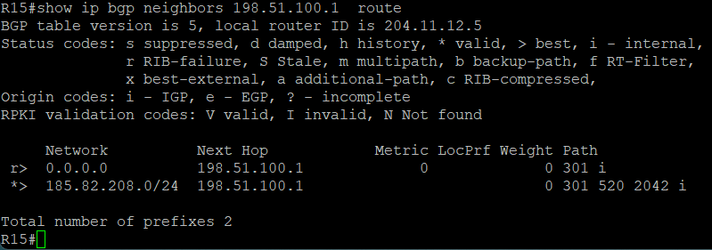

## 4. Проверка связанности сетей

Проверим, проходят ли ICMP запросы из каждой сети в каждую

Пинг из офиса в Москве до Санкт-Петербурга

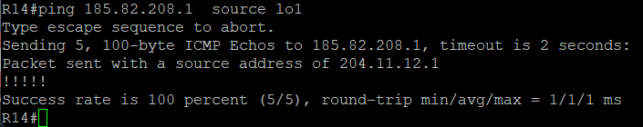

Пинг из офиса в Москве до Лабытнанги

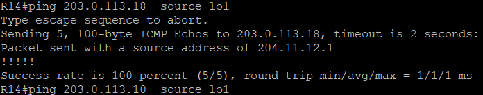

Пинг из офиса в Москве до Чокурдах

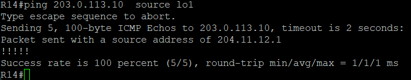

Пинг из Санкт-Петербурга до Лабытнанги

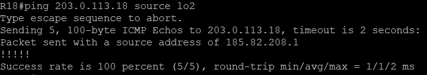

Пинг из Санкт-Петербурга до Чокурдах

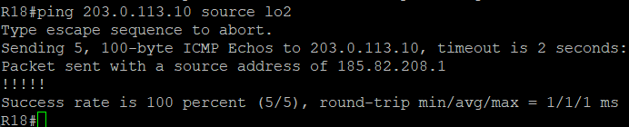

Пинг из Лабытнанги до Чокурдах

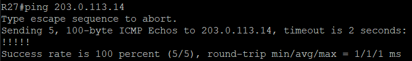

Все запросы прошли успешно, связанность полная.
