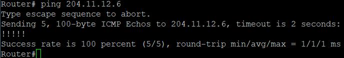
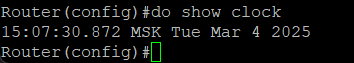

# ЛР 12. Основные протоколы в сети

1. Настроите NAT(PAT) на R14 и R15. Трансляция должна осуществляться в адрес автономной системы AS1001.
2. Настроите NAT(PAT) на R18. Трансляция должна осуществляться в пул из 5 адресов автономной системы AS2042.
3. Настроите статический NAT для R20.
4. Настроите NAT так, чтобы R19 был доступен с любого узла для удаленного управления.
5. Настроите для IPv4 DHCP сервер в офисе Москва на маршрутизаторах R12 и R13. VPC1 и VPC7 должны получать сетевые настройки по DHCP.
6. Настроите NTP сервер на R12 и R13. Все устройства в офисе Москва должны синхронизировать время с R12 и R13.
7. Все офисы в лабораторной работе должны иметь IP связность.

## Настройка NAP(PAT) на R14 и R15

R14 и R15 настройки одинаковые

```bash
ip access-list extended NAT_LOCAL_NET
 permit ip 10.4.0.0 0.0.255.255 any

interface Ethernet0/0
 ip nat inside
interface Ethernet0/1
 ip nat inside
interface Ethernet0/3
 ip nat inside

interface Ethernet0/2
 ip nat outside

ip nat inside source list NAT_LOCAL_NET interface Ethernet0/2 overload
```

Пинг с R13 на R21 (провайдер Ламас)



Результат команды `show ip nat translations` на R15


Перехват пакетов на R21 в Wireshark


## Настроите NAT(PAT) на R18

R18:

```bash
ip nat pool AS2042-POOL 185.82.208.2 185.82.208.6 netmask 255.255.255.0

access-list 10 permit 10.8.0.0 0.0.3.255

ip nat inside source list 10 pool AS2042-POOL overload

interface range e0/0-1
 ip nat inside

interface range e0/2-3
 ip nat outside
```

Пинг с R17 на R24 (провайдер Триада)


Результат команды `show ip nat translations` на R18


Перехват пакетов на R24 в Wireshark


## Настроите статический NAT для R20

В порт e0/1 R20 подключен VPC, на котором адрес 10.4.23.10/24. На R20 настроен статический NAT 10.4.23.10 -> 10.4.0.22

R20

```bash
interface e0/0
 ip nat outside

interface e0/1
 ip nat outside

ip nat inside source static 10.4.23.10 10.4.0.22
```

Пинг с VPC на R15


Результат команды `show ip nat translations` на R18


Перехват пакетов на R24 в Wireshark


## R19 должен быть доступен с любого узла для удаленного управления

Из локальной сети все смогут получить доступ к управлению R19 по Loopback интерфейсу, так как он анонсируется в OSPF. Чтобы все вне сети могли бы достучаться до данного маршрутизатора, настроен статический нат на белый адрес из пула компании 204.11.12.10, который перенаправляет трафик на 10.4.4.5 (R19)

```bash
ip nat inside source static 10.4.4.5 204.11.12.10
```

Пинг с Kitron на 204.11.12.10


Результат команды `show ip nat translations` на R14


Перехват пакетов на R25 в Wireshark


## IPv4 DHCP сервер в офисе Москва на маршрутизаторах R12 и R13

В схеме между R12, R13 и L3 коммутаторами SW2, SW3 общение идет по L3, поэтому на SW2-3 необходимо для каждого VLAN будет настроить ip helper-address, указывающие на DHCP сервера (на их Loopback интефрейы).

Предполагается, что R12 и R13 могут одновременно работать в сети. Для простоты реализации пул адресов для VLAN с маской /23 разделен пополам между R12 и R13 для разделения нагрузки.

R12

```bash
ip dhcp excluded-address 10.4.16.1 10.4.16.10
ip dhcp excluded-address 10.4.17.0 10.4.17.255
ip dhcp pool VLAN10
 network 10.4.16.0 255.255.254.0
 default-router 10.4.16.1

ip dhcp excluded-address 10.4.18.1 10.4.18.10
ip dhcp excluded-address 10.4.19.0 10.4.19.255
ip dhcp pool VLAN2
 network 10.4.18.0 255.255.254.0
 default-router 10.4.18.1
```

R12

```bash
ip dhcp excluded-address 10.4.17.1 10.4.17.10
ip dhcp excluded-address 10.4.16.0 10.4.16.255
ip dhcp pool VLAN1
 network 10.4.16.0 255.255.254.0
 default-router 10.4.16.1

ip dhcp excluded-address 10.4.19.1 10.4.19.10
ip dhcp excluded-address 10.4.18.0 10.4.18.255
ip dhcp pool VLAN2
 network 10.4.18.0 255.255.254.0
 default-router 10.4.18.1
```

SW2

```bash
interface gi0/0.10
 ip helper-address 10.4.4.1

interface gi0/1.20
 ip helper-address 10.4.4.2
```

SW3

```bash
interface gi0/0.20
 ip helper-address 10.4.4.2

interface gi0/1.10
 ip helper-address 10.4.4.1
```

С VPC1 и VPC7 выполнена команда на получение адреса по DHCP

```bash
ip dhcp
```

Адреса на VPC получены.

VPC-1:


VPC-7:


Пинг с VPC1 до маршрутизатора Китрон:


Пинг с VPC1 до маршрутизатора Ламас:


Пинги прошли успешно, натирование трафика работает корректно в офисе Москвы.

## Настроить NTP сервер на R12 и R13

R12 будет основным NTP сервером, а R13 запасным

R12:

```bash
ntp master 2
ntp source Loopback1
clock timezone MSK 3

clock set 15:00:00 4 Mar 2025

access-list 10 permit 10.4.0.0 0.0.255.255
ntp access-group serve 10
```

Результат `show clock` на сервере



R13:

```bash
ntp server 10.4.4.1
ntp master 3
ntp source Loopback1

access-list 10 permit 10.4.0.0 0.0.255.255
ntp access-group serve 10
```

Другие устройства в сети

```bash
ntp server 10.4.4.1 prefer
ntp server 10.4.4.2
```

Результат `show clock` на клиентах


Время синхронизировалось.
