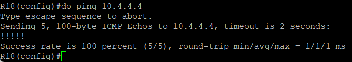
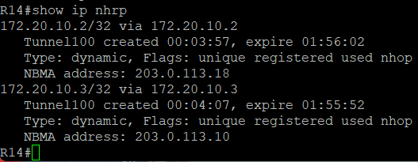
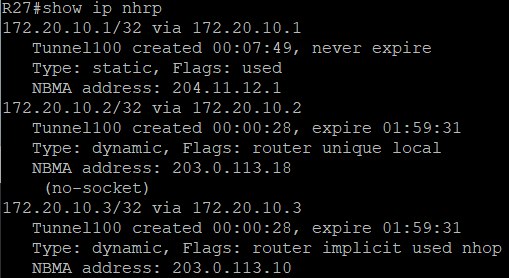
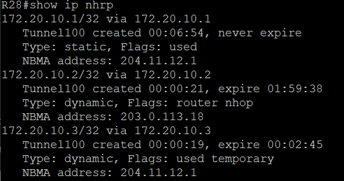

# ЛР 13. VPN. DmVPN

1. Настроите GRE между офисами Москва и С.-Петербург.
2. Настроите DMVMN между Москва и Чокурдах, Лабытнанги.
3. Все узлы в офисах в лабораторной работе должны иметь IP связность.

## Настроить GRE между офисами Москва и Санкт-Петербург

Просто GRE туннель между R15 (Москва) и R18 (Санкт-Петербург)

R15:

```bash
interface Tunnel100
 ip address 172.20.0.1 255.255.255.252
 ip mtu 1400
 ip tcp adjust-mss 1360
 tunnel source Ethernet0/2
 tunnel destination 185.82.208.1

ip route 10.8.0.0 255.255.0.0 172.20.0.2
```

R16:

```bash
interface Tunnel100
 ip address 172.20.0.2 255.255.255.252
 ip mtu 1400
 ip tcp adjust-mss 1360
 tunnel source Ethernet0/2
 tunnel destination 204.11.12.5

ip route 10.4.0.0 255.255.0.0 172.20.0.2
```

Пинг из сети Санкт-Петербурга до локальных адресов Москвы прошел успешно



## Настроить DMVMN между Москва и Чокурдах, Лабытнанги

DMVPN в Москве развернут на R14.

R14:

```bash
interface Tunnel100
 ip address 172.20.10.1 255.255.255.0
 no ip redirects
 ip mtu 1400
 ip nhrp authentication OTUS
 ip nhrp map multicast dynamic
 ip nhrp network-id 100
 ip tcp adjust-mss 1360
 tunnel source Ethernet0/2
 tunnel mode gre multipoint
```

R27:

```bash
interface Tunnel100
 ip address 172.20.10.2 255.255.255.0
 no ip redirects
 ip mtu 1400
 ip nhrp authentication OTUS
 ip nhrp map multicast 204.11.12.1
 ip nhrp map 172.20.10.1 204.11.12.1
 ip nhrp network-id 100
 ip nhrp nhs 172.20.10.1
 ip tcp adjust-mss 1360
 tunnel source Ethernet0/0
 tunnel mode gre multipoint
```

R28:

```bash
interface Tunnel100
 ip address 172.20.10.3 255.255.255.0
 no ip redirects
 ip mtu 1400
 ip nhrp authentication OTUS
 ip nhrp map multicast 204.11.12.1
 ip nhrp map 172.20.10.1 204.11.12.1
 ip nhrp network-id 100
 ip nhrp nhs 172.20.10.1
 ip tcp adjust-mss 1360
 tunnel source Ethernet0/0
 tunnel mode gre multipoint
```

После попытки R28 и R28 связаться с офисом и с друг другом на R14 поднялись туннели, как и на самих R27 и R28.

R14:



R27:



R28:


