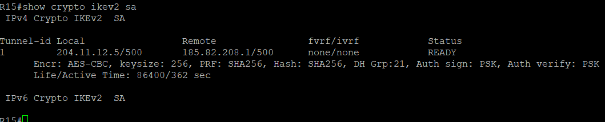
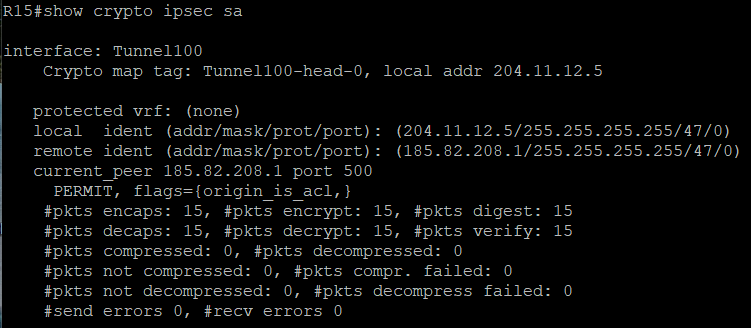
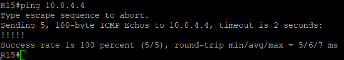
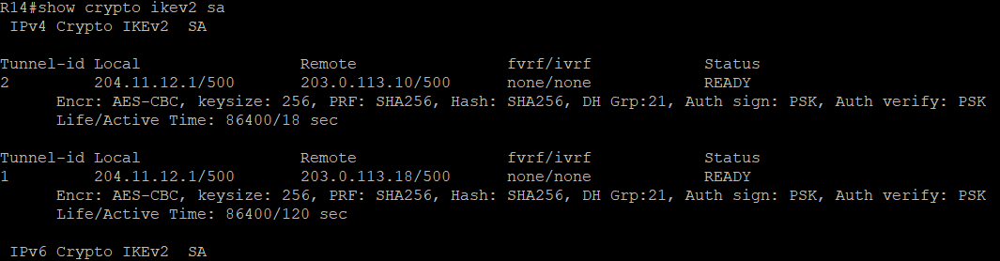
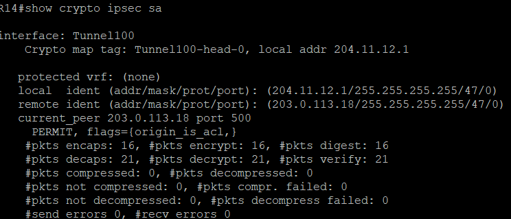
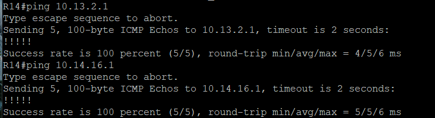
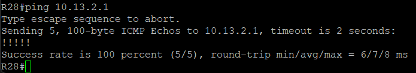

# ЛР 14. VPN. DmVPN and IPSec

1. Настроите GRE поверх IPSec между офисами Москва и С.-Петербург.
2. Настроите DMVPN поверх IPSec между Москва и Чокурдах, Лабытнанги.
3. Все узлы в офисах в лабораторной работе должны иметь IP связность.

## Настроить GRE поверх IPSec между офисами Москва и С.-Петербург

GRE IPSec туннель между R15 (Москва) и R18 (Санкт-Петербург)

R15:

```bash
crypto ikev2 proposal IKEv2-GRE
 encryption aes-cbc-256
 integrity sha256
 group 21

crypto ikev2 policy IKEv2-POLICY
 proposal IKEv2-GRE

crypto ikev2 keyring IKEv2-PSK
 peer SPB
  address 185.82.208.1
  pre-shared-key OTUS

crypto ikev2 profile IKEv2-PROFILE
 match identity remote address 185.82.208.1 255.255.255.255
 authentication remote pre-share
 authentication local pre-share
 keyring local IKEv2-PSK

crypto ipsec transform-set IPSEC-TRANSFORM esp-aes 256 esp-sha256-hmac
 mode transport

crypto ipsec profile IPSEC-PROFILE
 set transform-set IPSEC-TRANSFORM
 set ikev2-profile IKEv2-PROFILE

interface Tunnel100
 ip address 172.20.0.1 255.255.255.252
 ip mtu 1400
 ip tcp adjust-mss 1360
 tunnel source Ethernet0/2
 tunnel destination 185.82.208.1
 tunnel protection ipsec profile IPSEC-PROFILE

ip route 10.8.0.0 255.255.0.0 172.20.0.2
```

R16:

```bash
crypto ikev2 proposal IKEv2-GRE
 encryption aes-cbc-256
 integrity sha256
 group 21

crypto ikev2 policy IKEv2-POLICY
 proposal IKEv2-GRE

crypto ikev2 keyring IKEv2-PSK
 peer MSK
  address 204.11.12.5
  pre-shared-key OTUS

crypto ikev2 profile IKEv2-PROFILE
 match identity remote address 204.11.12.5 255.255.255.255
 authentication remote pre-share
 authentication local pre-share
 keyring local IKEv2-PSK

crypto ipsec transform-set IPSEC-TRANSFORM esp-aes 256 esp-sha256-hmac
 mode transport

crypto ipsec profile IPSEC-PROFILE
 set transform-set IPSEC-TRANSFORM
 set ikev2-profile IKEv2-PROFILE

interface Tunnel100
 ip address 172.20.0.2 255.255.255.252
 ip mtu 1400
 ip tcp adjust-mss 1360
 tunnel source Ethernet0/2
 tunnel destination 204.11.12.5
 tunnel protection ipsec profile IPSEC-PROFILE

ip route 10.4.0.0 255.255.0.0 172.20.0.1
```

Сессия IKEv2 установлена успешно



Счетчик пакетов через зашифрованный туннель увеличивается



Пинг из сети Санкт-Петербурга до локальных адресов Москвы прошел успешно



## Настроить DMVMN поверх IPSec между Москва и Чокурдах, Лабытнанги

К14:

```bash
crypto ikev2 proposal IKEv2-DMVPN
 encryption aes-cbc-256
 integrity sha256
 group 21

crypto ikev2 policy IKEv2-POLICY
 proposal IKEv2-DMVPN

crypto ikev2 keyring IKEv2-PSK
 peer SPOKE
  address 0.0.0.0 0.0.0.0
  pre-shared-key OTUS

crypto ikev2 profile IKEv2-PROFILE
 match identity remote address 0.0.0.0
 authentication remote pre-share
 authentication local pre-share
 keyring local IKEv2-PSK

crypto ipsec transform-set IPSEC-TRANSFORM esp-aes 256 esp-sha256-hmac
 mode transport

crypto ipsec profile DMVPN-PROFILE
 set transform-set IPSEC-TRANSFORM
 set ikev2-profile IKEv2-PROFILE

interface Tunnel100
 ip address 172.20.10.1 255.255.255.0
 no ip redirects
 ip mtu 1400
 ip nhrp authentication OTUS
 ip nhrp map multicast dynamic
 ip nhrp network-id 100
 ip tcp adjust-mss 1360
 tunnel source Ethernet0/2
 tunnel mode gre multipoint
 tunnel protection ipsec profile DMVPN-PROFILE

```

R27:

```bash
crypto ikev2 proposal IKEv2-DMVPN
 encryption aes-cbc-256
 integrity sha256
 group 21

crypto ikev2 policy IKEv2-POLICY
 proposal IKEv2-DMVPN

crypto ikev2 keyring IKEv2-PSK
 peer HUB
  address 204.11.12.1
  pre-shared-key OTUS

crypto ikev2 profile IKEv2-PROFILE
 match identity remote address 204.11.12.1 255.255.255.255
 authentication remote pre-share
 authentication local pre-share
 keyring local IKEv2-PSK

crypto ipsec transform-set IPSEC-TRANSFORM esp-aes 256 esp-sha256-hmac
 mode transport

crypto ipsec profile DMVPN-PROFILE
 set transform-set IPSEC-TRANSFORM
 set ikev2-profile IKEv2-PROFILE

interface Tunnel100
 ip address 172.20.10.2 255.255.255.0
 no ip redirects
 ip mtu 1400
 ip nhrp authentication OTUS
 ip nhrp map multicast 204.11.12.1
 ip nhrp map 172.20.10.1 204.11.12.1
 ip nhrp network-id 100
 ip nhrp nhs 172.20.10.1
 ip tcp adjust-mss 1360
 tunnel source Ethernet0/0
 tunnel mode gre multipoint
 tunnel protection ipsec profile DMVPN-PROFILE
```


R28:

```bash
crypto ikev2 proposal IKEv2-DMVPN
 encryption aes-cbc-256
 integrity sha256
 group 21

crypto ikev2 policy IKEv2-POLICY
 proposal IKEv2-DMVPN

crypto ikev2 keyring IKEv2-PSK
 peer HUB
  address 204.11.12.1
  pre-shared-key OTUS

crypto ikev2 profile IKEv2-PROFILE
 match identity remote address 204.11.12.1 255.255.255.255
 authentication remote pre-share
 authentication local pre-share
 keyring local IKEv2-PSK

crypto ipsec transform-set IPSEC-TRANSFORM esp-aes 256 esp-sha256-hmac
 mode transport

crypto ipsec profile DMVPN-PROFILE
 set transform-set IPSEC-TRANSFORM
 set ikev2-profile IKEv2-PROFILE

interface Tunnel100
 ip address 172.20.10.3 255.255.255.0
 no ip redirects
 ip mtu 1400
 ip nhrp authentication OTUS
 ip nhrp map multicast 204.11.12.1
 ip nhrp map 172.20.10.1 204.11.12.1
 ip nhrp network-id 100
 ip nhrp nhs 172.20.10.1
 ip tcp adjust-mss 1360
 tunnel source Ethernet0/0
 tunnel mode gre multipoint
 tunnel protection ipsec profile DMVPN-PROFILE
```

Сессия IKEv2 установлена успешно



Счетчик пакетов через зашифрованный туннель увеличивается



Пинги локальной сети SPOKEs с хаба



Пинги локальной сети с R28 до R27

