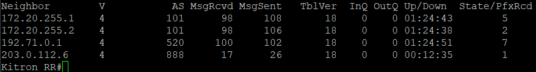
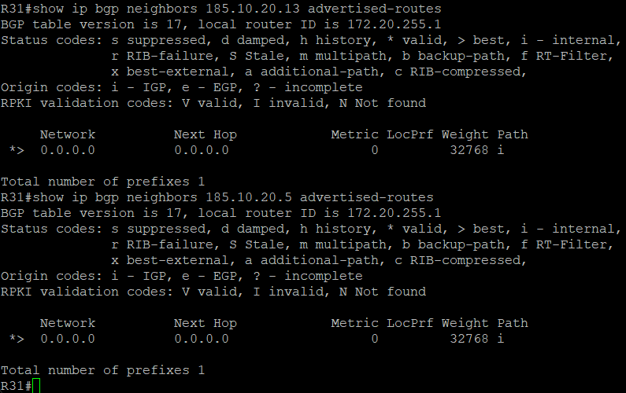

# Настройка AS 101

1. Настройка OSPF
2. Настройка iBGP
3. Настройка Router Reflector
4. Настройка соединения с другими AS

У данного провайдера есть Router Reflector в сети. В AS65000 анонсирует только дефолтный маршрут и является резервным провайдером.

Kitron_RR:

```bash
interface Loopback1
 ip ospf 1 area 0
interface Ethernet0/0
 ip ospf network point-to-point
 ip ospf 1 area 0
interface Ethernet0/1
 ip ospf network point-to-point
 ip ospf 1 area 0
router ospf 1

router bgp 101
 bgp router-id 172.20.255.10
 bgp log-neighbor-changes
 neighbor 101 peer-group
 neighbor 101 remote-as 101
 neighbor 101 update-source Loopback1
 neighbor 101 route-reflector-client
 neighbor 101 next-hop-self
 neighbor 172.20.255.1 peer-group 101
 neighbor 172.20.255.2 peer-group 101
 neighbor 192.71.0.1 remote-as 520
 neighbor 203.0.112.6 remote-as 888
```

R31:

```bash
interface Loopback1
 ip ospf 1 area 0
interface Ethernet0/1
 ip ospf network point-to-point
 ip ospf 1 area 0
router ospf 1

router bgp 101
 bgp log-neighbor-changes
 network 0.0.0.0
 neighbor 172.20.255.10 remote-as 101
 neighbor 172.20.255.10 update-source Loopback1
 neighbor 172.20.255.10 next-hop-self
 neighbor 185.10.20.5 remote-as 65000
 neighbor 185.10.20.5 route-map DEFAULT-ROUTE-TO-AS65000 out
 neighbor 185.10.20.13 remote-as 65000
 neighbor 185.10.20.13 route-map DEFAULT-ROUTE-TO-AS65000 out

ip route 0.0.0.0 0.0.0.0 Null0
ip route 203.0.112.0 255.255.252.0 Null0
ip prefix-list DEFAULT-ROUTE-TO-AS65000 seq 5 permit 0.0.0.0/0
route-map DEFAULT-ROUTE-TO-AS65000 permit 10
 match ip address prefix-list DEFAULT-ROUTE-TO-AS65000
```

R33

```bash
interface Loopback1
 ip ospf 1 area 0
interface Ethernet0/1
 ip ospf network point-to-point
 ip ospf 1 area 0
router ospf 1

router bgp 101
 bgp log-neighbor-changes
 neighbor 172.20.255.10 remote-as 101
 neighbor 172.20.255.10 update-source Loopback1
 neighbor 172.20.255.10 next-hop-self
 neighbor 203.0.112.2 remote-as 8359

ip route 203.0.112.0 255.255.252.0 Null0
```

Соседство BGP установлено внутри AS, а также с соседники AS



R31 анонсирует в AS65000 только маршрут по умолчанию:



Далее: [Настройка AS 301](./as-301.md)

Назад: [Оглавление](../README.md)