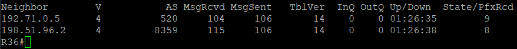

# Настройка AS 301

1. Настройка соединения с другими AS

Провайдер филиала во Владимире

R36:

```bash
router bgp 301
 bgp log-neighbor-changes
 network 198.51.96.0 mask 255.255.248.0
 neighbor 192.71.0.5 remote-as 520
 neighbor 198.51.96.2 remote-as 8359
 neighbor 198.51.96.2 soft-reconfiguration inbound

ip route 198.51.96.0 255.255.248.0 Null0
```

Соседство установлено со всеми соседними AS



Далее: [Настройка AS 8359](./as-8359.md)

Назад: [Оглавление](../README.md)