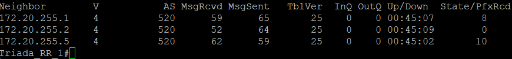
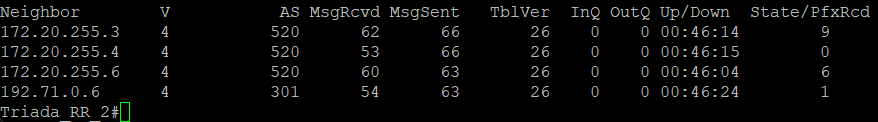
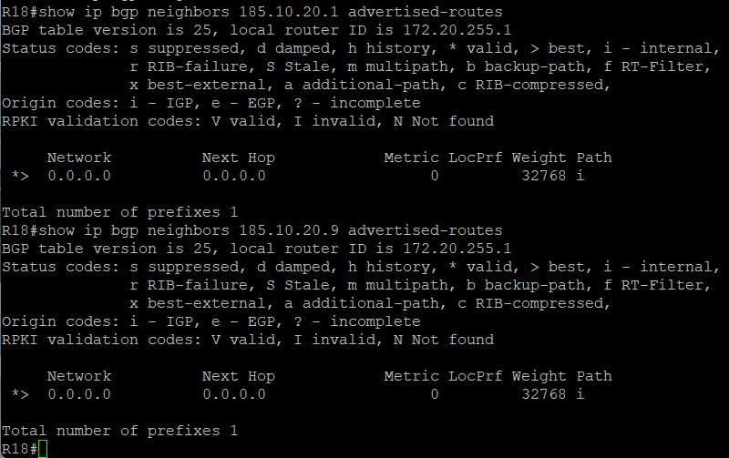

# Настройка AS 520

1. Настройка OSPF
2. Настройка iBGP
3. Настройка двух Router Reflector
4. Настройка соединения с другими AS

У провайдера Триада будет в сети 2 Router Reflector, у каждого по 2 клиента. В AS65000 анонсирует только дефолтный маршрут

Triada_RR_1:

```bash
router bgp 520
 bgp log-neighbor-changes
 neighbor 520 peer-group
 neighbor 520 remote-as 520
 neighbor 520 update-source Loopback1
 neighbor 520 route-reflector-client
 neighbor 520 next-hop-self
 neighbor 172.20.255.1 peer-group 520
 neighbor 172.20.255.2 peer-group 520
 neighbor 172.20.255.5 remote-as 520
 neighbor 172.20.255.5 update-source Loopback1
 neighbor 172.20.255.5 next-hop-self

```

R18:

```bash
router bgp 520
 bgp log-neighbor-changes
 redistribute connected
 redistribute static
 neighbor 172.20.255.6 remote-as 520
 neighbor 172.20.255.6 update-source Loopback1
 neighbor 172.20.255.6 next-hop-self
 network 0.0.0.0 mask 0.0.0.0

ip route 0.0.0.0 0.0.0.0 null 0
```

R26:

```bash
router bgp 520
 bgp log-neighbor-changes
 neighbor 172.20.255.4 remote-as 520
 neighbor 172.20.255.4 update-source Loopback1
 neighbor 172.20.255.4 next-hop-self
 neighbor 172.20.255.6 remote-as 520
 neighbor 172.20.255.6 update-source Loopback1
 neighbor 172.20.255.6 next-hop-self

```

Triada_RR_2

```bash
router bgp 520
 bgp log-neighbor-changes
 neighbor 520 peer-group
 neighbor 520 remote-as 520
 neighbor 520 update-source Loopback1
 neighbor 520 route-reflector-client
 neighbor 520 next-hop-self
 neighbor 172.20.255.3 peer-group 520
 neighbor 172.20.255.4 peer-group 520
 neighbor 172.20.255.6 remote-as 520
 neighbor 172.20.255.6 update-source Loopback1
 neighbor 172.20.255.6 next-hop-self
 neighbor 192.71.0.6 remote-as 301
 neighbor 192.71.0.6 route-map FILTER_LAMAS_OUT out

ip route 192.71.0.0 255.255.240.0 Null0

ip prefix-list TO-LAMAS seq 5 deny 172.20.0.0/16 le 32
ip prefix-list TO-LAMAS seq 10 permit 0.0.0.0/0 le 32

route-map FILTER_LAMAS_OUT permit 10
 match ip address prefix-list TO-LAMAS
```

R27:

```bash
router bgp 520
 bgp log-neighbor-changes
 redistribute connected
 redistribute static
 neighbor 520 peer-group
 neighbor 520 remote-as 520
 neighbor 520 update-source Loopback1
 neighbor 520 route-reflector-client
 neighbor 520 next-hop-self
 neighbor 172.20.255.5 peer-group 520
 neighbor 192.71.0.2 remote-as 101
 neighbor 192.71.0.2 route-map FILTER_KITRON_OUT out

ip prefix-list TO-KITRON seq 5 deny 172.20.0.0/16 le 32
ip prefix-list TO-KITRON seq 10 permit 0.0.0.0/0 le 32

route-map FILTER_KITRON_OUT permit 10
 match ip address prefix-list TO-KITRON
```

R28:

```bash
router bgp 520
 bgp log-neighbor-changes
 redistribute static
 neighbor 172.20.255.2 remote-as 520
 neighbor 172.20.255.2 update-source Loopback1
 neighbor 172.20.255.2 next-hop-self
 neighbor 172.20.255.5 remote-as 520
 neighbor 172.20.255.5 update-source Loopback1
 neighbor 172.20.255.5 next-hop-self
```

Triada_RR_1 установил соседство со своими пирами:



А Triada_RR_2 установил соседство со своими:



В AS65000 R18 анонсирует лишь маршрут по умолчанию:



Далее: [Настройка AS 101](./as-101.md)

Назад: [Оглавление](../README.md)