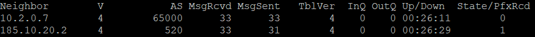

# Настройка AS 65000

1. Настройка OSPF
2. Настройка коммутаторов (Inter-VLAN Routing, EtherChannel)
3. Настройка DHCP и NTP
4. Настройка VPN
5. Настройка eBGP и iBGP

## Настройка OSPF

На всех маршрутизаторах настраивается OSPF, тип сети Point-to-Point.

### CORE_1

```bash
interface range e0/0-3,e1/0-2
 ip ospf network point-to-point
 ip ospf 1 area 0

interface lo1
 ip ospf 1 area 0
 
router ospf 1
 auto-cost reference-bandwidth 10000

ntp server 10.2.0.19
```

### CORE_2

```bash
interface range e0/0-3,e1/0-2
 ip ospf network point-to-point
 ip ospf 1 area 0

interface lo1
 ip ospf 1 area 0
 
router ospf 1
 auto-cost reference-bandwidth 10000

ntp server 10.2.0.19
```

### Technical_1

```bash
interface range e0-1
 ip ospf network point-to-point
 ip ospf 1 area 0

interface lo1
 ip ospf 1 area 0
 
router ospf 1
 auto-cost reference-bandwidth 10000

ntp server 10.2.0.19
```

### Technical_2

```bash
interface range e0/0
 ip ospf network point-to-point
 ip ospf 1 area 0

interface lo1
 ip ospf 1 area 0
 
router ospf 1
 auto-cost reference-bandwidth 10000

ntp server 10.2.0.19
```

### Server_1

```bash
interface e0/0
 ip ospf network point-to-point
 ip ospf 1 area 0

interface lo1
 ip ospf 1 area 0
 
router ospf 1
 auto-cost reference-bandwidth 10000

ntp server 10.2.0.19
```

### Server_2

```bash
interface e0/0
 ip ospf network point-to-point
 ip ospf 1 area 0

interface lo1
 ip ospf 1 area 0
 
router ospf 1
 auto-cost reference-bandwidth 10000

ntp server 10.2.0.19
```

VPN

```bash
interface Ethernet0/0
 ip address 10.0.0.74 255.255.255.252
 ip ospf network point-to-point
 ip ospf 1 area 1

router ospf 1
 router-id 10.2.0.30
 auto-cost reference-bandwidth 10000
 area 1 stub
 network 185.10.20.255 0.0.0.0 area 1
 redistribute static
```

### GW_1

```bash
interface range e0/0-1
 ip ospf network point-to-point
 ip ospf 1 area 0

interface lo1
 ip ospf 1 area 0
 
router ospf 1
 auto-cost reference-bandwidth 10000
 default-information originate

ntp server 10.2.0.19
```

### GW_2

```bash
interface range e0/0-1
 ip ospf network point-to-point
 ip ospf 1 area 0

interface lo1
 ip ospf 1 area 0
 
router ospf 1
 auto-cost reference-bandwidth 10000
 default-information originate

ntp server 10.2.0.19
```

### Management_1

```bash
interface e0/0
 ip ospf network point-to-point
 ip ospf 1 area 0

interface lo1
 ip ospf 1 area 0
 
router ospf 1
 auto-cost reference-bandwidth 10000

ntp server 10.2.0.19
```

### Management_2

```bash
interface e0/0
 ip ospf network point-to-point
 ip ospf 1 area 0

interface lo1
 ip ospf 1 area 0

router ospf 1
 auto-cost reference-bandwidth 10000

ntp server 10.2.0.19
```

### Director

```bash
interface range e0/0-1б
 ip ospf network point-to-point
 ip ospf 1 area 0

interface lo1
 ip ospf 1 area 0

router ospf 1
 auto-cost reference-bandwidth 10000

ntp server 10.2.0.19
```

Таблица с соседством на CORE_1


Полученные по OSPF маршруты на CORE_1


## Настройка устройств Gateways (GW1 и GW2)

### Настройка BGP

GW1

```bash
router bgp 65000
 neighbor 10.2.0.7 remote-as 65000
 neighbor 10.2.0.7 update-source loopback 1
 neighbor 10.2.0.7 next-hop-self
 neighbor 185.10.20.2 remote-as 520
 neighbor 185.10.20.6 remote-as 101
 network 185.10.20.0 mask 255.255.254.0
 no auto-summary
```

GW2

```bash
router bgp 65000
 neighbor 10.2.0.6 remote-as 65000
 neighbor 10.2.0.6 update-source loopback 1
 neighbor 10.2.0.6 next-hop-self
 neighbor 185.10.20.10 remote-as 520
 neighbor 185.10.20.14 remote-as 101
 network 185.10.20.0 mask 255.255.254.0
 no auto-summary
```

Соседство установлено

GW1:



GW2:


## Настройка отдела Технический

### Базовые настройки межвлановой маршрутизации, DHCP и NTP

SW1

```bash
interface Ethernet0/0
 switchport trunk allowed vlan 10,20,999
 switchport trunk encapsulation dot1q
 switchport mode trunk

interface Ethernet0/1
 switchport mode trunk
 duplex auto
 channel-group 1 mode active

interface Ethernet0/2
 switchport mode trunk
 channel-group 1 mode active

interface Ethernet0/3
 switchport access vlan 10
 switchport mode access

interface Port-channel1
 switchport trunk allowed vlan 10,20,999
 switchport trunk encapsulation dot1q
 switchport trunk native vlan 1000
 switchport mode trunk

vlan 10
 name Engineer
vlan 20
 name Programmers
vlan 999
 name Management
vlan 1000
 name Parking_lot
```

SW2
```bash
interface Ethernet0/0
 switchport trunk allowed vlan 10,20,999
 switchport trunk encapsulation dot1q
 switchport mode trunk

interface Ethernet0/1
 switchport mode trunk
 duplex auto
 channel-group 1 mode active

interface Ethernet0/2
 switchport mode trunk
 channel-group 1 mode active

interface Ethernet0/3
 switchport access vlan 20
 switchport mode access

interface Port-channel1
 switchport trunk allowed vlan 10,20,999
 switchport trunk encapsulation dot1q
 switchport trunk native vlan 1000
 switchport mode trunk

vlan 10
 name Engineer
vlan 20
 name Programmers
vlan 999
 name Management
vlan 1000
 name Parking_lot
```

Technical_1

```bash
interface Ethernet0/2.10
 encapsulation dot1Q 10
 ip address 10.4.0.2 255.255.255.0
 standby 10 ip 10.4.0.1
 standby 10 priority 150
 standby 10 preempt
!
interface Ethernet0/2.20
 encapsulation dot1Q 20
 ip address 10.4.1.2 255.255.255.0
 standby 20 ip 10.4.1.1
 standby 20 preempt
!
interface Ethernet0/2.999
 encapsulation dot1Q 999
!
interface Ethernet0/2.1000
 encapsulation dot1Q 1000 native
```

Technical_1

```bash
interface Ethernet0/2.10
 encapsulation dot1Q 10
 ip address 10.4.0.2 255.255.255.0
 standby 10 ip 10.4.0.1
 standby 10 priority 150
 standby 10 preempt
!
interface Ethernet0/2.20
 encapsulation dot1Q 20
 ip address 10.4.1.2 255.255.255.0
 standby 20 ip 10.4.1.1
 standby 20 preempt
!
interface Ethernet0/2.999
 encapsulation dot1Q 999
!
interface Ethernet0/2.1000
 encapsulation dot1Q 1000 native

router ospf 1
 redistribute connected subnets
```

Technical_2

```bash
interface Ethernet0/2.10
 encapsulation dot1Q 10
 ip address 10.4.0.3 255.255.255.0
 standby 10 ip 10.4.0.1
 standby 10 preempt
!
interface Ethernet0/2.20
 encapsulation dot1Q 20
 ip address 10.4.1.3 255.255.255.0
 standby 20 ip 10.4.1.1
 standby 20 priority 150
 standby 20 preempt
!
interface Ethernet0/2.1000
 encapsulation dot1Q 1000 native

router ospf 1
 redistribute connected subnets
```

Маршрутизаторы сегмента Серверной работают по протоколу VRRP


Между коммутаторами настроена агрегация каналов


Попытка по DHCP получить адрес завершилась успехом. В примере VPC22, который работает в VLAN10, получил адрес


## Настройка отдела Серверная

### Базовые настройки межвлановой маршрутизации, DHCP и NTP

SW3

```bash
interface Ethernet0/0
 switchport trunk allowed vlan 30,40,999
 switchport trunk encapsulation dot1q
 switchport trunk native vlan 1000
 switchport mode trunk

interface Ethernet0/3
 switchport trunk allowed vlan 30,40,999
 switchport trunk encapsulation dot1q
 switchport trunk native vlan 1000
 switchport mode trunk
 channel-group 1 mode active

interface Ethernet1/0
 switchport trunk allowed vlan 30,40,999
 switchport trunk encapsulation dot1q
 switchport trunk native vlan 1000
 switchport mode trunk
 channel-group 1 mode active

interface Ethernet1/1
 switchport access vlan 30
 switchport mode access

interface Port-channel1
 switchport trunk allowed vlan 30,40,999
 switchport trunk encapsulation dot1q
 switchport trunk native vlan 1000
 switchport mode trunk 

vlan 30
 name Monitoring
vlan 40 
 name Services
vlan 999
 name Management
vlan 1000
 name Parking_Lot
```

SW4

```bash
interface Ethernet0/0
 switchport trunk allowed vlan 30,40,999
 switchport trunk encapsulation dot1q
 switchport trunk native vlan 1000
 switchport mode trunk

interface Ethernet0/1
 switchport access vlan 40
 switchport mode access

interface Ethernet0/3
 switchport trunk allowed vlan 30,40,999
 switchport trunk encapsulation dot1q
 switchport trunk native vlan 1000
 switchport mode trunk
 channel-group 1 mode active

interface Ethernet1/0
 switchport trunk allowed vlan 30,40,999
 switchport trunk encapsulation dot1q
 switchport trunk native vlan 1000
 switchport mode trunk
 channel-group 1 mode active

interface Ethernet1/2
 switchport access vlan 40
 switchport mode access

interface Port-channel1
 switchport trunk allowed vlan 30,40,999
 switchport trunk encapsulation dot1q
 switchport trunk native vlan 1000
 switchport mode trunk

vlan 30
 name Monitoring
vlan 40 
 name Services
vlan 999
 name Management
vlan 1000
 name Parking_Lot
```

Server_1

```bash
interface Ethernet0/2.30
 encapsulation dot1Q 30
 ip address 10.4.3.3 255.255.255.0
 standby 30 ip 10.4.3.1
 standby 30 priority 150
 standby 30 preempt
 ip ospf network broadcast
 ip ospf 1 area 1

interface Ethernet0/2.40
 encapsulation dot1Q 40
 ip address 10.4.4.3 255.255.255.0
 standby 40 ip 10.4.4.1
 standby 40 preempt
 ip ospf network broadcast
 ip ospf 1 area 1

interface Ethernet0/2.1000
 encapsulation dot1Q 1000 native

router ospf 1
 auto-cost reference-bandwidth 10000
 area 1 stub no-summary
```

Server_2

```bash
interface Ethernet0/2.30
 encapsulation dot1Q 30
 ip address 10.4.3.2 255.255.255.0
 standby 30 ip 10.4.3.1
 standby 30 preempt
 ip ospf network broadcast
 ip ospf 1 area 1

interface Ethernet0/2.40
 encapsulation dot1Q 40
 ip address 10.4.4.2 255.255.255.0
 standby 40 ip 10.4.4.1
 standby 40 priority 150
 standby 40 preempt
 ip ospf network broadcast
 ip ospf 1 area 1

interface Ethernet0/2.1000
 encapsulation dot1Q 1000 native 

router ospf 1
 auto-cost reference-bandwidth 10000
 area 1 stub no-summary
```


В качестве DHCPv4 сервера будет выступать устройство DHCP-NAT в данном сегменте сети, находящийся в VLAN 40. Также это устройство будет выполнять функции NTP сервера для локальной сети.

DHCP-NAT

```bash
ip dhcp excluded-address 10.4.0.1 10.4.0.3
ip dhcp excluded-address 10.4.1.1 10.4.1.3
ip dhcp excluded-address 10.4.5.1 10.4.5.3
ip dhcp excluded-address 10.4.6.1 10.4.6.3
ip dhcp excluded-address 10.4.7.1 10.4.7.3
ip dhcp excluded-address 10.4.8.1 10.4.8.3

ip dhcp pool VLAN10
 network 10.4.0.0 255.255.255.0
 default-router 10.4.0.1
 dns-server 8.8.8.8
 option 42 ip 10.4.4.10

ip dhcp pool VLAN20
 network 10.4.1.0 255.255.255.0
 default-router 10.4.1.1
 dns-server 8.8.8.8
 option 42 ip 10.4.4.10

ip dhcp pool VLAN50
 network 10.4.5.0 255.255.255.0
 default-router 10.4.5.1
 dns-server 8.8.8.8
 option 42 ip 10.4.4.10

ip dhcp pool VLAN60
 network 10.4.6.0 255.255.255.0
 default-router 10.4.6.1
 dns-server 8.8.8.8
 option 42 ip 10.4.4.10

ip dhcp pool VLAN70
 network 10.4.7.0 255.255.255.0
 default-router 10.4.7.1
 dns-server 8.8.8.8
 option 42 ip 10.4.4.10

ip dhcp pool VLAN80
 network 10.4.8.0 255.255.255.0
 default-router 10.4.8.1
 dns-server 8.8.8.8
 option 42 ip 10.4.4.10

interface Loopback1
 ip address 10.2.0.19 255.255.255.255
 ip ospf 1 area 1

interface Ethernet0/0
 ip address 10.4.4.10 255.255.255.0
 ip ospf network broadcast
 ip ospf 1 area 1
 ntp broadcast

router ospf 1
 area 1 stub
```

В качестве VPN сервера выступает маршрутизатор VPN. На нем на Loopback 1 назначен белый IP адрес из пула компании, который анонсируется в OSPF. Настрен DmVPN over IPSEC

VPN

```bash
crypto ikev2 proposal IKEv2-GRE
 encryption aes-cbc-256
 integrity sha256
 group 21
!
crypto ikev2 policy IKEv2-POLICY
 proposal IKEv2-GRE
!
crypto ikev2 keyring IKEv2-PSK
 peer SPOKE
  address 0.0.0.0 0.0.0.0
  pre-shared-key OTUS
 !
!
!
crypto ikev2 profile IKEv2-PROFILE
 match identity remote address 0.0.0.0
 authentication remote pre-share
 authentication local pre-share
 keyring local IKEv2-PSK
!
!
!
crypto ipsec transform-set IPSEC-TRANSFORM esp-aes 256 esp-sha256-hmac
 mode transport
!
crypto ipsec profile DMVPN-PROFILE
 set transform-set IPSEC-TRANSFORM
 set ikev2-profile IKEv2-PROFILE

interface Loopback1
 ip address 185.10.20.255 255.255.255.255
 ip ospf 1 area 1

interface Tunnel100
 ip address 10.1.0.1 255.255.255.0
 no ip redirects
 ip mtu 1400
 ip nhrp authentication OTUS
 ip nhrp map multicast dynamic
 ip nhrp network-id 100
 ip tcp adjust-mss 1360
 tunnel source Loopback1
 tunnel mode gre multipoint
 tunnel protection ipsec profile DMVPN-PROFILE
```

Маршрутизаторы сегмента Серверной работают по протоколу VRRP


Между коммутаторами настроена агрегация каналов


Попытка по DHCP получить адрес завершилась успехом. В примере VPC23 (Технический отдел), который работает в VLAN20, получил адрес


Spokes из филиалов Владимира и Нижнего-Новгорода подключаются успешно, маршрутизацию между сетями идет


## Настройка отдела Менеджмента

### Базовые настройки межвлановой маршрутизации, DHCP и NTP

SW5

```bash
interface Ethernet0/0
 switchport trunk allowed vlan 50,60,999
 switchport trunk encapsulation dot1q
 switchport trunk native vlan 1000
 switchport mode trunk

interface Ethernet0/2
 switchport access vlan 50
 switchport mode access

interface Ethernet0/3
 switchport trunk allowed vlan 50,60,999
 switchport trunk encapsulation dot1q
 switchport trunk native vlan 1000
 switchport mode trunk
 channel-group 1 mode active

interface Ethernet1/0
 switchport trunk allowed vlan 50,60,999
 switchport trunk encapsulation dot1q
 switchport trunk native vlan 1000
 switchport mode trunk
 channel-group 1 mode active

interface Port-channel1
 switchport trunk allowed vlan 50,60,999
 switchport trunk encapsulation dot1q
 switchport trunk native vlan 1000
 switchport mode trunk
```

SW6

```bash
interface Ethernet0/0
 switchport trunk allowed vlan 50,60,999
 switchport trunk encapsulation dot1q
 switchport trunk native vlan 1000
 switchport mode trunk

interface Ethernet0/2
 switchport access vlan 60
 switchport mode access

interface Ethernet0/3
 switchport trunk allowed vlan 50,60,999
 switchport trunk encapsulation dot1q
 switchport trunk native vlan 1000
 switchport mode trunk
 channel-group 1 mode active

interface Ethernet1/0
 switchport trunk allowed vlan 50,60,999
 switchport trunk encapsulation dot1q
 switchport trunk native vlan 1000
 switchport mode trunk
 channel-group 1 mode active

interface Port-channel1
 switchport trunk allowed vlan 50,60,999
 switchport trunk encapsulation dot1q
 switchport trunk native vlan 1000
 switchport mode trunk
```

Management_1

```bash
interface Ethernet0/2.50
 encapsulation dot1Q 50
 ip address 10.4.5.2 255.255.255.0
 ip helper-address 10.4.4.10
 standby 50 ip 10.4.5.1
 standby 50 preempt

interface Ethernet0/2.60
 encapsulation dot1Q 60
 ip address 10.4.6.2 255.255.255.0
 ip helper-address 10.4.4.10
 standby 60 ip 10.4.6.1
 standby 60 priority 150
 standby 60 preempt

interface Ethernet0/2.1000
 encapsulation dot1Q 1000 native

router ospf 1
 redistribute connected subnets
```

Management_2

```bash
interface Ethernet0/2.50
 encapsulation dot1Q 50
 ip address 10.4.5.3 255.255.255.0
 ip helper-address 10.4.4.10
 standby 50 ip 10.4.5.1
 standby 50 priority 150
 standby 50 preempt

interface Ethernet0/2.60
 encapsulation dot1Q 60
 ip address 10.4.6.3 255.255.255.0
 ip helper-address 10.4.4.10
 standby 60 ip 10.4.6.1
 standby 60 preempt

interface Ethernet0/2.1000
 encapsulation dot1Q 1000 native

router ospf 1
 redistribute connected subnets
```

Маршрутизаторы сегмента Management работают по протоколу VRRP


Между коммутаторами настроена агрегация каналов


Попытка по DHCP получить адрес завершилась успехом. В примере VPC13 (Технический отдел), который работает в VLAN20, получил адрес


## Настройка отдела Директората

### Базовые настройки межвлановой маршрутизации, DHCP и NTP

SW7

```bash
interface Ethernet0/0
 switchport trunk allowed vlan 70,80,999
 switchport trunk encapsulation dot1q
 switchport trunk native vlan 1000
 switchport mode trunk

interface Ethernet0/1
 switchport trunk allowed vlan 70,80,999
 switchport trunk encapsulation dot1q
 switchport trunk native vlan 1000
 switchport mode trunk
 channel-group 1 mode active

interface Ethernet0/2
 switchport trunk allowed vlan 70,80,999
 switchport trunk encapsulation dot1q
 switchport trunk native vlan 1000
 switchport mode trunk
 channel-group 1 mode active

interface Ethernet0/3
 switchport access vlan 70
 switchport mode access

 interface Port-channel1
 switchport trunk allowed vlan 70,80,999
 switchport trunk encapsulation dot1q
 switchport trunk native vlan 1000
 switchport mode trunk

vlan 70
 name Director
vlan 80
 name Coucher
vlan 999
 name Management
vlan 1000
 name Parking_Lot
```

SW8

```bash
 interface Ethernet0/0
 switchport trunk allowed vlan 70,80,999
 switchport trunk encapsulation dot1q
 switchport trunk native vlan 1000
 switchport mode trunk

interface Ethernet0/1
 switchport trunk allowed vlan 70,80,999
 switchport trunk encapsulation dot1q
 switchport trunk native vlan 1000
 switchport mode trunk
 channel-group 1 mode active

interface Ethernet0/2
 switchport trunk allowed vlan 70,80,999
 switchport trunk encapsulation dot1q
 switchport trunk native vlan 1000
 switchport mode trunk
 channel-group 1 mode active

interface Ethernet0/3
 switchport access vlan 80
 switchport mode access

interface Port-channel1
 switchport trunk allowed vlan 70,80,999
 switchport trunk encapsulation dot1q
 switchport trunk native vlan 1000
 switchport mode trunk

vlan 70
 name Director
vlan 80
 name Coucher
vlan 999
 name Management
vlan 1000
 name Parking_Lot
```

Director_1

```bash
interface Ethernet0/2.70
 encapsulation dot1Q 70
 ip address 10.4.7.2 255.255.255.0
 ip helper-address 10.4.4.10
 standby 70 ip 10.4.7.1
 standby 70 preempt

interface Ethernet0/2.80
 encapsulation dot1Q 80
 ip address 10.4.8.2 255.255.255.0
 ip helper-address 10.4.4.10
 standby 80 ip 10.4.8.1
 standby 80 priority 150
 standby 80 preempt

interface Ethernet0/2.1000
 encapsulation dot1Q 1000 native

router ospf 1
 redistribute connected subnets
```

Director_2

```bash
interface Ethernet0/2.70
 encapsulation dot1Q 70
 ip address 10.4.7.3 255.255.255.0
 ip helper-address 10.4.4.10
 standby 70 ip 10.4.7.1
 standby 70 priority 150
 standby 70 preempt

interface Ethernet0/2.80
 encapsulation dot1Q 80
 ip address 10.4.8.3 255.255.255.0
 ip helper-address 10.4.4.10
 standby 80 ip 10.4.8.1
 standby 80 preempt

interface Ethernet0/2.1000
 encapsulation dot1Q 1000 native

router ospf 1
 redistribute connected subnets
```

Маршрутизаторы сегмента Директората работают по протоколу VRRP


Между коммутаторами настроена агрегация каналов


Попытка по DHCP получить адрес завершилась успехом. В примере VPC44, который работает в VLAN80, получил адрес


## Настройка NAT на пограничных устройствах

GW1:

```bash
access-list 1 permit 10.0.0.0 0.15.255.255
ip nat inside source list 1 interface Ethernet1/1 overload

interface Ethernet0/0
 ip nat inside

interface Ethernet0/1
 ip nat inside

interface Ethernet1/1
 ip nat outside
```

GW2:

```bash
access-list 1 permit 10.0.0.0 0.15.255.255
ip nat inside source list 1 interface Ethernet1/0 overload

interface Ethernet0/0
 ip nat inside

interface Ethernet0/1
 ip nat inside

interface Ethernet1/0
 ip nat outside
```

Из локальной сети CORE 1 пингует NNGW1 по белому адресу. Пинг проходит, натирование осуществляется 


Далее: [Настройка AS 520](./as-520.md)

Назад: [Оглавление](../README.md)