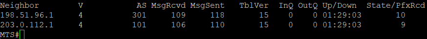

# Настройка AS 520

1. Настройка соединения с другими AS

Провайдер для филиала в Нижнем Новгороде

```bash
router bgp 8359
 bgp router-id 172.20.255.254
 bgp log-neighbor-changes
 network 104.16.0.0 mask 255.255.240.0
 neighbor 104.16.0.2 remote-as 4334
 neighbor 198.51.96.1 remote-as 301
 neighbor 203.0.112.1 remote-as 101

ip route 104.16.0.0 255.255.240.0 Null0
```

Соседство с другими AS установлено



Далее: [Настройка AS 888](./as-888.md)

Назад: [Оглавление](../README.md)
