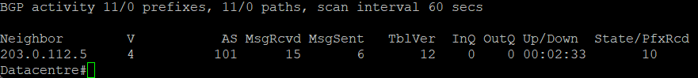

# Настройка AS 888

1. Настройка соединения с AS 101

Данная AS служит для имитации датацентра, в котором может располагаться база данных компании, сайт или другие ресурсы.

Datacentre:

```bash
router bgp 888
 bgp log-neighbor-changes
 network 172.64.0.0 mask 255.255.252.0
 neighbor 203.0.112.5 remote-as 101

ip route 172.64.0.0 255.255.252.0 Null 0
```

Соседство с AS 101 установлено спешно:



Далее: [Настройка сети в офисе Владимира](./vladimir-network.md)

Назад: [Оглавление](../README.md)