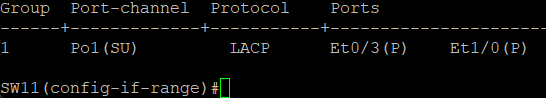
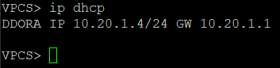
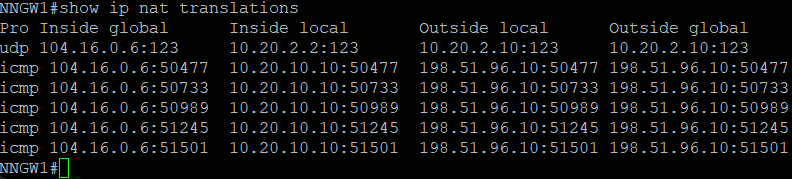
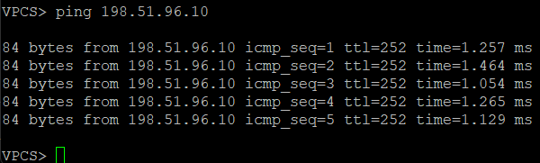
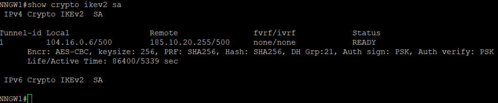
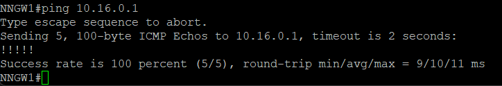

# Настройка сети в филиале Нижнего Новогорода

1. DHCPv4 и NTP
2. VRRP
3. DmVPN + IPSec
4. Статическая маршрутизация 0.0.0.0/0 на провайдера

## Настройка маршрутизаторов

NNGW1

```bash
interface Ethernet0/0
 ip nat outside

interface Ethernet0/2.10
 encapsulation dot1Q 10
 ip address 10.20.1.2 255.255.255.0
 ip helper-address 10.20.2.10
 standby 10 ip 10.20.1.1
 standby 10 priority 150
 standby 10 preempt
 ip nat inside

interface Ethernet0/2.20
 encapsulation dot1Q 20
 ip address 10.20.2.2 255.255.255.0
 ip helper-address 10.20.2.10
 standby 20 ip 10.20.2.1
 standby 20 preempt
 ip nat inside

interface Ethernet0/3
 no ip address

router ospf 1
 network 10.0.0.0 0.255.255.255 area 0

ntp server 10.20.2.10 

ip route 0.0.0.0 0.0.0.0 104.16.0.5
ip route 0.0.0.0 0.0.0.0 10.20.99.2 100

access-list 1 permit 10.20.0.0 0.3.255.255
ip nat inside source list 1 interface Ethernet0/0 overload


crypto ikev2 proposal IKEv2-DMVPN
 encryption aes-cbc-256
 integrity sha256
 group 21
!
crypto ikev2 policy IKEv2-POLICY
 proposal IKEv2-DMVPN
!
crypto ikev2 keyring IKEv2-PSK
 peer HUB
  address 185.10.20.255
  pre-shared-key OTUS
 !
!
!
crypto ikev2 profile IKEv2-PROFILE
 match identity remote address 185.10.20.255 255.255.255.255
 authentication remote pre-share
 authentication local pre-share
 keyring local IKEv2-PSK
!
!
!
crypto ipsec transform-set IPSEC-TRANSFORM esp-aes 256 esp-sha256-hmac
 mode transport
!
crypto ipsec profile DMVPN-PROFILE
 set transform-set IPSEC-TRANSFORM
 set ikev2-profile IKEv2-PROFILE

interface Tunnel100
 ip address 10.1.0.3 255.255.255.0
 no ip redirects
 ip mtu 1400
 ip nhrp authentication OTUS
 ip nhrp map multicast 185.10.20.255
 ip nhrp map 10.1.0.1 185.10.20.255
 ip nhrp network-id 100
 ip nhrp nhs 10.1.0.1
 ip tcp adjust-mss 1360
 tunnel source Ethernet0/0
 tunnel mode gre multipoint
 tunnel protection ipsec profile DMVPN-PROFILE

ip route 10.0.0.0 255.240.0.0 10.1.0.1
ip route 10.16.0.0 255.252.0.0 10.1.0.2
```

NNGW2

```bash
interface Ethernet0/0
 ip nat outside

interface Loopback1
 ip address 10.20.0.2 255.255.255.255

interface Ethernet0/0
 ip address 104.16.0.10 255.255.255.252

interface Ethernet0/1
 ip address 10.20.99.2 255.255.255.252

interface Ethernet0/2.10
 encapsulation dot1Q 10
 ip address 10.20.1.3 255.255.255.0
 ip helper-address 10.20.2.10
 standby 10 ip 10.20.1.1
 standby 10 preempt
 ip nat inside

interface Ethernet0/2.20
 encapsulation dot1Q 20
 ip address 10.20.2.3 255.255.255.0
 ip helper-address 10.20.2.10
 standby 20 ip 10.20.2.1
 standby 20 priority 150
 standby 20 preempt
 ip nat inside

router ospf 1
 network 10.0.0.0 0.255.255.255 area 0

ntp server 10.20.2.10

ip route 0.0.0.0 0.0.0.0 104.16.0.9
ip route 0.0.0.0 0.0.0.0 10.20.99.1 100

access-list 1 permit 10.20.0.0 0.3.255.255
ip nat inside source list 1 interface Ethernet0/0 overload
```

NN-DHCP-NAT

```bash
ip dhcp excluded-address 10.20.1.1 10.20.1.3
ip dhcp excluded-address 10.20.2.1 10.20.2.3

ip dhcp pool VLAN10
 network 10.20.1.0 255.255.255.0
 default-router 10.20.1.1
 dns-server 8.8.8.8

ip dhcp pool VLAN20
 network 10.20.2.0 255.255.255.0
 default-router 10.20.2.1
 dns-server 8.8.8.8

ntp master 1
```

## Настройка коммутаторов

SW11

```bash
interface Ethernet0/0
 switchport trunk allowed vlan 10,20,999
 switchport trunk encapsulation dot1q
 switchport trunk native vlan 1000
 switchport mode trunk

interface Ethernet0/2
 switchport access vlan 10
 switchport mode access

interface Ethernet0/3
 switchport trunk allowed vlan 10,20,999
 switchport trunk encapsulation dot1q
 switchport trunk native vlan 1000
 switchport mode trunk
 channel-group 1 mode active

interface Ethernet1/0
 switchport trunk allowed vlan 10,20,999
 switchport trunk encapsulation dot1q
 switchport trunk native vlan 1000
 switchport mode trunk
 channel-group 1 mode active

interface Port-channel1
 switchport trunk allowed vlan 10,20,999
 switchport trunk encapsulation dot1q
 switchport trunk native vlan 1000
 switchport mode trunk

vlan 10
 name Director
vlan 20
 name Manager
vlan 999
 name Management
vlan 1000
 name Parking_Lot
```

SW12

```bash
interface Ethernet0/0
 switchport trunk allowed vlan 10,20,999
 switchport trunk encapsulation dot1q
 switchport trunk native vlan 1000
 switchport mode trunk

interface Ethernet0/2
 switchport access vlan 20
 switchport mode access

interface Ethernet0/3
 switchport trunk allowed vlan 10,20,999
 switchport trunk encapsulation dot1q
 switchport trunk native vlan 1000
 switchport mode trunk
 channel-group 1 mode active

interface Ethernet1/0
 switchport trunk allowed vlan 10,20,999
 switchport trunk encapsulation dot1q
 switchport trunk native vlan 1000
 switchport mode trunk
 channel-group 1 mode active

interface Port-channel1
 switchport trunk allowed vlan 10,20,999
 switchport trunk encapsulation dot1q
 switchport trunk native vlan 1000
 switchport mode trunk

vlan 10
 name Director
vlan 20
 name Manager
vlan 999
 name Management
vlan 1000
 name Parking_Lot
```

На маршрутизаторах VladimirGW-1 и VladimirGW-2 настроен VRRP


На SW9 и SW10 настроен Etherchannel



В сети действует DHCPv4. Пример получения IP на клиенте VPC46



Состояние таблицы с NAT трансляцией на NNGW1 после попытки VPC50 выйти за пределы сети:



Пинг с VPC46 до NNGW1 проходит успешно:



Туннель до Москвы установлен успешно



Пинги до локальной сети Владимира проходят успешно



Назад: [Оглавление](../README.md)