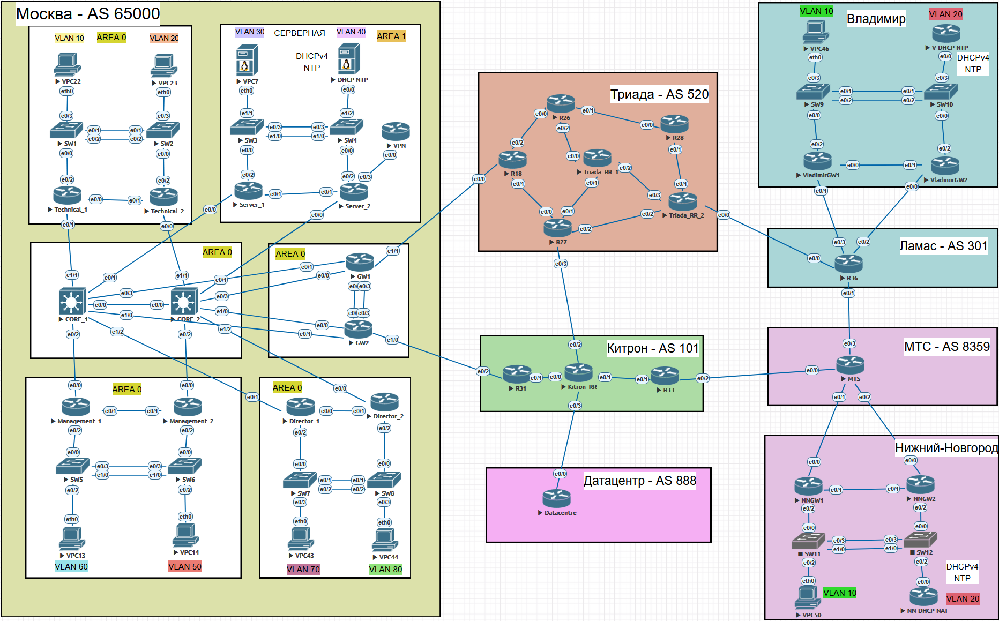

# Задание на проект

У компании имеется головной офис в Москве, для которого выделена своя AS 65000, а также 2 филиала во Владимире и Нижнем-Новгороде, которые работают без своей собственной AS, но подключаются к провайдеру в своем регионе. В топологии предусмотрено 4 разных провайдера, которые работают друг с другом, обеспечивая связь Москва-филиалы. В сети предусмотрен датацентр, который предлагает аренду серверов. На одном из таких серверов развернут сайт компании. Схема сети приведена на рисунке 1.

Рисунок 1. Топология сети

## Требования к сети в головном офисе

1. Сеть строится по трехуровневой схеме, где корневой уровень используется в качестве транзита трафика для уровня распределения
2. В сети действует OSPF протокол, есть деление на зоны

| Area | Маршрутизатор         | Сеть      | Тип линка |
|------|-----------------------|-----------|-----------|
| 0    | CORE_1 CORE_2     | Broadcast | P2P       |
| 1    | Technical             | Broadcast | P2P       |
| 2    | Server_1 Server_2 | Broadcast | P2P       |
| 3    | GW_1 GW_2         | Broadcast | P2P       |
| 4    | Management_1 Management_2 | Broadcast | P2P       |
| 5    | Director              | Broadcast | P2P       |

3. В сети настроен DHCPv4 сервер на маршрутизаторе DHCP в Area 2
4. На GW_1 и GW_2 настроен VRRP и NAT протоколы, EtherChannel
5. На SW1-SW2, SW2-SW4, SW5-SW6, SW7-SW8 настроены VLAN для работы Access уровня раздельно друг от друга в рамках Area, настроен EtherChannel
6. VPC в Area 1, Area 4-5 получают IP адрес динамитческии по DHCP протоколу. В Area 2 адреса раздаются статические
7. Настроен NTP сервер
8. Не является транзитной AS

## Требования к сети AS 520

1. Маршрутизатор Triada_RR используется в качестве Router Reflector для маршрутиазторов R18, R26, R27
2. В сети работает протокол OSPF для анонса Loopback адресов и iBGP протокол
3. Стык с AS 65000, AS 101 и AS 301 осуществлен по eBGP

## Требования к сети AS 101

1. Маршрутизатор Kitron_RR используется в качестве Router Reflector для маршрутиазторов R31, R33
2. В сети работает протокол OSPF для анонса Loopback адресов и iBGP протокол
3. Стык с AS 65000, AS 520, AS 8359 и AS 888 осуществлен по eBGP

## Требования к сети AS 301

1. Фильтруются префиксы из AS 4334

## Требования к сети офиса во Владимире

1. Настроена статика на VladimirGW1 и VladimirGW2
2. На VladimirGW1 и VladimirGW2 настроен ECMP
3. На VladimirGW1 и VladimirGW2 настроен VRRP протокол и NAT
4. На SW9-SW10 настроен Inter-VLAN Routing
5. На SW9-SW10 настроен EtherChannel

## Требования к сети офиса в Нижнем-Новгороде

1. Настроена статика на NNGW1 и NNGW2
2. На NNGW1 и NNGW2 настроен ECMP
3. На NNGW1 и NNGW2 настроен VRRP протокол и NAT
4. На SW11-SW12 настроен Inter-VLAN Routing
5. На SW11-SW12 настроен EtherChannel

Далее: [Настройка клиента](./office_descriptions.md)

Назад: [Оглавление](../README.md)
