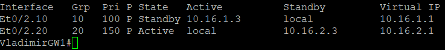
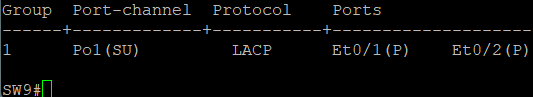
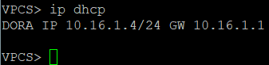
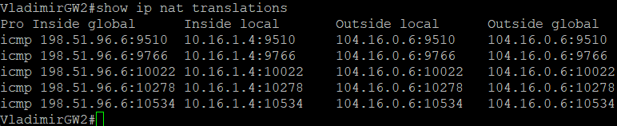
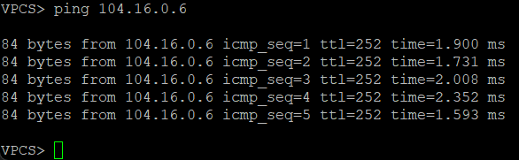
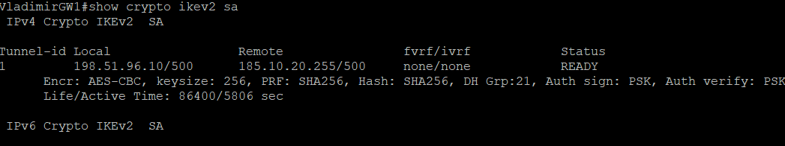
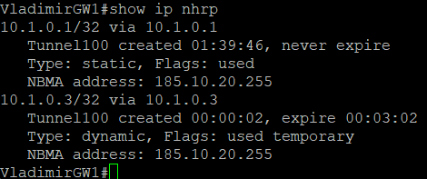
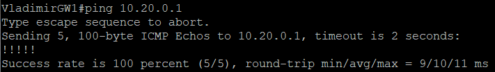

# Настройка сети в филиале Владимира

1. DHCPv4 и NTP
2. VRRP
3. DmVPN + IPSec
4. Статическая маршрутизация 0.0.0.0/0 на провайдера

## Настройка маршрутизаторов

VladimirGW_1

```bash
interface Loopback1
 ip address 10.16.0.1 255.255.255.255

interface Ethernet0/0
 ip address 10.16.255.1 255.255.255.252

interface Ethernet0/1
 ip address 198.51.96.10 255.255.255.252

interface Ethernet0/2.10
 encapsulation dot1Q 10
 ip address 10.16.1.2 255.255.255.0
 ip helper-address 10.16.2.10
 standby 10 ip 10.16.1.1
 standby 10 preempt
 ip nat inside

interface Ethernet0/2.20
 encapsulation dot1Q 20
 ip address 10.16.2.2 255.255.255.0
 ip helper-address 10.16.2.10
 standby 20 ip 10.16.2.1
 standby 20 priority 150
 standby 20 preempt
 ip nat inside

interface Ethernet0/2.1000
 encapsulation dot1Q 1000 native

router ospf 1
 network 10.0.0.0 0.255.255.255 area 0

ip route 0.0.0.0 0.0.0.0 198.51.96.9
ip route 0.0.0.0 0.0.0.0 10.16.255.2 100 

ip nat inside source list NAT-LOCAL interface Ethernet0/1 overload
ip access-list standard NAT-LOCAL
 permit 10.16.0.0 0.3.255.255


crypto ikev2 proposal IKEv2-DMVPN
 encryption aes-cbc-256
 integrity sha256
 group 21

crypto ikev2 policy IKEv2-POLICY
 proposal IKEv2-DMVPN

crypto ikev2 keyring IKEv2-PSK
 peer HUB
  address 185.10.20.255
  pre-shared-key OTUS

crypto ikev2 profile IKEv2-PROFILE
 match identity remote address 185.10.20.255 255.255.255.255
 authentication remote pre-share
 authentication local pre-share
 keyring local IKEv2-PSK

crypto ipsec transform-set IPSEC-TRANSFORM esp-aes 256 esp-sha256-hmac
 mode transport

crypto ipsec profile DMVPN-PROFILE
 set transform-set IPSEC-TRANSFORM
 set ikev2-profile IKEv2-PROFILE

interface Tunnel100
 ip address 10.1.0.2 255.255.255.0
 no ip redirects
 ip mtu 1400
 ip nhrp authentication OTUS
 ip nhrp map multicast 185.10.20.255
 ip nhrp map 10.1.0.1 185.10.20.255
 ip nhrp network-id 100
 ip nhrp nhs 10.1.0.1
 ip tcp adjust-mss 1360
 tunnel source Ethernet0/1
 tunnel mode gre multipoint
 tunnel protection ipsec profile DMVPN-PROFILE

ip route 10.0.0.0 255.240.0.0 10.1.0.1
ip route 10.20.0.0 255.252.0.0 10.1.0.3
```

VladimirGW_2

```bash
interface Loopback1
 ip address 10.16.0.2 255.255.255.255

interface Ethernet0/0
 ip address 198.51.96.6 255.255.255.252

interface Ethernet0/1
 ip address 10.16.255.2 255.255.255.252

interface Ethernet0/2.10
 encapsulation dot1Q 10
 ip address 10.16.1.3 255.255.255.0
 ip helper-address 10.16.2.10
 standby 10 ip 10.16.1.1
 standby 10 priority 150
 standby 10 preempt
 ip nat inside

interface Ethernet0/2.20
 encapsulation dot1Q 20
 ip address 10.16.2.3 255.255.255.0
 ip helper-address 10.16.2.10
 standby 20 ip 10.16.2.1
 standby 20 preempt
 ip nat inside

interface Ethernet0/2.1000
 encapsulation dot1Q 1000 native

router ospf 1
 network 10.0.0.0 0.255.255.255 area 0

ip route 0.0.0.0 0.0.0.0 198.51.96.5
ip route 0.0.0.0 0.0.0.0 10.16.255.1 100

ip nat inside source list NAT-LOCAL interface Ethernet0/0 overload
ip access-list standard NAT-LOCAL
 permit 10.16.0.0 0.3.255.255
```

V-DHCP-NTP

```bash
ip dhcp excluded-address 10.16.1.1 10.16.1.3
ip dhcp excluded-address 10.16.2.1 10.16.2.3

ip dhcp pool VLAN10
 network 10.16.1.0 255.255.255.0
 default-router 10.16.1.1
 dns-server 8.8.8.8

ip dhcp pool VLAN20
 network 10.16.2.0 255.255.255.0
 default-router 10.16.2.1
 dns-server 8.8.8.8

interface Ethernet0/0
 ip address 10.16.2.10 255.255.255.0
 duplex auto

router ospf 1
 network 10.0.0.0 0.255.255.255 area 0
```

## Настрйока коммутаторв

SW9

```bash
interface Ethernet0/0
 switchport trunk allowed vlan 10,20,999
 switchport trunk encapsulation dot1q
 switchport trunk native vlan 1000
 switchport mode trunk

interface Ethernet0/1
 switchport trunk allowed vlan 10,20,999
 switchport trunk encapsulation dot1q
 switchport trunk native vlan 1000
 switchport mode trunk
 channel-group 1 mode active

interface Ethernet0/2
 switchport trunk allowed vlan 10,20,999
 switchport trunk encapsulation dot1q
 switchport trunk native vlan 1000
 switchport mode trunk
 channel-group 1 mode active

interface Ethernet0/3
 switchport access vlan 10
 switchport mode access

interface Port-channel1
 switchport trunk allowed vlan 10,20,999
 switchport trunk encapsulation dot1q
 switchport trunk native vlan 1000
 switchport mode trunk
```

SW10

```bash
interface Ethernet0/0
 switchport trunk allowed vlan 10,20,999
 switchport trunk encapsulation dot1q
 switchport trunk native vlan 1000
 switchport mode trunk

interface Ethernet0/1
 switchport trunk allowed vlan 10,20,999
 switchport trunk encapsulation dot1q
 switchport trunk native vlan 1000
 switchport mode trunk
 channel-group 1 mode active

interface Ethernet0/2
 switchport trunk allowed vlan 10,20,999
 switchport trunk encapsulation dot1q
 switchport trunk native vlan 1000
 switchport mode trunk
 channel-group 1 mode active

interface Ethernet0/3
 switchport access vlan 20
 switchport mode access

interface Port-channel1
 switchport trunk allowed vlan 10,20,999
 switchport trunk encapsulation dot1q
 switchport trunk native vlan 1000
 switchport mode trunk
```

На маршрутизаторах VladimirGW-1 и VladimirGW-2 настроен VRRP



На SW9 и SW10 настроен Etherchannel



В сети действует DHCPv4. Пример получения IP на клиенте VPC46



Состояние таблицы с NAT трансляцией на VladimirGW1 после попытки VPC46 выйти за пределы сети:



Пинг с VPC46 до NNGW1 проходит успешно:



VPN туннель до Москвы установлен успешно





Пинг до локальной сети филиала в Нижнем Новгороде проходит



Далее: [Настройка сети в офисе Нижнего Новгорода](./nizhni-novgorod-network.md)

Назад: [Оглавление](../README.md)